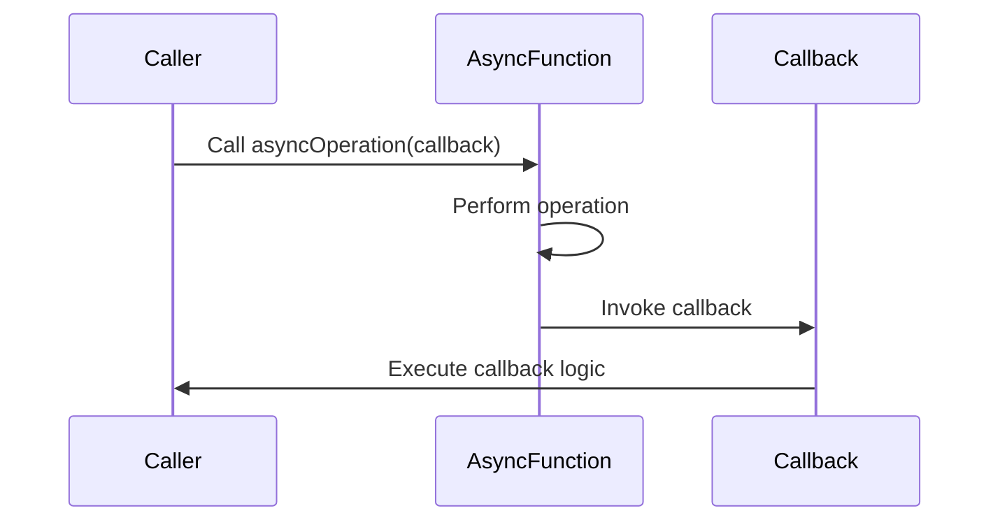

## 8.4.1 Implementing Callbacks in TypeScript

In the realm of asynchronous programming, callbacks are a fundamental concept that allows us to execute code after a certain operation has completed. In TypeScript, implementing callbacks with accurate typings is crucial for ensuring robust and maintainable code. In this section, we'll delve into the intricacies of defining and using callbacks in TypeScript, covering everything from basic function types to advanced generics.

### Understanding Callbacks

A callback is a function passed as an argument to another function, which is then invoked inside the outer function to complete some kind of routine or action. Callbacks are essential for handling asynchronous operations, such as network requests or file I/O, where the operation may not complete immediately.

#### Why Use Callbacks?

- **Asynchronous Execution**: Callbacks allow us to perform operations asynchronously, preventing blocking of the main execution thread.
- **Flexibility**: They provide a way to customize the behavior of functions by passing different callback implementations.
- **Event Handling**: Callbacks are often used in event-driven programming to handle user interactions or system events.

### Declaring Functions with Callbacks

In TypeScript, we can declare functions that accept callbacks as parameters. This involves defining the type of the callback function to ensure type safety and catch errors at compile time.

#### Basic Function Type

Let's start with a simple example of a function that accepts a callback:

```typescript
// Define a callback type
type Callback = (message: string) => void;

// Function that accepts a callback
function greetUser(callback: Callback) {
    const message = "Hello, TypeScript!";
    callback(message);
}

// Implement the callback
const logMessage = (msg: string) => {
    console.log(msg);
};

// Pass the callback to the function
greetUser(logMessage);
```

In this example, we define a `Callback` type that represents a function taking a `string` and returning `void`. The `greetUser` function accepts a callback of this type and invokes it with a message.

#### Using Interfaces for Callbacks

Alternatively, we can use interfaces to define callback types, which can be more descriptive and flexible:

```typescript
// Define a callback interface
interface MessageCallback {
    (message: string): void;
}

// Function that accepts a callback
function notifyUser(callback: MessageCallback) {
    const notification = "You have a new message!";
    callback(notification);
}

// Implement the callback
const displayNotification = (notification: string) => {
    alert(notification);
};

// Pass the callback to the function
notifyUser(displayNotification);
```

Using interfaces allows us to define more complex callback structures and provides a clear contract for the callback's signature.

### Handling Return Values and Parameters

Callbacks can also handle return values and parameters, which can be especially useful in scenarios where the callback needs to process data and return a result.

#### Example with Return Values

Consider a scenario where a callback processes a number and returns a transformed value:

```typescript
// Define a callback type with a return value
type NumberTransformer = (num: number) => number;

// Function that uses the callback
function processNumber(num: number, transformer: NumberTransformer): number {
    return transformer(num);
}

// Implement the callback
const double = (n: number) => n * 2;

// Use the callback
const result = processNumber(5, double);
console.log(result); // Output: 10
```

Here, the `NumberTransformer` type specifies that the callback takes a `number` and returns a `number`. The `processNumber` function applies the transformation and returns the result.

### Typing Callbacks for Error Handling

One of the key benefits of using TypeScript is its ability to catch errors at compile time. By typing callbacks, we can ensure that the functions we pass adhere to the expected signature, reducing runtime errors.

#### Catching Errors with Typed Callbacks

Let's see an example where typing helps prevent errors:

```typescript
// Define a callback type with a specific signature
type ErrorCallback = (error: Error | null, result?: string) => void;

// Function that simulates an asynchronous operation
function fetchData(callback: ErrorCallback) {
    const success = Math.random() > 0.5;
    if (success) {
        callback(null, "Data fetched successfully!");
    } else {
        callback(new Error("Failed to fetch data"));
    }
}

// Implement the callback
const handleResponse = (error: Error | null, result?: string) => {
    if (error) {
        console.error("Error:", error.message);
    } else {
        console.log("Success:", result);
    }
};

// Use the callback
fetchData(handleResponse);
```

In this example, the `ErrorCallback` type ensures that the callback can handle both error and success scenarios, providing a robust mechanism for error handling.

### Generics with Callbacks

To enhance the flexibility of our callbacks, we can use generics. Generics allow us to define callbacks that can work with various data types, making our code more reusable.

#### Example with Generics

Let's create a generic callback type:

```typescript
// Define a generic callback type
type GenericCallback<T> = (data: T) => void;

// Function that uses a generic callback
function fetchDataGeneric<T>(data: T, callback: GenericCallback<T>) {
    callback(data);
}

// Implement the callback for different types
const logString = (data: string) => console.log("String:", data);
const logNumber = (data: number) => console.log("Number:", data);

// Use the generic callback
fetchDataGeneric("Hello, Generics!", logString);
fetchDataGeneric(42, logNumber);
```

By using generics, the `fetchDataGeneric` function can work with any data type, and the appropriate callback will handle the data accordingly.

### Asynchronous vs. Synchronous Callbacks

Callbacks can be used in both asynchronous and synchronous contexts. Understanding the differences is crucial for implementing them effectively.

#### Asynchronous Callbacks

Asynchronous callbacks are executed after an asynchronous operation completes, such as a network request or a timer. They are often used with functions like `setTimeout` or `fetch`.

```typescript
// Asynchronous callback example
function asyncOperation(callback: () => void) {
    setTimeout(() => {
        console.log("Async operation complete");
        callback();
    }, 1000);
}

// Implement the callback
const onComplete = () => console.log("Callback executed");

// Use the asynchronous callback
asyncOperation(onComplete);
```

In this example, the callback is executed after a delay, simulating an asynchronous operation.

#### Synchronous Callbacks

Synchronous callbacks are executed immediately within the calling function. They are often used for operations that don't involve waiting for external resources.

```typescript
// Synchronous callback example
function syncOperation(callback: () => void) {
    console.log("Sync operation start");
    callback();
    console.log("Sync operation end");
}

// Implement the callback
const duringOperation = () => console.log("Callback during operation");

// Use the synchronous callback
syncOperation(duringOperation);
```

Here, the callback is executed as part of the synchronous flow of the function.

### Best Practices for Using Callbacks

- **Type Your Callbacks**: Always define the types of your callbacks to catch errors early and ensure consistency.
- **Handle Errors Gracefully**: Implement error handling within your callbacks to manage failures effectively.
- **Use Generics for Flexibility**: Leverage generics to create reusable and adaptable callback functions.
- **Avoid Callback Hell**: For complex asynchronous flows, consider using Promises or async/await to improve readability and maintainability.

### Try It Yourself

Experiment with the following code examples by modifying the callback functions or the data they process. Try creating a callback that processes an array of numbers and returns the sum, or implement a callback that logs messages with different levels of severity (e.g., info, warning, error).

### Visualizing Callback Flow

To better understand how callbacks work, let's visualize the flow of a simple asynchronous operation using a callback:



This diagram illustrates the sequence of interactions between the caller, the asynchronous function, and the callback. The callback is invoked after the asynchronous operation completes, allowing the caller to handle the result.

### Further Reading

For more information on callbacks and asynchronous programming in TypeScript, consider exploring the following resources:

- [MDN Web Docs: Asynchronous JavaScript](https://developer.mozilla.org/en-US/docs/Learn/JavaScript/Asynchronous)
- [TypeScript Handbook: Functions](https://www.typescriptlang.org/docs/handbook/functions.html)
- [JavaScript.info: Callbacks](https://javascript.info/callbacks)

### Knowledge Check

- What are the benefits of using callbacks in asynchronous programming?
- How can you define a callback type using an interface in TypeScript?
- What is the difference between asynchronous and synchronous callbacks?
- How can generics enhance the flexibility of callback functions?

### Embrace the Journey

Remember, mastering callbacks is just one step in your journey to becoming an expert in asynchronous programming with TypeScript. As you progress, you'll encounter more complex patterns and techniques that will further enhance your skills. Keep experimenting, stay curious, and enjoy the journey!

## Quiz Time!



### What is a callback in programming?

- [x] A function passed as an argument to another function
- [ ] A variable that holds a function
- [ ] A method that returns a function
- [ ] A class that implements a function

> **Explanation:** A callback is a function passed as an argument to another function, which is then invoked inside the outer function to complete a routine or action.

### How can you define a callback type in TypeScript?

- [x] Using a function type or an interface
- [ ] Using a class
- [ ] Using a variable
- [ ] Using a module

> **Explanation:** In TypeScript, you can define a callback type using a function type or an interface, which specifies the signature of the callback function.

### What is the main advantage of typing callbacks in TypeScript?

- [x] Catching errors at compile time
- [ ] Improving runtime performance
- [ ] Reducing code size
- [ ] Increasing execution speed

> **Explanation:** Typing callbacks in TypeScript helps catch errors at compile time, ensuring that the functions passed adhere to the expected signature.

### What is the difference between asynchronous and synchronous callbacks?

- [x] Asynchronous callbacks are executed after an operation completes, while synchronous callbacks are executed immediately
- [ ] Asynchronous callbacks are faster than synchronous callbacks
- [ ] Synchronous callbacks are executed after an operation completes, while asynchronous callbacks are executed immediately
- [ ] There is no difference

> **Explanation:** Asynchronous callbacks are executed after an asynchronous operation completes, such as a network request, while synchronous callbacks are executed immediately within the calling function.

### How can generics be used with callbacks in TypeScript?

- [x] To define callbacks that can work with various data types
- [ ] To improve runtime performance
- [ ] To reduce code size
- [ ] To increase execution speed

> **Explanation:** Generics allow us to define callbacks that can work with various data types, enhancing the flexibility and reusability of our code.

### What is "callback hell"?

- [x] A situation where multiple nested callbacks make code difficult to read and maintain
- [ ] A type of error that occurs during callback execution
- [ ] A method of handling errors in callbacks
- [ ] A design pattern for managing callbacks

> **Explanation:** "Callback hell" refers to a situation where multiple nested callbacks make code difficult to read and maintain, often leading to complex and hard-to-debug code.

### Which of the following is a best practice for using callbacks?

- [x] Type your callbacks to catch errors early
- [ ] Avoid using callbacks altogether
- [ ] Use callbacks only for synchronous operations
- [ ] Always use anonymous functions as callbacks

> **Explanation:** Typing your callbacks is a best practice to catch errors early and ensure consistency in your code.

### What is the purpose of using interfaces for defining callback types?

- [x] To provide a clear contract for the callback's signature
- [ ] To improve runtime performance
- [ ] To reduce code size
- [ ] To increase execution speed

> **Explanation:** Using interfaces for defining callback types provides a clear contract for the callback's signature, ensuring that the functions passed adhere to the expected structure.

### True or False: Callbacks can only be used in asynchronous contexts.

- [ ] True
- [x] False

> **Explanation:** Callbacks can be used in both asynchronous and synchronous contexts. They are often used in asynchronous programming but can also be used for synchronous operations.

### Which of the following resources is recommended for further reading on callbacks?

- [x] MDN Web Docs: Asynchronous JavaScript
- [ ] TypeScript Handbook: Classes
- [ ] JavaScript.info: Variables
- [ ] W3Schools: HTML

> **Explanation:** The MDN Web Docs on Asynchronous JavaScript is a recommended resource for further reading on callbacks and asynchronous programming.


