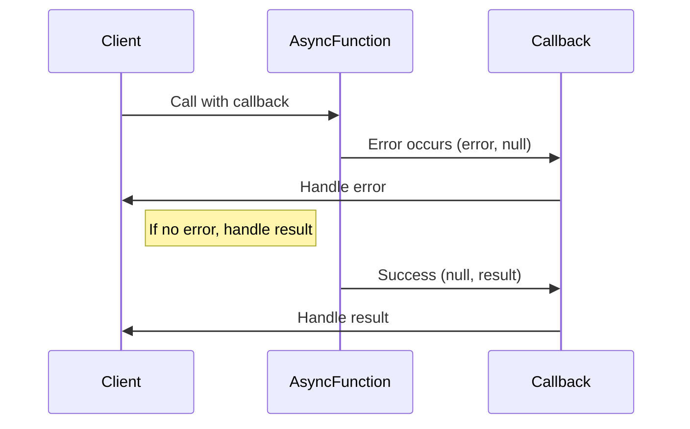

## 8.4.2 Error-First Callbacks

In the realm of asynchronous programming, particularly in environments like Node.js, handling errors effectively is paramount. The error-first callback pattern is a widely adopted convention that simplifies error handling in asynchronous operations. This section delves into the intricacies of error-first callbacks, illustrating their implementation in TypeScript, and providing insights into best practices and common pitfalls to avoid.

### Understanding the Error-First Callback Pattern

The error-first callback pattern is a convention where the first argument of a callback function is reserved for an error object. If an error occurs, this parameter is populated with an error object; otherwise, it is set to `null`. Subsequent parameters are used for the successful result of the operation. This pattern allows developers to handle errors and results in a standardized manner, promoting consistency across asynchronous APIs.

#### Key Characteristics

- **Error Handling**: The first parameter is always reserved for an error. If no error occurs, it is `null`.
- **Result Handling**: Subsequent parameters contain the result of the operation if no error occurs.
- **Consistency**: Provides a uniform approach to handling errors across various asynchronous operations.

### Implementing Error-First Callbacks in TypeScript

Let's explore how to define and use error-first callbacks in TypeScript with practical examples.

#### Example: Reading a File with Error-First Callback

Consider a scenario where we need to read a file asynchronously. We can use the `fs` module in Node.js, which follows the error-first callback pattern.

```typescript
import * as fs from 'fs';

// Define the callback type
type Callback<T> = (error: Error | null, result: T | null) => void;

// Function to read a file using error-first callback
function readFileAsync(filePath: string, callback: Callback<string>): void {
    fs.readFile(filePath, 'utf8', (err, data) => {
        if (err) {
            callback(err, null);
            return;
        }
        callback(null, data);
    });
}

// Usage
readFileAsync('example.txt', (error, data) => {
    if (error) {
        console.error('Error reading file:', error.message);
        return;
    }
    console.log('File content:', data);
});
```

In this example, the `readFileAsync` function reads a file and uses an error-first callback to handle the result. The callback type `Callback<T>` is defined to ensure type safety, specifying that the first parameter is an `Error` or `null`, and the second is the result or `null`.

### Typing Error-First Callbacks

Properly typing error-first callbacks in TypeScript enhances code reliability and maintainability. By defining a generic callback type, we can ensure that callbacks adhere to the expected signature.

#### Defining a Generic Callback Type

```typescript
// Generic callback type
type Callback<T> = (error: Error | null, result: T | null) => void;
```

This type definition can be reused across various functions that follow the error-first callback pattern, ensuring consistency and reducing the risk of errors.

### Handling Errors and Successful Results

Handling errors effectively is crucial in asynchronous programming. The error-first callback pattern provides a clear structure for distinguishing between errors and successful results.

#### Example: Handling Errors and Results

```typescript
// Function to simulate an asynchronous operation
function performOperation(callback: Callback<number>): void {
    setTimeout(() => {
        const success = Math.random() > 0.5;
        if (success) {
            callback(null, 42); // Success result
        } else {
            callback(new Error('Operation failed'), null); // Error
        }
    }, 1000);
}

// Usage
performOperation((error, result) => {
    if (error) {
        console.error('Error:', error.message);
        return;
    }
    console.log('Result:', result);
});
```

In this example, the `performOperation` function simulates an asynchronous operation that may succeed or fail. The callback handles both scenarios, logging the result if successful or the error message if an error occurs.

### Standardizing Error Handling in Callback-Based APIs

The error-first callback pattern standardizes error handling across callback-based APIs, making it easier for developers to predict and manage errors.

#### Benefits of Standardization

- **Predictability**: Developers can anticipate the structure of callbacks, simplifying error handling.
- **Consistency**: Uniform error handling across different APIs reduces cognitive load.
- **Interoperability**: Facilitates integration with other libraries and frameworks that follow the same pattern.

### Common Pitfalls and How to Avoid Them

While the error-first callback pattern is effective, there are common pitfalls to be aware of.

#### Neglecting to Check for Errors

One of the most common mistakes is neglecting to check for errors before using the result. Always check the error parameter first.

```typescript
// Incorrect usage
performOperation((error, result) => {
    console.log('Result:', result); // This may cause issues if error is not null
    if (error) {
        console.error('Error:', error.message);
    }
});
```

#### Correct Approach

```typescript
// Correct usage
performOperation((error, result) => {
    if (error) {
        console.error('Error:', error.message);
        return;
    }
    console.log('Result:', result);
});
```

#### Best Practices

- **Always Check for Errors First**: Before accessing the result, ensure the error parameter is `null`.
- **Document Callback Signatures**: Clearly document the expected signature of callbacks, including the types of errors and results.
- **Use TypeScript's Type System**: Leverage TypeScript's type system to define and enforce callback signatures.

### Visualizing the Error-First Callback Flow

To better understand the flow of error-first callbacks, let's visualize the process using a sequence diagram.



This diagram illustrates the flow of an asynchronous function using an error-first callback. The function calls the callback with an error or result, and the client handles each case accordingly.

### Try It Yourself

Experiment with the provided examples by modifying the callback logic or simulating different asynchronous operations. Consider adding additional error handling or logging to enhance the examples.

### References and Further Reading

- [Node.js Callbacks](https://nodejs.org/en/docs/guides/blocking-vs-non-blocking/) - Node.js documentation on asynchronous programming.
- [TypeScript Handbook](https://www.typescriptlang.org/docs/handbook/intro.html) - Official TypeScript documentation for understanding types and interfaces.
- [MDN Web Docs on Callbacks](https://developer.mozilla.org/en-US/docs/Glossary/Callback_function) - Explanation of callback functions and their usage.

### Knowledge Check

- What is the primary purpose of the error-first callback pattern?
- How does TypeScript's type system enhance the use of error-first callbacks?
- What are the common pitfalls associated with error-first callbacks, and how can they be avoided?

### Embrace the Journey

Remember, mastering error-first callbacks is just one step in your journey to becoming proficient in asynchronous programming with TypeScript. As you continue to explore and experiment, you'll gain deeper insights into handling asynchronous operations effectively. Keep learning, stay curious, and enjoy the process!

## Quiz Time!



### What is the primary purpose of the error-first callback pattern?

- [x] To handle errors and results in a standardized manner
- [ ] To prioritize successful results over errors
- [ ] To simplify synchronous programming
- [ ] To eliminate the need for error handling

> **Explanation:** The error-first callback pattern standardizes the handling of errors and results, ensuring consistency across asynchronous APIs.

### In an error-first callback, what should the first parameter be?

- [x] An error object or `null`
- [ ] The result of the operation
- [ ] A boolean indicating success
- [ ] A string message

> **Explanation:** The first parameter in an error-first callback is reserved for an error object or `null` if no error occurs.

### How can TypeScript's type system enhance error-first callbacks?

- [x] By defining and enforcing callback signatures
- [ ] By eliminating the need for callbacks
- [ ] By converting callbacks to promises
- [ ] By automatically handling errors

> **Explanation:** TypeScript's type system allows developers to define and enforce callback signatures, ensuring type safety and consistency.

### What is a common pitfall when using error-first callbacks?

- [x] Neglecting to check for errors before using results
- [ ] Using promises instead of callbacks
- [ ] Handling errors before results
- [ ] Using synchronous functions

> **Explanation:** A common pitfall is neglecting to check for errors before accessing the result, which can lead to unexpected behavior.

### What is the correct order of handling in an error-first callback?

- [x] Check for errors first, then handle results
- [ ] Handle results first, then check for errors
- [ ] Ignore errors and proceed with results
- [ ] Log results and ignore errors

> **Explanation:** In an error-first callback, always check for errors first before handling the results to ensure proper error management.

### Which of the following is a benefit of the error-first callback pattern?

- [x] Consistency in error handling across APIs
- [ ] Eliminating the need for error handling
- [ ] Simplifying synchronous code
- [ ] Prioritizing results over errors

> **Explanation:** The error-first callback pattern provides consistency in error handling across different APIs, making it easier to manage errors.

### What should you do if an error occurs in an error-first callback?

- [x] Log the error and return early
- [ ] Ignore the error and proceed
- [ ] Convert the error to a result
- [ ] Retry the operation immediately

> **Explanation:** If an error occurs, log the error and return early to prevent further execution with invalid results.

### How can you document callback signatures effectively?

- [x] Clearly specify the types of errors and results
- [ ] Use generic descriptions without types
- [ ] Avoid documenting callbacks
- [ ] Only document successful results

> **Explanation:** Clearly specifying the types of errors and results in documentation helps ensure that callbacks are used correctly and consistently.

### What is a key characteristic of the error-first callback pattern?

- [x] The first parameter is reserved for an error
- [ ] The last parameter is reserved for an error
- [ ] Errors are ignored
- [ ] Results are prioritized over errors

> **Explanation:** A key characteristic of the error-first callback pattern is that the first parameter is reserved for an error, ensuring consistent error handling.

### True or False: The error-first callback pattern eliminates the need for error handling.

- [ ] True
- [x] False

> **Explanation:** False. The error-first callback pattern does not eliminate the need for error handling; instead, it standardizes how errors are handled in callbacks.


