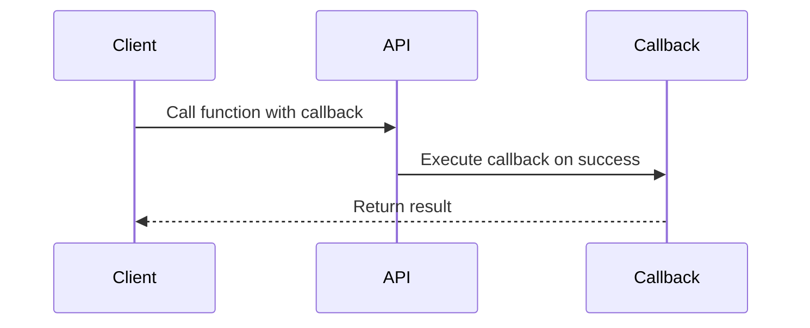

## 8.4.3 Use Cases and Examples

In this section, we explore the practical applications of the callback pattern in TypeScript, focusing on scenarios where callbacks are still relevant and beneficial. We will delve into Node.js APIs, third-party libraries, event-driven programming, and the integration of callback-based code with modern asynchronous patterns. By the end of this section, you'll have a comprehensive understanding of how to work with callbacks effectively, ensuring type safety and code quality.

### Node.js APIs and Callbacks

Node.js has a rich history of using callbacks, particularly in its core modules. One of the most notable examples is the `fs` (file system) module, which provides asynchronous file operations. Let's examine how callbacks are used in this context.

#### Example: Reading a File with Callbacks

The `fs.readFile` method in Node.js reads the contents of a file asynchronously and executes a callback function upon completion.

```typescript
import * as fs from 'fs';

// Read a file using a callback
fs.readFile('example.txt', 'utf8', (err, data) => {
  if (err) {
    console.error('Error reading file:', err);
    return;
  }
  console.log('File contents:', data);
});
```

In this example, the callback function takes two parameters: `err` and `data`. If an error occurs during the file read operation, `err` will be populated with an error object, allowing us to handle the error gracefully. Otherwise, `data` will contain the file's contents.

### Working with Third-Party Libraries

Many third-party libraries still use callbacks, especially those that have been around since before the advent of Promises and `async/await`. Understanding how to work with these libraries is crucial for maintaining and integrating legacy codebases.

#### Example: Using a Callback-Based Library

Consider a hypothetical library that fetches data from an API using callbacks:

```typescript
function fetchData(url: string, callback: (error: Error | null, data?: any) => void) {
  // Simulate an asynchronous operation
  setTimeout(() => {
    if (url === 'https://api.example.com/data') {
      callback(null, { id: 1, name: 'Example Data' });
    } else {
      callback(new Error('Invalid URL'));
    }
  }, 1000);
}

// Using the callback-based function
fetchData('https://api.example.com/data', (error, data) => {
  if (error) {
    console.error('Error fetching data:', error);
    return;
  }
  console.log('Fetched data:', data);
});
```

### Converting Callbacks to Promises

To modernize callback-based code, we can convert these functions to return Promises. This approach allows us to use `async/await`, making the code more readable and maintainable.

#### Example: Promisifying a Callback Function

Node.js provides a utility function, `util.promisify`, to convert callback-based functions to return Promises.

```typescript
import { promisify } from 'util';
import * as fs from 'fs';

// Promisify the readFile function
const readFileAsync = promisify(fs.readFile);

// Use the promisified function with async/await
async function readExampleFile() {
  try {
    const data = await readFileAsync('example.txt', 'utf8');
    console.log('File contents:', data);
  } catch (err) {
    console.error('Error reading file:', err);
  }
}

readExampleFile();
```

By promisifying the `fs.readFile` function, we can now use it with `async/await`, improving code clarity and error handling.

### Event-Driven Programming and Callbacks

Callbacks are naturally suited for event-driven programming, where functions are executed in response to specific events. This pattern is prevalent in both Node.js and browser environments.

#### Example: Setting Event Listeners in the Browser

In the browser, we often use callbacks to handle events such as clicks, form submissions, and more.

```typescript
// Select a button element
const button = document.querySelector('button');

// Add a click event listener with a callback
button?.addEventListener('click', (event) => {
  console.log('Button clicked!', event);
});
```

In this example, we attach a callback function to the `click` event of a button element. When the button is clicked, the callback is executed, allowing us to respond to the event.

### Integrating Callbacks with Modern Async Patterns

While callbacks are still useful, integrating them with modern asynchronous patterns like Promises and `async/await` can enhance code quality and maintainability.

#### Example: Combining Callbacks and Promises

Sometimes, we need to work with both callbacks and Promises, especially when dealing with legacy codebases or third-party libraries.

```typescript
function fetchDataWithPromise(url: string): Promise<any> {
  return new Promise((resolve, reject) => {
    fetchData(url, (error, data) => {
      if (error) {
        reject(error);
      } else {
        resolve(data);
      }
    });
  });
}

// Use the function with async/await
async function fetchDataExample() {
  try {
    const data = await fetchDataWithPromise('https://api.example.com/data');
    console.log('Fetched data:', data);
  } catch (error) {
    console.error('Error fetching data:', error);
  }
}

fetchDataExample();
```

In this example, we wrap the callback-based `fetchData` function in a Promise, allowing us to use `async/await` for cleaner and more readable code.

### Understanding Callbacks for Legacy Code Maintenance

Understanding the callback pattern is essential for maintaining and updating existing codebases. Many legacy systems rely heavily on callbacks, and being able to work with them effectively is crucial for any developer.

#### Example: Refactoring Legacy Code

Consider a legacy codebase that uses callbacks extensively. By understanding the callback pattern, we can refactor the code to improve readability and maintainability.

```typescript
// Original callback-based code
function processData(callback: (error: Error | null, result?: any) => void) {
  // Simulate an asynchronous operation
  setTimeout(() => {
    callback(null, 'Processed Data');
  }, 1000);
}

// Refactored code using Promises
function processDataAsync(): Promise<any> {
  return new Promise((resolve, reject) => {
    processData((error, result) => {
      if (error) {
        reject(error);
      } else {
        resolve(result);
      }
    });
  });
}

// Use the refactored function with async/await
async function processExample() {
  try {
    const result = await processDataAsync();
    console.log('Result:', result);
  } catch (error) {
    console.error('Error processing data:', error);
  }
}

processExample();
```

By refactoring the callback-based `processData` function to use Promises, we can leverage `async/await` for improved code quality.

### Visualizing Callback Flow

To better understand how callbacks work, let's visualize the flow of a callback-based operation.



**Diagram Description**: This sequence diagram illustrates the flow of a callback-based operation. The client calls a function on the API, passing a callback. Upon successful completion, the API executes the callback, returning the result to the client.

### Try It Yourself

To solidify your understanding of callbacks, try modifying the examples provided. For instance, change the `fs.readFile` example to read a different file or add additional error handling. Experiment with converting other callback-based functions to Promises using `util.promisify`.

### Key Takeaways

- Callbacks are still relevant in Node.js APIs, third-party libraries, and event-driven programming.
- Converting callback-based functions to Promises can improve code readability and maintainability.
- Understanding callbacks is crucial for maintaining and updating legacy codebases.
- Visualizing callback flow can aid in understanding how callbacks work in practice.

Remember, mastering callbacks is just one step in your journey as a TypeScript developer. Keep experimenting and exploring new patterns to enhance your skills.

## Quiz Time!



### Which Node.js module commonly uses callbacks for asynchronous operations?

- [x] fs
- [ ] http
- [ ] os
- [ ] path

> **Explanation:** The `fs` module in Node.js commonly uses callbacks for asynchronous file operations.

### How can you convert a callback-based function to return a Promise in Node.js?

- [x] Use util.promisify
- [ ] Use async/await
- [ ] Use setTimeout
- [ ] Use process.nextTick

> **Explanation:** `util.promisify` is used to convert callback-based functions to return Promises in Node.js.

### What is a common use case for callbacks in browser environments?

- [x] Event handling
- [ ] Data fetching
- [ ] File operations
- [ ] Network requests

> **Explanation:** Callbacks are commonly used for event handling in browser environments, such as setting event listeners.

### What is the main advantage of using Promises over callbacks?

- [x] Improved readability and maintainability
- [ ] Faster execution
- [ ] Reduced memory usage
- [ ] Increased security

> **Explanation:** Promises improve code readability and maintainability by allowing the use of `async/await`.

### Which utility function in Node.js can convert callback-based functions to Promises?

- [x] util.promisify
- [ ] util.callbackify
- [ ] util.convert
- [ ] util.promise

> **Explanation:** `util.promisify` is the utility function in Node.js that converts callback-based functions to Promises.

### What is a key benefit of understanding the callback pattern?

- [x] Maintaining and updating legacy codebases
- [ ] Writing faster code
- [ ] Reducing code complexity
- [ ] Enhancing security

> **Explanation:** Understanding the callback pattern is crucial for maintaining and updating legacy codebases that rely on callbacks.

### How can you handle errors in a callback function?

- [x] Check the error parameter in the callback
- [ ] Use try/catch blocks
- [ ] Use a finally block
- [ ] Use process.exit

> **Explanation:** In callback functions, errors are typically handled by checking the error parameter passed to the callback.

### What is the purpose of the `setTimeout` function in the callback examples?

- [x] Simulate asynchronous operations
- [ ] Delay execution indefinitely
- [ ] Create a new thread
- [ ] Terminate a process

> **Explanation:** `setTimeout` is used to simulate asynchronous operations in the callback examples.

### How can you integrate callback-based code with modern async patterns?

- [x] Wrap callback functions in Promises
- [ ] Use synchronous functions
- [ ] Use process.nextTick
- [ ] Use event emitters

> **Explanation:** Wrapping callback functions in Promises allows integration with modern async patterns like `async/await`.

### True or False: Callbacks are no longer relevant in modern JavaScript development.

- [ ] True
- [x] False

> **Explanation:** False. Callbacks are still relevant, especially in legacy codebases, third-party libraries, and event-driven programming.


