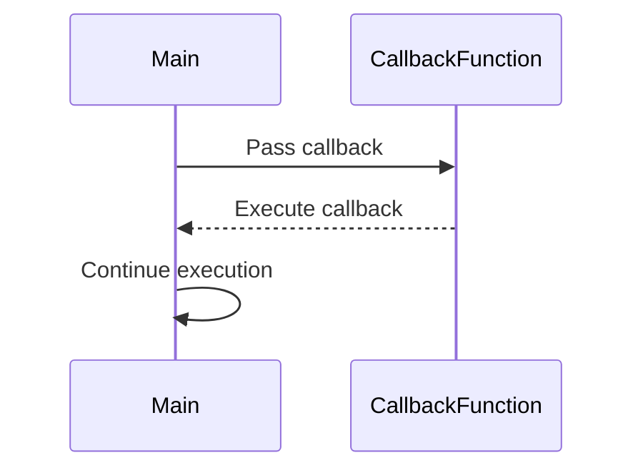

## 8.4 Callback Pattern

In the realm of JavaScript and TypeScript, callbacks have long been a cornerstone for handling asynchronous operations. As expert developers, understanding the callback pattern is crucial, not only for historical context but also for its continued relevance in certain scenarios. In this section, we will delve into the intricacies of callbacks, explore their usage, and discuss their limitations compared to modern alternatives like Promises and `async`/`await`.

### What is a Callback?

A callback is a function passed as an argument to another function, which is then invoked inside the outer function to complete some kind of routine or action. In JavaScript and TypeScript, callbacks are commonly used to handle asynchronous operations, such as reading files, making HTTP requests, or interacting with databases.

```typescript
// Example of a simple callback function
function fetchData(callback: (data: string) => void): void {
    setTimeout(() => {
        const data = "Sample Data";
        callback(data);
    }, 1000);
}

// Invoking the callback
fetchData((data) => {
    console.log("Received:", data);
});
```

In this example, `fetchData` takes a callback function that logs the received data. The `setTimeout` function simulates an asynchronous operation.

### Historical Context of Callbacks

Before the introduction of Promises and `async`/`await`, callbacks were the primary mechanism for handling asynchronous operations in JavaScript. They provided a way to execute code after a certain task was completed, such as fetching data from a server or reading a file from disk. However, as applications grew in complexity, so did the challenges associated with using callbacks.

### Challenges with Callbacks

#### Callback Hell

One of the most notorious issues with callbacks is "callback hell," a situation where callbacks are nested within other callbacks, leading to deeply indented and hard-to-read code. This often occurs when multiple asynchronous operations need to be performed in sequence.

```typescript
// Example of callback hell
function first(callback: (result: string) => void) {
    setTimeout(() => {
        callback("First");
    }, 1000);
}

function second(callback: (result: string) => void) {
    setTimeout(() => {
        callback("Second");
    }, 1000);
}

function third(callback: (result: string) => void) {
    setTimeout(() => {
        callback("Third");
    }, 1000);
}

first((result1) => {
    console.log(result1);
    second((result2) => {
        console.log(result2);
        third((result3) => {
            console.log(result3);
        });
    });
});
```

This pyramid-like structure makes the code difficult to maintain and debug.

#### Error Handling

Handling errors in callback-based code can be cumbersome. Unlike Promises, which have built-in error handling mechanisms, callbacks require explicit error handling, often leading to additional complexity.

```typescript
// Error handling with callbacks
function fetchDataWithError(callback: (error: Error | null, data?: string) => void): void {
    setTimeout(() => {
        const error = Math.random() > 0.5 ? new Error("Something went wrong!") : null;
        const data = error ? undefined : "Sample Data";
        callback(error, data);
    }, 1000);
}

fetchDataWithError((error, data) => {
    if (error) {
        console.error("Error:", error.message);
    } else {
        console.log("Received:", data);
    }
});
```

### Typing Callbacks in TypeScript

TypeScript enhances the callback pattern by allowing us to define types for callback functions, improving code clarity and type safety.

```typescript
// Typing a callback function
type CallbackFunction = (error: Error | null, data?: string) => void;

function fetchDataTyped(callback: CallbackFunction): void {
    setTimeout(() => {
        const data = "Typed Data";
        callback(null, data);
    }, 1000);
}

fetchDataTyped((error, data) => {
    if (error) {
        console.error("Error:", error.message);
    } else {
        console.log("Received:", data);
    }
});
```

By defining a `CallbackFunction` type, we ensure that any function passed as a callback adheres to the expected signature.

### Modern Alternatives: Promises and `async`/`await`

While callbacks are still relevant, modern JavaScript and TypeScript development often favors Promises and `async`/`await` for handling asynchronous operations due to their improved readability and error handling.

#### Promises

Promises represent a value that may be available now, or in the future, or never. They provide a cleaner way to chain asynchronous operations and handle errors.

```typescript
// Using Promises
function fetchDataPromise(): Promise<string> {
    return new Promise((resolve, reject) => {
        setTimeout(() => {
            const data = "Promise Data";
            resolve(data);
        }, 1000);
    });
}

fetchDataPromise()
    .then((data) => {
        console.log("Received:", data);
    })
    .catch((error) => {
        console.error("Error:", error.message);
    });
```

#### `async`/`await`

The `async`/`await` syntax allows us to write asynchronous code in a synchronous style, making it easier to read and maintain.

```typescript
// Using async/await
async function fetchDataAsync(): Promise<void> {
    try {
        const data = await fetchDataPromise();
        console.log("Received:", data);
    } catch (error) {
        console.error("Error:", error.message);
    }
}

fetchDataAsync();
```

### When to Use Callbacks

Despite the advantages of Promises and `async`/`await`, there are scenarios where callbacks remain relevant:

- **Legacy Code**: Many existing libraries and APIs still use callbacks.
- **Event Handlers**: Callbacks are commonly used in event-driven programming, such as handling user interactions in web applications.
- **Performance**: In some cases, callbacks can offer performance benefits by avoiding the overhead associated with Promises.

### Best Practices for Using Callbacks

1. **Avoid Deep Nesting**: Use named functions or modularize your code to prevent callback hell.
2. **Consistent Error Handling**: Always handle errors in callbacks to prevent unhandled exceptions.
3. **Use TypeScript's Type System**: Define types for callbacks to ensure type safety and improve code readability.
4. **Consider Alternatives**: Evaluate whether Promises or `async`/`await` would be more appropriate for your use case.

### Visualizing Callback Execution

To better understand how callbacks work, let's visualize the flow of a simple callback execution using a sequence diagram.



This diagram illustrates how the main function passes a callback to another function, which then executes the callback, allowing the main function to continue its execution.

### Try It Yourself

Experiment with the provided code examples by modifying the callback functions. Try adding additional asynchronous operations or error handling logic to see how it affects the flow of execution.

### Summary

The callback pattern is a fundamental concept in JavaScript and TypeScript development, providing a way to handle asynchronous operations. While modern alternatives like Promises and `async`/`await` offer improved readability and error handling, callbacks remain relevant in certain scenarios. By understanding the challenges and best practices associated with callbacks, we can effectively integrate them into our TypeScript applications.

## Quiz Time!



### What is a callback in JavaScript and TypeScript?

- [x] A function passed as an argument to another function
- [ ] A function that always returns a Promise
- [ ] A synchronous function that blocks execution
- [ ] A function that is automatically executed at program start

> **Explanation:** A callback is a function passed as an argument to another function, which is then invoked inside the outer function to complete some kind of routine or action.

### What is "callback hell"?

- [x] A situation where callbacks are nested within other callbacks, leading to deeply indented code
- [ ] A scenario where callbacks are used without error handling
- [ ] A problem caused by using too many Promises
- [ ] A type error caused by incorrect callback typing

> **Explanation:** "Callback hell" refers to a situation where callbacks are nested within other callbacks, leading to deeply indented and hard-to-read code.

### How can you type a callback function in TypeScript?

- [x] By defining a type or interface for the callback function
- [ ] By using the `any` type for the callback
- [ ] By declaring the callback as a `Promise`
- [ ] By using `async`/`await` inside the callback

> **Explanation:** In TypeScript, you can define a type or interface for the callback function to ensure it adheres to the expected signature.

### What is a common challenge associated with callbacks?

- [x] Difficulty in error handling
- [ ] Lack of support for asynchronous operations
- [ ] Incompatibility with TypeScript
- [ ] Inability to handle synchronous code

> **Explanation:** A common challenge with callbacks is difficulty in error handling, as they require explicit error handling mechanisms.

### How do Promises improve over callbacks?

- [x] By providing a cleaner way to chain asynchronous operations and handle errors
- [ ] By eliminating the need for asynchronous operations
- [ ] By automatically converting all callbacks to synchronous functions
- [ ] By using the `any` type for all operations

> **Explanation:** Promises provide a cleaner way to chain asynchronous operations and handle errors, improving readability and maintainability.

### When might callbacks still be relevant?

- [x] In legacy code and certain APIs
- [ ] When using `async`/`await`
- [ ] When working with synchronous code
- [ ] When using TypeScript's `any` type

> **Explanation:** Callbacks remain relevant in legacy code and certain APIs that still use them for handling asynchronous operations.

### What is a best practice for using callbacks?

- [x] Avoid deep nesting to prevent callback hell
- [ ] Always use the `any` type for callbacks
- [ ] Avoid error handling in callbacks
- [ ] Use callbacks only for synchronous operations

> **Explanation:** A best practice for using callbacks is to avoid deep nesting to prevent callback hell and improve code readability.

### How can you handle errors in callback-based code?

- [x] By explicitly checking for errors and handling them in the callback
- [ ] By using `async`/`await` inside the callback
- [ ] By ignoring errors altogether
- [ ] By converting callbacks to Promises

> **Explanation:** In callback-based code, errors should be explicitly checked and handled within the callback function to prevent unhandled exceptions.

### What is the main advantage of using `async`/`await` over callbacks?

- [x] It allows writing asynchronous code in a synchronous style
- [ ] It automatically converts all callbacks to synchronous functions
- [ ] It eliminates the need for error handling
- [ ] It only works with synchronous operations

> **Explanation:** The main advantage of using `async`/`await` is that it allows writing asynchronous code in a synchronous style, making it easier to read and maintain.

### True or False: Callbacks are no longer used in modern JavaScript and TypeScript development.

- [ ] True
- [x] False

> **Explanation:** False. While modern alternatives like Promises and `async`/`await` are often preferred, callbacks are still used in certain scenarios, such as legacy code and event handlers.



Remember, mastering the callback pattern is just the beginning of your journey in asynchronous programming with TypeScript. As you continue to explore and experiment, you'll gain a deeper understanding of how to effectively manage asynchronous operations in your applications. Keep pushing the boundaries, stay curious, and enjoy the process!
