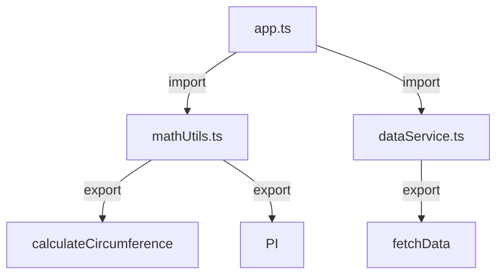

## 8.5.1 Implementing Modules in TypeScript

In the realm of modern software development, managing code organization and dependencies is crucial for building scalable and maintainable applications. TypeScript, with its robust module system, provides developers with powerful tools to encapsulate code and manage dependencies effectively. In this section, we will explore how to implement modules in TypeScript, focusing on encapsulating asynchronous functionality and promoting better code organization.

### Understanding TypeScript Modules

TypeScript's module system is built on top of the ECMAScript 2015 (ES6) module syntax, which introduces `import` and `export` statements. This system allows developers to break down their code into smaller, reusable pieces, known as modules. Modules can export classes, functions, variables, or interfaces, which can then be imported and used in other parts of the application.

#### Exporting from a Module

To create a module, you simply need to export the entities you want to make available to other modules. Here's an example of a simple module that exports a function and a variable:

```typescript
// mathUtils.ts
export const PI = 3.14159;

export function calculateCircumference(diameter: number): number {
    return diameter * PI;
}
```

In this example, we have a module named `mathUtils.ts` that exports a constant `PI` and a function `calculateCircumference`. These exports can be imported into other modules.

#### Importing a Module

To use the exports from a module, you need to import them using the `import` statement. Here's how you can import and use the `mathUtils` module:

```typescript
// app.ts
import { PI, calculateCircumference } from './mathUtils';

console.log(`The circumference is: ${calculateCircumference(10)}`);
```

In this example, we import the `PI` constant and the `calculateCircumference` function from the `mathUtils` module and use them in our `app.ts` file.

### Benefits of TypeScript Modules

TypeScript modules offer several advantages over traditional Immediately Invoked Function Expressions (IIFEs) and closures, especially when dealing with asynchronous code:

1. **Encapsulation and Isolation**: Modules help encapsulate code, preventing namespace pollution and ensuring that variables and functions are only accessible where they are needed.

2. **Type Safety**: TypeScript's type system provides compile-time checks, reducing runtime errors and making refactoring easier.

3. **Scalability**: Modules allow for better organization of code, making it easier to manage larger codebases.

4. **Dependency Management**: Modules make it easy to manage dependencies, as you can explicitly declare what each module requires and provides.

5. **Asynchronous Code Isolation**: Modules can encapsulate asynchronous functionality, making it easier to manage state and side effects.

### Organizing Asynchronous Code with Modules

When dealing with asynchronous code, such as network requests or file I/O, modules can help isolate and manage this functionality. Let's consider an example where we encapsulate asynchronous operations in a module:

```typescript
// dataService.ts
export async function fetchData(url: string): Promise<any> {
    const response = await fetch(url);
    if (!response.ok) {
        throw new Error('Network response was not ok');
    }
    return response.json();
}
```

In this `dataService.ts` module, we define an asynchronous function `fetchData` that fetches data from a given URL. By encapsulating this functionality in a module, we can easily manage the asynchronous operation and handle errors.

#### Using the Asynchronous Module

To use the `fetchData` function in another module, we simply import it and handle the asynchronous operation:

```typescript
// app.ts
import { fetchData } from './dataService';

async function displayData() {
    try {
        const data = await fetchData('https://api.example.com/data');
        console.log('Data:', data);
    } catch (error) {
        console.error('Error fetching data:', error);
    }
}

displayData();
```

In this example, we import the `fetchData` function and use it within an `async` function `displayData`. This approach keeps our asynchronous code organized and manageable.

### Module Resolution Strategies

TypeScript provides several module resolution strategies to determine how modules are located and imported. Understanding these strategies is crucial for configuring your TypeScript projects effectively.

#### Classic vs. Node Module Resolution

TypeScript supports two primary module resolution strategies: Classic and Node.

- **Classic**: This is the default strategy used in older versions of TypeScript. It resolves modules relative to the base URL or the current directory.

- **Node**: This strategy mimics the Node.js module resolution mechanism, which is widely used in modern TypeScript projects. It resolves modules by searching in `node_modules` directories and supports package.json files.

You can configure the module resolution strategy in your `tsconfig.json` file:

```json
{
  "compilerOptions": {
    "moduleResolution": "node"
  }
}
```

#### Path Mapping

TypeScript allows you to define custom path mappings to simplify module imports. This is particularly useful in large projects where you want to avoid long relative paths. Here's an example configuration:

```json
{
  "compilerOptions": {
    "baseUrl": "./",
    "paths": {
      "@utils/*": ["src/utils/*"],
      "@components/*": ["src/components/*"]
    }
  }
}
```

With this configuration, you can import modules using the defined aliases:

```typescript
import { calculateCircumference } from '@utils/mathUtils';
```

### Organizing Project Structure with Modules

A well-organized project structure is essential for scalability and maintainability. Here are some best practices for organizing your TypeScript projects with modules:

1. **Feature-Based Structure**: Organize your code by features, grouping related modules together. This approach makes it easier to navigate and manage the codebase.

2. **Use Index Files**: Create `index.ts` files in each directory to re-export modules. This simplifies imports and keeps your code clean.

3. **Separate Concerns**: Keep different concerns in separate modules, such as separating data access, business logic, and UI components.

4. **Consistent Naming Conventions**: Use consistent naming conventions for modules and files to improve readability and discoverability.

5. **Document Your Modules**: Provide documentation for each module, explaining its purpose and usage. This is especially important in large teams or open-source projects.

### Try It Yourself

To reinforce your understanding of TypeScript modules, try modifying the examples provided. Here are some suggestions:

- **Add More Exports**: Extend the `mathUtils` module with additional mathematical functions and constants.

- **Create a New Module**: Implement a new module that handles user authentication, including functions for login and logout.

- **Experiment with Path Mapping**: Configure path mappings in your `tsconfig.json` file and refactor your imports to use aliases.

### Visualizing Module Interaction

To better understand how modules interact in a TypeScript project, let's visualize the relationship between them using a Mermaid.js diagram:



This diagram illustrates how the `app.ts` module imports functionality from `mathUtils.ts` and `dataService.ts`, and how these modules export their entities.

### References and Further Reading

For more information on TypeScript modules and best practices, consider exploring the following resources:

- [TypeScript Handbook: Modules](https://www.typescriptlang.org/docs/handbook/modules.html)
- [MDN Web Docs: JavaScript Modules](https://developer.mozilla.org/en-US/docs/Web/JavaScript/Guide/Modules)
- [Node.js Module Documentation](https://nodejs.org/api/modules.html)

### Knowledge Check

Before moving on, take a moment to reflect on what you've learned. Consider the following questions:

- How do TypeScript modules help encapsulate asynchronous functionality?
- What are the benefits of using TypeScript modules over traditional IIFEs?
- How can you configure module resolution strategies in a TypeScript project?

### Embrace the Journey

Remember, mastering TypeScript modules is a journey. As you continue to build more complex applications, you'll find that modules play a crucial role in organizing and managing your code. Keep experimenting, stay curious, and enjoy the process of becoming a more proficient TypeScript developer!

## Quiz Time!



### What is the primary purpose of using modules in TypeScript?

- [x] To encapsulate code and manage dependencies
- [ ] To increase the execution speed of the code
- [ ] To reduce the file size of the application
- [ ] To enable dynamic typing in TypeScript

> **Explanation:** Modules in TypeScript are used to encapsulate code and manage dependencies, promoting better organization and isolation of functionality.

### Which statement correctly imports the `calculateCircumference` function from `mathUtils.ts`?

- [ ] import { calculateCircumference } from 'mathUtils';
- [x] import { calculateCircumference } from './mathUtils';
- [ ] import calculateCircumference from './mathUtils';
- [ ] import calculateCircumference from 'mathUtils';

> **Explanation:** The correct import statement uses a relative path to the module file, prefixed with `./`.

### What is a key advantage of using TypeScript modules over traditional IIFEs?

- [x] Better type checking and easier refactoring
- [ ] Faster execution time
- [ ] Smaller file size
- [ ] Dynamic typing support

> **Explanation:** TypeScript modules offer better type checking and easier refactoring compared to traditional IIFEs.

### How can you configure custom path mappings in a TypeScript project?

- [ ] By using the `import` statement
- [x] By setting the `paths` option in `tsconfig.json`
- [ ] By modifying the `package.json` file
- [ ] By using environment variables

> **Explanation:** Custom path mappings are configured in the `tsconfig.json` file using the `paths` option.

### Which module resolution strategy mimics Node.js?

- [ ] Classic
- [x] Node
- [ ] ES6
- [ ] CommonJS

> **Explanation:** The Node module resolution strategy mimics the module resolution mechanism used by Node.js.

### What is the purpose of an `index.ts` file in a module directory?

- [x] To re-export modules and simplify imports
- [ ] To provide documentation for the module
- [ ] To define the main entry point of the application
- [ ] To configure module resolution strategies

> **Explanation:** An `index.ts` file is used to re-export modules, simplifying imports and keeping the code clean.

### How do modules help isolate asynchronous code and state?

- [x] By encapsulating functionality and preventing namespace pollution
- [ ] By increasing the execution speed of asynchronous operations
- [ ] By reducing the complexity of asynchronous code
- [ ] By enabling dynamic typing in TypeScript

> **Explanation:** Modules encapsulate functionality, preventing namespace pollution and helping to manage asynchronous code and state.

### What is the default module resolution strategy in TypeScript?

- [ ] Node
- [x] Classic
- [ ] ES6
- [ ] CommonJS

> **Explanation:** The default module resolution strategy in TypeScript is Classic.

### Which of the following is a benefit of using TypeScript modules?

- [x] Scalability and better organization of code
- [ ] Faster execution time
- [ ] Smaller file size
- [ ] Dynamic typing support

> **Explanation:** TypeScript modules provide scalability and better organization of code, making it easier to manage larger codebases.

### True or False: Modules in TypeScript can only export functions.

- [ ] True
- [x] False

> **Explanation:** Modules in TypeScript can export functions, variables, classes, and interfaces, not just functions.


