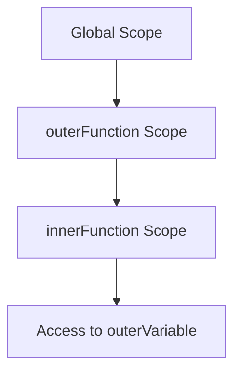

## 8.5.2 Closure Usage

Closures are a fundamental concept in JavaScript and TypeScript, enabling powerful programming techniques such as data encapsulation, state management, and asynchronous operations. In this section, we will delve into the intricacies of closures, explore their practical applications, and provide best practices for using them effectively in TypeScript.

### Understanding Closures

A **closure** is a feature in JavaScript where an inner function has access to the outer (enclosing) function's variables. This access is preserved even after the outer function has completed execution. Closures are created every time a function is created, at function creation time.

#### How Closures Work

In JavaScript, functions are first-class citizens, meaning they can be passed around as arguments, returned from other functions, and assigned to variables. A closure is formed when a function is defined within another function, and it retains access to the outer function's scope.

```typescript
function outerFunction(outerVariable: string) {
    return function innerFunction(innerVariable: string) {
        console.log(`Outer Variable: ${outerVariable}`);
        console.log(`Inner Variable: ${innerVariable}`);
    };
}

const closureExample = outerFunction('Hello');
closureExample('World');
// Output:
// Outer Variable: Hello
// Inner Variable: World
```

In this example, `innerFunction` is a closure that captures `outerVariable` from `outerFunction`. Even after `outerFunction` has returned, `innerFunction` retains access to `outerVariable`.

### Practical Uses of Closures

Closures are particularly useful in asynchronous programming, where they can maintain context across asynchronous operations. Let's explore some practical scenarios where closures shine.

#### Maintaining Context in Callbacks

In asynchronous programming, closures can be used to retain context in callbacks, ensuring that variables are available when the callback is executed.

```typescript
function fetchData(url: string) {
    const timestamp = new Date().toISOString();
    setTimeout(() => {
        console.log(`Data fetched from ${url} at ${timestamp}`);
    }, 1000);
}

fetchData('https://api.example.com/data');
// Output after 1 second:
// Data fetched from https://api.example.com/data at 2024-11-17T12:00:00.000Z
```

Here, the closure formed by the arrow function inside `setTimeout` retains access to `url` and `timestamp`, allowing them to be used when the asynchronous operation completes.

#### Event Handlers

Closures are also beneficial in event handling, where they can capture and maintain state across multiple event occurrences.

```typescript
function createButtonHandler(buttonId: string) {
    let clickCount = 0;
    document.getElementById(buttonId)?.addEventListener('click', () => {
        clickCount++;
        console.log(`Button ${buttonId} clicked ${clickCount} times`);
    });
}

createButtonHandler('myButton');
```

In this example, the closure created by the event listener retains access to `clickCount`, allowing it to persist across multiple clicks.

### Common Issues with Closures

While closures are powerful, they can also lead to common pitfalls, especially when dealing with loops and asynchronous operations.

#### Loop Variable Referencing

A common issue arises when closures capture loop variables, leading to unexpected behavior due to the variable's changing value.

```typescript
for (var i = 0; i < 3; i++) {
    setTimeout(() => {
        console.log(i);
    }, 1000);
}
// Output after 1 second:
// 3
// 3
// 3
```

In this example, all closures capture the same `i` variable, which has the value `3` by the time the `setTimeout` callbacks execute.

#### Avoiding Loop Variable Issues

To avoid this issue, use `let` instead of `var`, as `let` creates a new binding for each iteration of the loop.

```typescript
for (let i = 0; i < 3; i++) {
    setTimeout(() => {
        console.log(i);
    }, 1000);
}
// Output after 1 second:
// 0
// 1
// 2
```

Alternatively, you can use an Immediately Invoked Function Expression (IIFE) to create a new scope for each iteration.

```typescript
for (var i = 0; i < 3; i++) {
    ((j) => {
        setTimeout(() => {
            console.log(j);
        }, 1000);
    })(i);
}
// Output after 1 second:
// 0
// 1
// 2
```

### Memory Management and Closures

Closures can inadvertently lead to memory leaks if not managed properly. Since closures retain references to the outer function's variables, they can prevent garbage collection of those variables, leading to increased memory usage.

#### Avoiding Memory Leaks

To avoid memory leaks, ensure that closures do not hold onto large objects or unnecessary references longer than needed. Use closures judiciously and clean up references when they are no longer required.

### Best Practices for Using Closures

To use closures effectively and safely in TypeScript applications, consider the following best practices:

1. **Use `let` and `const`**: Prefer `let` and `const` over `var` to ensure block-scoped variables and avoid issues with loop variable referencing.

2. **Limit Scope**: Keep the closure's scope as small as possible to minimize memory usage and potential leaks.

3. **Avoid Unnecessary Closures**: Only use closures when necessary. Avoid creating closures in performance-critical code paths unless needed.

4. **Clean Up References**: Explicitly remove references to closures when they are no longer needed, especially in long-running applications.

5. **Document Closure Usage**: Clearly document where and why closures are used, especially in complex codebases, to aid understanding and maintenance.

### Try It Yourself

Experiment with closures by modifying the examples provided. Try creating a closure that maintains state across multiple asynchronous operations, or use closures to encapsulate private data within a module.

### Visualizing Closure Scope

To better understand how closures capture and retain variables, let's visualize the scope chain using a diagram.



**Diagram Description**: This diagram illustrates the scope chain for the closure example. The `innerFunction` scope has access to the `outerFunction` scope, which includes `outerVariable`.

### References and Further Reading

- [MDN Web Docs: Closures](https://developer.mozilla.org/en-US/docs/Web/JavaScript/Closures)
- [JavaScript Info: Closures](https://javascript.info/closure)
- [TypeScript Handbook: Functions](https://www.typescriptlang.org/docs/handbook/functions.html)

### Knowledge Check

- What is a closure, and how is it formed?
- How can closures be used to maintain state in asynchronous operations?
- What common issues can arise with closures, and how can they be avoided?
- How can closures lead to memory leaks, and what practices help prevent them?

### Embrace the Journey

Remember, mastering closures is a journey. As you continue to explore and experiment with closures, you'll discover new ways to leverage their power in your TypeScript applications. Stay curious, keep learning, and enjoy the process!

## Quiz Time!



### What is a closure in JavaScript?

- [x] A function that retains access to its outer scope's variables even after the outer function has returned.
- [ ] A function that is immediately invoked.
- [ ] A function that only operates on global variables.
- [ ] A function that cannot access variables from its outer scope.

> **Explanation:** A closure is a function that retains access to variables in its outer scope even after the outer function has finished executing.

### How can closures be useful in asynchronous programming?

- [x] They can maintain context across asynchronous operations.
- [ ] They prevent asynchronous operations from executing.
- [ ] They automatically handle errors in asynchronous code.
- [ ] They eliminate the need for callbacks.

> **Explanation:** Closures can maintain context across asynchronous operations by retaining access to variables that are needed when the asynchronous operation completes.

### What issue can arise when using closures with loop variables?

- [x] Closures may capture the loop variable's final value rather than its value at each iteration.
- [ ] Closures cannot access loop variables at all.
- [ ] Closures will always cause memory leaks when used with loops.
- [ ] Closures will prevent loops from executing.

> **Explanation:** Closures can capture the loop variable's final value if `var` is used, leading to unexpected behavior. Using `let` or IIFE can avoid this issue.

### How can you avoid closure-related issues with loop variables?

- [x] Use `let` to create a new binding for each iteration.
- [ ] Use `var` to ensure the loop variable is accessible.
- [ ] Avoid using loops altogether.
- [ ] Use global variables instead.

> **Explanation:** Using `let` creates a new binding for each iteration, ensuring that closures capture the correct value of the loop variable.

### What is a potential downside of using closures?

- [x] They can lead to memory leaks if not managed properly.
- [ ] They prevent functions from being reused.
- [ ] They cannot be used in asynchronous programming.
- [ ] They always slow down program execution.

> **Explanation:** Closures can lead to memory leaks if they retain references to large objects or unnecessary data that is not cleared.

### Which of the following is a best practice for using closures?

- [x] Limit the scope of closures to minimize memory usage.
- [ ] Always use closures for every function.
- [ ] Avoid using closures in asynchronous code.
- [ ] Use closures to replace all global variables.

> **Explanation:** Limiting the scope of closures helps minimize memory usage and potential leaks, making them more efficient and manageable.

### How can closures contribute to encapsulation?

- [x] They allow functions to retain private variables and function scopes.
- [ ] They expose all variables to the global scope.
- [ ] They prevent any variable from being accessed.
- [ ] They eliminate the need for functions.

> **Explanation:** Closures allow functions to retain private variables and function scopes, contributing to data encapsulation and modularity.

### What is the role of an IIFE in managing closures?

- [x] It creates a new scope for each iteration or function call.
- [ ] It prevents closures from being created.
- [ ] It makes all variables global.
- [ ] It automatically optimizes memory usage.

> **Explanation:** An IIFE creates a new scope for each iteration or function call, helping manage closures and avoid issues with loop variables.

### Why is it important to clean up references in closures?

- [x] To prevent memory leaks and ensure efficient memory usage.
- [ ] To make the code run faster.
- [ ] To ensure closures are never used.
- [ ] To prevent closures from being created.

> **Explanation:** Cleaning up references in closures prevents memory leaks and ensures efficient memory usage, especially in long-running applications.

### True or False: Closures can only be used in synchronous code.

- [ ] True
- [x] False

> **Explanation:** False. Closures are particularly useful in asynchronous code, where they can maintain context and state across asynchronous operations.


