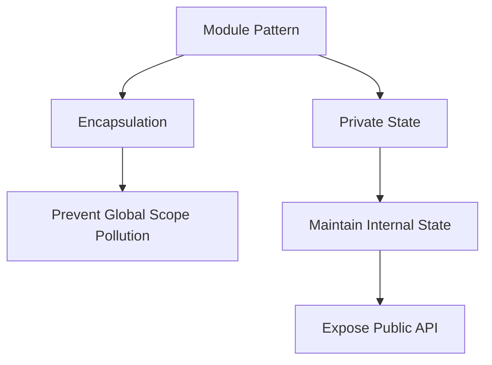

## 8.5.3 Use Cases and Examples

In the realm of TypeScript and JavaScript, the Module Pattern with Immediately Invoked Function Expressions (IIFEs) and closures is a powerful technique for encapsulating code and managing scope. This pattern is particularly useful in environments where ES6 modules are not available or when building code for legacy systems. In this section, we will explore various real-world use cases and examples that demonstrate the effectiveness of this pattern in creating maintainable, scalable, and efficient code.

### Understanding the Module Pattern with IIFEs and Closures

Before diving into the use cases, let's briefly revisit the concepts of IIFEs and closures, which are foundational to the Module Pattern.

#### IIFE (Immediately Invoked Function Expression)

An IIFE is a function that is executed immediately after it is defined. It is a common JavaScript pattern used to create a new scope, thereby avoiding polluting the global scope.

```typescript
(function() {
    console.log("This is an IIFE!");
})();
```

In the above example, the function is defined and immediately invoked, creating a new scope for its variables.

#### Closures

A closure is a function that retains access to its lexical scope, even when the function is executed outside that scope. Closures are crucial for maintaining private state in the Module Pattern.

```typescript
function createCounter() {
    let count = 0;
    return function() {
        return ++count;
    };
}

const counter = createCounter();
console.log(counter()); // 1
console.log(counter()); // 2
```

In this example, the `createCounter` function returns a closure that has access to the `count` variable, allowing it to maintain state across invocations.

### Use Cases for the Module Pattern

#### 1. Creating Singleton Services or Utilities

The Module Pattern is ideal for creating singleton services or utilities that maintain internal state. This is particularly useful in applications where a single instance of a service is needed throughout the application lifecycle.

**Example: Logger Service**

Consider a logging service that needs to maintain a log level and provide methods to log messages at different levels.

```typescript
const Logger = (function() {
    let logLevel = "info";

    function log(message: string, level: string) {
        if (level === logLevel) {
            console.log(`[${level.toUpperCase()}]: ${message}`);
        }
    }

    return {
        setLogLevel: function(level: string) {
            logLevel = level;
        },
        info: function(message: string) {
            log(message, "info");
        },
        error: function(message: string) {
            log(message, "error");
        }
    };
})();

Logger.setLogLevel("error");
Logger.info("This is an info message."); // Won't be logged
Logger.error("This is an error message."); // Will be logged
```

**Explanation:**

- The `Logger` module encapsulates the `logLevel` variable, keeping it private.
- The module exposes methods to set the log level and log messages, maintaining a single instance throughout the application.

#### 2. Encapsulating Third-Party Library Interfaces

When integrating third-party libraries, the Module Pattern can be used to encapsulate the library's interface, abstracting complexity and providing a simplified API for the rest of the application.

**Example: jQuery Wrapper**

Suppose we are using jQuery in a legacy application. We can create a module to encapsulate jQuery operations.

```typescript
const jQueryWrapper = (function($) {
    function hideElement(selector: string) {
        $(selector).hide();
    }

    function showElement(selector: string) {
        $(selector).show();
    }

    return {
        hide: hideElement,
        show: showElement
    };
})(jQuery);

jQueryWrapper.hide("#myElement");
jQueryWrapper.show("#myElement");
```

**Explanation:**

- The `jQueryWrapper` module takes jQuery as a parameter, encapsulating its usage.
- The module provides `hide` and `show` methods, abstracting jQuery's complexity.

#### 3. Implementing Feature Toggles or Configuration Management

Feature toggles and configuration management are essential for controlling application behavior without redeploying code. The Module Pattern allows for encapsulating configuration within a closure, maintaining private state.

**Example: Feature Toggle**

```typescript
const FeatureToggle = (function() {
    const features = {
        darkMode: false,
        newDashboard: true
    };

    return {
        isEnabled: function(feature: string) {
            return features[feature] || false;
        },
        setFeature: function(feature: string, isEnabled: boolean) {
            features[feature] = isEnabled;
        }
    };
})();

console.log(FeatureToggle.isEnabled("darkMode")); // false
FeatureToggle.setFeature("darkMode", true);
console.log(FeatureToggle.isEnabled("darkMode")); // true
```

**Explanation:**

- The `FeatureToggle` module maintains a private `features` object.
- The module provides methods to check and set feature states, encapsulating configuration logic.

### Advantages of Using the Module Pattern

- **Encapsulation**: The Module Pattern encapsulates functionality, preventing global scope pollution and maintaining private state.
- **Reusability**: Modules can be reused across different parts of an application, promoting DRY (Don't Repeat Yourself) principles.
- **Maintainability**: By encapsulating related functionality, the Module Pattern enhances code organization and maintainability.

### Challenges and Considerations

While the Module Pattern offers numerous benefits, it also introduces some challenges:

- **Complexity**: Using closures for encapsulation can introduce complexity, especially in large applications. It's important to balance encapsulation with simplicity.
- **Performance**: Overuse of closures can lead to performance issues due to increased memory usage. It's crucial to use closures judiciously.
- **Modern Alternatives**: With the advent of ES6 modules, the need for the Module Pattern has diminished in modern JavaScript environments. However, understanding this pattern remains valuable, especially when working with legacy systems or environments lacking module support.

### Encouraging Exploration

As expert developers, it's essential to understand foundational patterns like the Module Pattern. While modern module systems offer more robust solutions, the principles of encapsulation and scope management remain relevant. By mastering these concepts, you'll be better equipped to tackle complex challenges and build scalable, maintainable applications.

### Try It Yourself

To deepen your understanding, try modifying the examples above:

- **Logger Service**: Add more log levels (e.g., `debug`, `warn`) and implement a method to retrieve the current log level.
- **jQuery Wrapper**: Extend the wrapper to include more jQuery methods, such as `fadeIn` and `fadeOut`.
- **Feature Toggle**: Implement a method to list all enabled features and explore how to persist feature states across sessions.

### Visualizing the Module Pattern

Let's visualize the Module Pattern using a diagram to illustrate how it encapsulates functionality and maintains private state.



**Diagram Explanation:**

- The Module Pattern encapsulates functionality, preventing global scope pollution and maintaining private state.
- It exposes a public API, allowing controlled access to the module's functionality.

### References and Further Reading

For more information on the Module Pattern and related concepts, consider exploring the following resources:

- [MDN Web Docs: Closures](https://developer.mozilla.org/en-US/docs/Web/JavaScript/Closures)
- [MDN Web Docs: IIFE](https://developer.mozilla.org/en-US/docs/Glossary/IIFE)
- [JavaScript Design Patterns](https://addyosmani.com/resources/essentialjsdesignpatterns/book/)

### Knowledge Check

To reinforce your understanding, consider the following questions:

- What are the key benefits of using the Module Pattern?
- How does the Module Pattern prevent global scope pollution?
- What are some challenges associated with using closures for encapsulation?
- How can the Module Pattern be used to implement feature toggles?

Remember, this is just the beginning. As you progress, you'll build more complex and interactive applications. Keep experimenting, stay curious, and enjoy the journey!

## Quiz Time!



### What is the primary purpose of using the Module Pattern with IIFEs and closures?

- [x] To encapsulate functionality and prevent global scope pollution
- [ ] To increase the execution speed of JavaScript code
- [ ] To simplify the syntax of JavaScript functions
- [ ] To enable the use of ES6 modules in older environments

> **Explanation:** The Module Pattern with IIFEs and closures is primarily used to encapsulate functionality and prevent global scope pollution by creating private scopes.

### How does the Module Pattern maintain private state?

- [x] By using closures to retain access to variables within the module
- [ ] By declaring variables in the global scope
- [ ] By using ES6 classes to encapsulate variables
- [ ] By storing variables in local storage

> **Explanation:** The Module Pattern maintains private state by using closures, which allow functions to retain access to their lexical scope, even when executed outside that scope.

### What is a potential drawback of overusing closures in the Module Pattern?

- [x] Increased memory usage and potential performance issues
- [ ] Lack of support for asynchronous operations
- [ ] Inability to use ES6 syntax
- [ ] Difficulty in debugging due to lack of error messages

> **Explanation:** Overusing closures can lead to increased memory usage and potential performance issues, as each closure retains its own scope.

### In what scenario is the Module Pattern particularly useful?

- [x] When building code for legacy systems without ES6 module support
- [ ] When working with modern JavaScript frameworks like React
- [ ] When using TypeScript's type system for static analysis
- [ ] When developing mobile applications with native code

> **Explanation:** The Module Pattern is particularly useful in environments where ES6 modules are not available, such as legacy systems.

### Which of the following is an example of using the Module Pattern?

- [x] Creating a singleton logger service with private log levels
- [ ] Using a class to define a data model
- [ ] Implementing a REST API with Express.js
- [ ] Writing a CSS stylesheet for a web page

> **Explanation:** Creating a singleton logger service with private log levels is an example of using the Module Pattern to encapsulate functionality and maintain private state.

### What is an IIFE in JavaScript?

- [x] A function that is executed immediately after it is defined
- [ ] A function that is declared but not invoked
- [ ] A function that is used to iterate over arrays
- [ ] A function that is used to handle asynchronous operations

> **Explanation:** An IIFE (Immediately Invoked Function Expression) is a function that is executed immediately after it is defined, creating a new scope.

### How can the Module Pattern be used to implement feature toggles?

- [x] By encapsulating feature states within a closure and providing methods to check and set states
- [ ] By using global variables to store feature states
- [ ] By using TypeScript interfaces to define feature states
- [ ] By storing feature states in a database

> **Explanation:** The Module Pattern can be used to implement feature toggles by encapsulating feature states within a closure and providing methods to check and set states.

### What is a common use case for encapsulating third-party library interfaces with the Module Pattern?

- [x] To abstract complexity and provide a simplified API
- [ ] To increase the performance of the library
- [ ] To convert the library to TypeScript
- [ ] To enable asynchronous operations

> **Explanation:** Encapsulating third-party library interfaces with the Module Pattern is commonly used to abstract complexity and provide a simplified API for the rest of the application.

### What is a closure in JavaScript?

- [x] A function that retains access to its lexical scope
- [ ] A function that is executed in the global scope
- [ ] A function that is used to handle events
- [ ] A function that is used to manipulate the DOM

> **Explanation:** A closure is a function that retains access to its lexical scope, even when the function is executed outside that scope.

### True or False: The Module Pattern is no longer relevant with the advent of ES6 modules.

- [ ] True
- [x] False

> **Explanation:** While ES6 modules offer more robust solutions, the Module Pattern remains relevant, especially in legacy systems or environments lacking module support.


