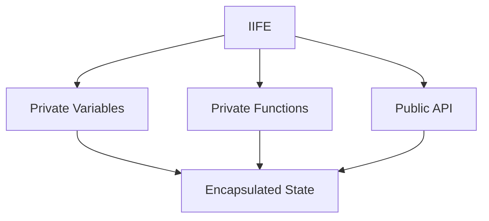

## 8.5 Module Pattern with IIFEs and Closures

In the world of software engineering, especially when dealing with JavaScript and TypeScript, managing scope and state effectively is crucial. The Module Pattern, combined with Immediately Invoked Function Expressions (IIFEs) and closures, offers a robust solution for encapsulating code and state. This section will delve into how these concepts work together, particularly in managing asynchronous operations, and how they can be leveraged in TypeScript to create more maintainable and organized code.

### Understanding the Module Pattern

The Module Pattern is a design pattern used to encapsulate code within a private scope, thus avoiding pollution of the global namespace. It is particularly useful in JavaScript, where variables and functions can easily become global if not properly contained. The pattern leverages closures to maintain state and provide a public interface for interacting with the encapsulated code.

#### Key Concepts

- **Encapsulation**: The Module Pattern encapsulates variables and functions within a private scope, exposing only what is necessary.
- **Closure**: A closure is a function that captures variables from its lexical scope, allowing it to maintain state across invocations.
- **IIFE**: An Immediately Invoked Function Expression is a function that is executed immediately after it is defined, creating a new scope.

### Implementing the Module Pattern with IIFEs and Closures

To implement the Module Pattern using IIFEs and closures in TypeScript, we define a function that is immediately invoked. This function returns an object containing methods that interact with the private variables and functions within the IIFE.

```typescript
const CounterModule = (function () {
  // Private variable
  let count = 0;

  // Private function
  function logCount() {
    console.log(`Current count: ${count}`);
  }

  // Public API
  return {
    increment: function () {
      count++;
      logCount();
    },
    decrement: function () {
      count--;
      logCount();
    },
    reset: function () {
      count = 0;
      logCount();
    }
  };
})();

// Usage
CounterModule.increment(); // Current count: 1
CounterModule.decrement(); // Current count: 0
CounterModule.reset();     // Current count: 0
```

In this example, `count` and `logCount` are private to the module, while `increment`, `decrement`, and `reset` are exposed as the public API.

### Managing Asynchronous Code with the Module Pattern

The Module Pattern is particularly useful for managing asynchronous code, as it allows you to encapsulate state and avoid global variables. By using closures, you can maintain state across asynchronous operations.

#### Example: Asynchronous Data Fetching

Let's consider a scenario where we need to fetch data asynchronously and maintain the fetched data within a module.

```typescript
const DataFetcherModule = (function () {
  let data: any = null;

  async function fetchData(url: string) {
    try {
      const response = await fetch(url);
      data = await response.json();
      console.log('Data fetched successfully:', data);
    } catch (error) {
      console.error('Error fetching data:', error);
    }
  }

  return {
    getData: function () {
      return data;
    },
    loadData: function (url: string) {
      fetchData(url);
    }
  };
})();

// Usage
DataFetcherModule.loadData('https://api.example.com/data');
setTimeout(() => {
  console.log('Fetched Data:', DataFetcherModule.getData());
}, 2000);
```

In this example, `data` is a private variable that holds the fetched data, and `fetchData` is a private function that performs the asynchronous operation. The public API consists of `getData` and `loadData`, allowing interaction with the module.

### Closures and Lexical Scope

Closures are a fundamental concept in JavaScript and TypeScript, allowing functions to capture variables from their lexical scope. This capability is what enables the Module Pattern to maintain state across asynchronous operations.

#### How Closures Work

A closure is created when a function is defined within another function and accesses variables from its parent scope. The inner function retains access to these variables even after the outer function has finished executing.

```typescript
function createCounter() {
  let count = 0;
  return function () {
    count++;
    return count;
  };
}

const counter = createCounter();
console.log(counter()); // 1
console.log(counter()); // 2
```

In this example, the inner function retains access to the `count` variable, demonstrating how closures capture and maintain state.

### Comparing Module Pattern with ES6 Modules

With the introduction of ES6 modules, JavaScript and TypeScript offer a more modern way to encapsulate code. However, the Module Pattern still has its place, especially in environments where ES6 modules are not supported or when you need to encapsulate code within a single file.

#### When to Use the Module Pattern

- **Legacy Code**: In projects where ES6 modules are not feasible due to legacy code or build constraints.
- **Single File Applications**: When you need to encapsulate code within a single file without setting up a module system.
- **Immediate Execution**: When you need to execute code immediately upon loading, such as initializing a library.

### Best Practices and Pitfalls

When using the Module Pattern with IIFEs and closures, there are several best practices and potential pitfalls to be aware of.

#### Best Practices

- **Minimize Global Variables**: Use the Module Pattern to encapsulate code and minimize the use of global variables.
- **Clear Public API**: Clearly define the public API of your module to ensure it is easy to use and understand.
- **Consistent Naming**: Use consistent naming conventions for private and public members to avoid confusion.

#### Potential Pitfalls

- **Variable Hoisting**: Be aware of JavaScript's variable hoisting behavior, which can lead to unexpected results if not properly managed.
- **Scope Confusion**: Ensure that you understand the scope of variables within your module to avoid accidental overwrites or leaks.

### Enhancing Code Organization and Maintainability

The Module Pattern, when used effectively, can greatly enhance code organization and maintainability. By encapsulating code within a private scope, you can prevent unintended interactions and ensure that your code is modular and easy to maintain.

#### Example: Organizing a Complex Application

Consider a complex application with multiple modules, each responsible for a different aspect of the application. By using the Module Pattern, you can encapsulate each module's state and functionality, exposing only what is necessary.

```typescript
const UserModule = (function () {
  let users: string[] = [];

  function addUser(user: string) {
    users.push(user);
    console.log(`User added: ${user}`);
  }

  function removeUser(user: string) {
    users = users.filter(u => u !== user);
    console.log(`User removed: ${user}`);
  }

  return {
    addUser,
    removeUser,
    listUsers: function () {
      return [...users];
    }
  };
})();

// Usage
UserModule.addUser('Alice');
UserModule.addUser('Bob');
console.log(UserModule.listUsers()); // ['Alice', 'Bob']
UserModule.removeUser('Alice');
console.log(UserModule.listUsers()); // ['Bob']
```

In this example, the `UserModule` encapsulates user management functionality, providing a clear and organized structure for the application.

### Visualizing the Module Pattern

To better understand how the Module Pattern works, let's visualize the interaction between IIFEs, closures, and the encapsulated state.



**Figure 1**: This diagram illustrates how an IIFE creates a private scope, encapsulating variables and functions. The public API interacts with the encapsulated state through closures.

### Try It Yourself

To deepen your understanding of the Module Pattern, try modifying the examples provided:

- **Add New Methods**: Extend the `CounterModule` or `UserModule` with additional methods and observe how they interact with the encapsulated state.
- **Experiment with Asynchronous Operations**: Modify the `DataFetcherModule` to handle multiple asynchronous requests and manage state accordingly.
- **Implement Error Handling**: Introduce error handling mechanisms within the modules to see how they affect the overall structure and maintainability.

### Conclusion

The Module Pattern, combined with IIFEs and closures, is a powerful tool for encapsulating code and managing state in TypeScript. While modern ES6 modules offer an alternative approach, the Module Pattern remains valuable in certain scenarios, particularly when dealing with legacy code or single-file applications. By understanding and applying these concepts, you can create more organized, maintainable, and efficient code.

Remember, this is just the beginning. As you progress, you'll build more complex and interactive applications. Keep experimenting, stay curious, and enjoy the journey!

## Quiz Time!



### What is the primary purpose of the Module Pattern?

- [x] To encapsulate code within a private scope
- [ ] To increase the performance of JavaScript code
- [ ] To replace ES6 modules
- [ ] To simplify asynchronous programming

> **Explanation:** The Module Pattern is primarily used to encapsulate code within a private scope, preventing global namespace pollution.

### How does an IIFE contribute to the Module Pattern?

- [x] It creates a private scope for variables and functions
- [ ] It improves the performance of the module
- [ ] It allows the module to be reused across different files
- [ ] It automatically optimizes the code

> **Explanation:** An IIFE creates a private scope, which is essential for encapsulating variables and functions in the Module Pattern.

### What is a closure in JavaScript?

- [x] A function that captures variables from its lexical scope
- [ ] A method to increase code execution speed
- [ ] A way to define global variables
- [ ] A feature exclusive to TypeScript

> **Explanation:** A closure is a function that captures variables from its lexical scope, allowing it to maintain state across invocations.

### In what scenario might the Module Pattern still be useful despite the availability of ES6 modules?

- [x] When working with legacy code
- [ ] When developing with modern frameworks
- [ ] When using TypeScript's latest features
- [ ] When optimizing for performance

> **Explanation:** The Module Pattern is particularly useful in legacy codebases where ES6 modules may not be feasible.

### What is a potential pitfall of using closures?

- [x] Variable hoisting can lead to unexpected results
- [ ] Closures are not supported in TypeScript
- [ ] Closures always increase memory usage
- [ ] Closures prevent code reuse

> **Explanation:** Variable hoisting can lead to unexpected results if not properly managed when using closures.

### How can the Module Pattern enhance code maintainability?

- [x] By encapsulating state and functionality within a private scope
- [ ] By automatically generating documentation
- [ ] By reducing the file size of the code
- [ ] By enforcing strict typing

> **Explanation:** The Module Pattern enhances maintainability by encapsulating state and functionality, preventing unintended interactions.

### What is the role of the public API in the Module Pattern?

- [x] To expose selected methods and properties for external use
- [ ] To optimize the performance of the module
- [ ] To automatically handle errors
- [ ] To replace the need for closures

> **Explanation:** The public API exposes selected methods and properties, allowing controlled interaction with the module.

### How does the Module Pattern help manage asynchronous code?

- [x] By encapsulating state and avoiding global variables
- [ ] By automatically resolving promises
- [ ] By replacing callbacks with async/await
- [ ] By increasing the speed of asynchronous operations

> **Explanation:** The Module Pattern helps manage asynchronous code by encapsulating state and avoiding global variables, which can lead to conflicts.

### What is a key difference between the Module Pattern and ES6 modules?

- [x] The Module Pattern uses IIFEs to create private scope
- [ ] ES6 modules are faster than the Module Pattern
- [ ] The Module Pattern is only used in TypeScript
- [ ] ES6 modules cannot encapsulate state

> **Explanation:** The Module Pattern uses IIFEs to create a private scope, whereas ES6 modules use the module system to encapsulate code.

### True or False: Closures can maintain state across asynchronous operations.

- [x] True
- [ ] False

> **Explanation:** True. Closures can maintain state across asynchronous operations by capturing variables from their lexical scope.


