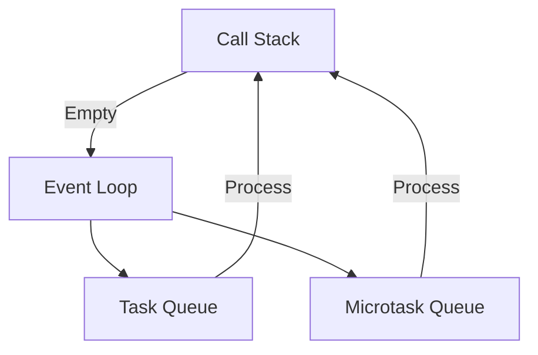

## 8.6.1 Event Loop Mechanics

In the world of JavaScript and TypeScript, understanding the event loop is crucial for mastering asynchronous programming. The event loop is the backbone of JavaScript's concurrency model, allowing non-blocking I/O operations and enabling the execution of asynchronous code. In this section, we will delve into the mechanics of the event loop, exploring how it manages the call stack, task queues, and microtask queues. We will also examine how these components interact to execute asynchronous code efficiently.

### The Call Stack: Managing Function Execution

The call stack is a fundamental concept in programming languages, including JavaScript and TypeScript. It is a data structure that keeps track of function calls in a program. When a function is invoked, a new execution context is created and pushed onto the call stack. Once the function completes, its execution context is popped off the stack.

#### How the Call Stack Works

1. **Function Invocation**: When a function is called, its execution context is created and added to the top of the call stack.
2. **Execution**: The JavaScript engine executes the function's code.
3. **Completion**: Once the function finishes execution, its context is removed from the stack.

Here's a simple example to illustrate the call stack in action:

```typescript
function firstFunction() {
    console.log("First function");
    secondFunction();
    console.log("Back to first function");
}

function secondFunction() {
    console.log("Second function");
}

firstFunction();
```

**Output:**
```
First function
Second function
Back to first function
```

**Explanation:**
- `firstFunction` is called, and its execution context is pushed onto the stack.
- Inside `firstFunction`, `secondFunction` is called, pushing its context onto the stack.
- `secondFunction` completes, and its context is popped off the stack.
- Control returns to `firstFunction`, which then completes and is removed from the stack.

### The Event Loop: Coordinating Asynchronous Execution

The event loop is a mechanism that continuously checks if the call stack is empty and processes tasks from the task queues. It is responsible for executing code, collecting and processing events, and executing queued sub-tasks.

#### How the Event Loop Works

1. **Check Call Stack**: The event loop checks if the call stack is empty.
2. **Process Task Queue**: If the stack is empty, the event loop processes the first task in the task queue.
3. **Execute Task**: The task is executed, and any resulting functions are pushed onto the call stack.
4. **Repeat**: The event loop repeats this process indefinitely.

### Task Queues: Macro-tasks and Microtasks

JavaScript distinguishes between two types of tasks: macro-tasks and microtasks. Understanding the difference between these is key to mastering the event loop.

#### Macro-tasks

Macro-tasks include operations such as `setTimeout`, `setInterval`, and I/O operations. These tasks are queued in the task queue and are processed one at a time by the event loop.

#### Microtasks

Microtasks, on the other hand, include operations such as Promises and `process.nextTick` in Node.js. These tasks are queued in the microtask queue and are processed immediately after the current operation completes, before any new macro-tasks.

#### Order of Execution

The event loop processes all available microtasks before moving on to the next macro-task. This ensures that microtasks are executed as soon as possible, providing a more responsive experience.

### Code Example: Understanding Task Execution Order

Let's explore a code example that demonstrates the execution order of macro-tasks and microtasks:

```typescript
console.log("Start");

setTimeout(() => {
    console.log("Timeout");
}, 0);

Promise.resolve().then(() => {
    console.log("Promise");
});

console.log("End");
```

**Output:**
```
Start
End
Promise
Timeout
```

**Explanation:**
- The synchronous code (`console.log("Start")` and `console.log("End")`) executes first.
- The promise is resolved and its callback is added to the microtask queue.
- The `setTimeout` callback is added to the macro-task queue.
- The event loop processes the microtask queue before the macro-task queue, so "Promise" is logged before "Timeout".

### Impact on Performance and Responsiveness

The event loop model has a significant impact on performance and UI responsiveness. By processing tasks and microtasks efficiently, the event loop ensures that applications remain responsive to user interactions.

#### Avoid Blocking the Event Loop

One of the key principles in JavaScript programming is to avoid blocking the event loop with long-running operations. Blocking the event loop can lead to unresponsive applications, as it prevents the processing of other tasks and microtasks.

### Browser APIs vs. Node.js APIs

While the event loop operates similarly in both browsers and Node.js, there are differences in how they interact with APIs.

#### Browser APIs

In browsers, the event loop is responsible for handling UI rendering and user interactions. It processes tasks such as DOM events, timers, and network requests.

#### Node.js APIs

In Node.js, the event loop handles I/O operations, timers, and other asynchronous tasks. Node.js provides additional APIs, such as `process.nextTick`, which allows tasks to be queued in the microtask queue.

### Visualizing the Event Loop

To better understand the event loop, let's visualize its components and interactions using a Mermaid.js diagram:



**Diagram Description:**
- The call stack is checked by the event loop.
- If the call stack is empty, the event loop processes tasks from the task queue and microtask queue.
- Microtasks are processed before macro-tasks.

### Try It Yourself

Experiment with the following code example to see how the event loop processes tasks and microtasks:

```typescript
console.log("Start");

setTimeout(() => {
    console.log("Timeout 1");
}, 0);

setTimeout(() => {
    console.log("Timeout 2");
}, 0);

Promise.resolve().then(() => {
    console.log("Promise 1");
}).then(() => {
    console.log("Promise 2");
});

console.log("End");
```

**Suggested Modifications:**
- Add more `setTimeout` and Promise callbacks to observe their execution order.
- Introduce a long-running synchronous operation to see its impact on the event loop.

### Knowledge Check

- What is the role of the call stack in the event loop?
- How does the event loop ensure that microtasks are processed before macro-tasks?
- What are the differences between browser APIs and Node.js APIs in terms of event loop interaction?

### Summary

Understanding the event loop mechanics is essential for writing efficient and responsive TypeScript applications. By mastering the call stack, task queues, and microtask queues, you can optimize your code for performance and responsiveness. Remember to avoid blocking the event loop with long-running operations and leverage the power of asynchronous programming to create seamless user experiences.

## Quiz Time!



### What is the primary role of the call stack in JavaScript?

- [x] To manage function execution contexts.
- [ ] To queue asynchronous tasks.
- [ ] To handle I/O operations.
- [ ] To process microtasks.

> **Explanation:** The call stack is responsible for managing function execution contexts, pushing and popping them as functions are called and completed.

### How does the event loop determine when to process tasks from the task queue?

- [x] It checks if the call stack is empty.
- [ ] It processes tasks at regular intervals.
- [ ] It waits for a specific event to occur.
- [ ] It processes tasks based on priority.

> **Explanation:** The event loop processes tasks from the task queue when the call stack is empty, ensuring that all synchronous code has been executed first.

### What is the difference between macro-tasks and microtasks?

- [x] Macro-tasks include operations like setTimeout, while microtasks include Promises.
- [ ] Macro-tasks are processed before microtasks.
- [ ] Microtasks include I/O operations, while macro-tasks include Promises.
- [ ] There is no difference between macro-tasks and microtasks.

> **Explanation:** Macro-tasks include operations like setTimeout and I/O, while microtasks include Promises and process.nextTick. Microtasks are processed before macro-tasks.

### In what order are tasks and microtasks processed by the event loop?

- [x] Microtasks are processed before macro-tasks.
- [ ] Macro-tasks are processed before microtasks.
- [ ] Tasks and microtasks are processed in the order they are queued.
- [ ] Tasks and microtasks are processed simultaneously.

> **Explanation:** The event loop processes all available microtasks before moving on to the next macro-task, ensuring that microtasks are executed as soon as possible.

### How can blocking the event loop impact application performance?

- [x] It can lead to unresponsive applications.
- [ ] It improves application performance.
- [ ] It has no impact on performance.
- [ ] It speeds up asynchronous operations.

> **Explanation:** Blocking the event loop with long-running operations can lead to unresponsive applications, as it prevents the processing of other tasks and microtasks.

### What is the purpose of `process.nextTick` in Node.js?

- [x] To queue a function to be executed in the microtask queue.
- [ ] To execute a function immediately.
- [ ] To delay a function's execution until the next event loop iteration.
- [ ] To handle I/O operations.

> **Explanation:** `process.nextTick` queues a function to be executed in the microtask queue, ensuring it runs before the next macro-task.

### How do browser APIs differ from Node.js APIs in terms of event loop interaction?

- [x] Browser APIs handle UI rendering, while Node.js APIs handle I/O operations.
- [ ] Browser APIs handle I/O operations, while Node.js APIs handle UI rendering.
- [ ] Both handle UI rendering.
- [ ] Both handle I/O operations.

> **Explanation:** Browser APIs handle UI rendering and user interactions, while Node.js APIs handle I/O operations and other asynchronous tasks.

### What happens when a Promise is resolved in JavaScript?

- [x] Its callback is added to the microtask queue.
- [ ] Its callback is added to the macro-task queue.
- [ ] It is executed immediately.
- [ ] It is ignored until the next event loop iteration.

> **Explanation:** When a Promise is resolved, its callback is added to the microtask queue, ensuring it is processed before the next macro-task.

### Why is it important to understand the event loop in JavaScript?

- [x] To write efficient and responsive applications.
- [ ] To improve synchronous code execution.
- [ ] To handle errors more effectively.
- [ ] To optimize memory usage.

> **Explanation:** Understanding the event loop is crucial for writing efficient and responsive applications, as it allows developers to manage asynchronous code execution effectively.

### True or False: The event loop processes tasks and microtasks simultaneously.

- [ ] True
- [x] False

> **Explanation:** The event loop processes all available microtasks before moving on to the next macro-task, ensuring that tasks and microtasks are not processed simultaneously.



Remember, mastering the event loop is just the beginning. As you continue your journey in TypeScript and JavaScript, you'll discover more advanced patterns and techniques to enhance your applications. Keep experimenting, stay curious, and enjoy the journey!
