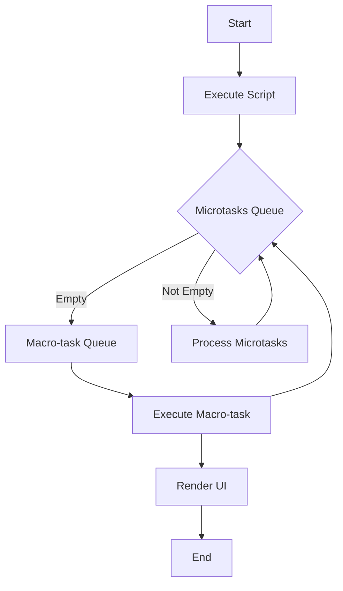

## 8.6.2 Task Queues and Microtasks

In the realm of JavaScript, understanding the event loop and its associated task queues is crucial for mastering asynchronous programming. As TypeScript is a superset of JavaScript, these concepts are equally applicable and important. In this section, we will delve into the distinction between macro-tasks and microtasks, explore their scheduling priorities, and provide insights into how they influence the execution order of asynchronous operations.

### Introduction to Task Queues

JavaScript is a single-threaded language, meaning it can only execute one piece of code at a time. To manage multiple operations, especially asynchronous ones, JavaScript relies on an event loop mechanism. The event loop coordinates the execution of code, collecting and processing events from the task queues.

#### Macro-tasks

Macro-tasks, also known simply as tasks, are operations that are queued for execution in the event loop. These tasks include events such as `setTimeout`, `setInterval`, and I/O operations. Each macro-task is executed one at a time, and the event loop moves to the next task only after the current one has been completed.

**Examples of Macro-tasks:**

- `setTimeout`
- `setInterval`
- I/O operations (e.g., network requests, file reading)
- UI rendering events

```typescript
setTimeout(() => {
  console.log("Macro-task: Timeout");
}, 0);
```

#### Microtasks

Microtasks are a special kind of task that are executed immediately after the currently executing script and before any macro-tasks. They have a higher priority than macro-tasks and are typically used for operations that need to be executed as soon as possible after the current operation completes.

**Examples of Microtasks:**

- Promise callbacks
- `process.nextTick()` in Node.js
- `MutationObserver` callbacks

```typescript
Promise.resolve().then(() => {
  console.log("Microtask: Promise callback");
});
```

### Scheduling Priority: Microtasks vs. Macro-tasks

The scheduling priority of microtasks over macro-tasks is a fundamental aspect of the JavaScript event loop. When a piece of JavaScript code is executed, the event loop processes all microtasks in the queue before moving on to the next macro-task. This ensures that operations that need to happen immediately after the current execution are prioritized.

#### Code Example: Microtasks Executed Before Macro-tasks

Let's illustrate this with a code example:

```typescript
console.log("Script start");

setTimeout(() => {
  console.log("Macro-task: Timeout");
}, 0);

Promise.resolve().then(() => {
  console.log("Microtask: Promise callback");
});

console.log("Script end");
```

**Output:**

```
Script start
Script end
Microtask: Promise callback
Macro-task: Timeout
```

In this example, the promise callback (a microtask) is executed before the `setTimeout` callback (a macro-task), even though both are scheduled to run after the current script.

### Potential Issues with Task Scheduling

While the prioritization of microtasks can be beneficial for ensuring timely execution, it can also lead to potential issues if not managed properly. Excessive use of microtasks can block the rendering or execution of macro-tasks, leading to performance bottlenecks and unexpected delays.

#### Blocking the Event Loop with Microtasks

Consider the following scenario where microtasks are used excessively:

```typescript
function createMicrotasks() {
  Promise.resolve().then(() => {
    console.log("Microtask executed");
    createMicrotasks(); // Recursively creating microtasks
  });
}

createMicrotasks();
```

In this example, the recursive creation of microtasks can lead to a situation where the event loop is constantly processing microtasks, preventing any macro-tasks from being executed. This can block UI updates and lead to a poor user experience.

### Best Practices for Using Macro-tasks and Microtasks

To avoid performance issues and ensure efficient execution of asynchronous operations, it is important to follow best practices when using macro-tasks and microtasks.

#### Best Practices:

1. **Limit the Use of Microtasks:** Avoid creating excessive microtasks in a loop or recursive function. This can lead to blocking the event loop and delaying macro-tasks.

2. **Use Macro-tasks for Long-running Operations:** If an operation is expected to take a significant amount of time, consider using a macro-task to allow other operations to proceed.

3. **Balance Task Types:** Strive for a balance between macro-tasks and microtasks to ensure smooth execution and responsiveness.

4. **Monitor Performance:** Use performance monitoring tools to identify bottlenecks and optimize task scheduling.

### Differences in Event Loop Behavior: Browsers vs. Node.js

While the fundamental concepts of the event loop are consistent across environments, there are some differences in behavior between browsers and Node.js.

#### Browsers

In browsers, the event loop is responsible for handling UI rendering, user interactions, and network requests. The browser's event loop prioritizes rendering tasks to ensure a responsive user interface.

#### Node.js

In Node.js, the event loop is designed to handle server-side operations, such as file I/O and network requests. Node.js introduces additional phases in the event loop, such as the `timers` phase for executing `setTimeout` and `setInterval` callbacks, and the `nextTick` queue for processing `process.nextTick()` callbacks.

### Visualizing the Event Loop

To better understand the interaction between macro-tasks, microtasks, and the event loop, let's visualize the process using a flowchart.



**Diagram Explanation:**

- The event loop starts by executing the current script.
- It then processes all microtasks in the queue.
- Once the microtasks queue is empty, it proceeds to the macro-task queue.
- After executing a macro-task, the loop checks for any pending microtasks.
- UI rendering occurs after macro-tasks, ensuring a responsive interface.

### Try It Yourself

To deepen your understanding, try modifying the code examples provided. Experiment with different combinations of macro-tasks and microtasks to observe their execution order. Consider adding additional `setTimeout` or promise callbacks to see how they interact with each other.

### Knowledge Check

Before we conclude, let's summarize the key takeaways:

- **Macro-tasks** are queued operations like `setTimeout` and I/O events.
- **Microtasks** have higher priority and include promise callbacks.
- **Microtasks** are executed before the next macro-task in the event loop.
- **Excessive microtasks** can block the event loop and delay macro-tasks.
- **Best practices** include balancing task types and monitoring performance.
- **Event loop behavior** differs between browsers and Node.js.

### Embrace the Journey

Remember, mastering the event loop and task scheduling is a journey. As you continue to explore asynchronous programming in TypeScript, keep experimenting and refining your understanding. Stay curious, and enjoy the process of building efficient and responsive applications.

## Quiz Time!



### What are macro-tasks in JavaScript?

- [x] Operations like `setTimeout` and I/O events
- [ ] Operations like promise callbacks
- [ ] Operations that block the event loop
- [ ] Operations that are executed before microtasks

> **Explanation:** Macro-tasks include operations such as `setTimeout`, `setInterval`, and I/O events, which are queued for execution in the event loop.

### What are microtasks in JavaScript?

- [ ] Operations like `setTimeout` and I/O events
- [x] Operations like promise callbacks
- [ ] Operations that block the event loop
- [ ] Operations that are executed after macro-tasks

> **Explanation:** Microtasks include operations such as promise callbacks and `process.nextTick()` in Node.js, which are executed immediately after the current script.

### Which has higher priority in the event loop, microtasks or macro-tasks?

- [x] Microtasks
- [ ] Macro-tasks
- [ ] Both have equal priority
- [ ] It depends on the environment

> **Explanation:** Microtasks have a higher priority and are executed before the next macro-task in the event loop.

### What can happen if microtasks are used excessively?

- [x] They can block the event loop and delay macro-tasks
- [ ] They can improve performance
- [ ] They can reduce memory usage
- [ ] They can increase rendering speed

> **Explanation:** Excessive use of microtasks can block the event loop, preventing macro-tasks from being executed and leading to performance bottlenecks.

### What is a best practice for using macro-tasks and microtasks?

- [x] Balance task types to ensure smooth execution
- [ ] Use only macro-tasks for all operations
- [ ] Use only microtasks for all operations
- [ ] Avoid using tasks altogether

> **Explanation:** Balancing the use of macro-tasks and microtasks helps ensure efficient execution and responsiveness.

### How does the event loop behavior differ between browsers and Node.js?

- [x] Browsers prioritize UI rendering, while Node.js handles server-side operations
- [ ] Browsers and Node.js have identical event loop behavior
- [ ] Node.js prioritizes UI rendering, while browsers handle server-side operations
- [ ] There is no difference in event loop behavior

> **Explanation:** Browsers prioritize UI rendering to ensure a responsive interface, while Node.js is designed to handle server-side operations.

### What is the purpose of the `nextTick` queue in Node.js?

- [x] To process `process.nextTick()` callbacks
- [ ] To execute `setTimeout` callbacks
- [ ] To handle UI rendering events
- [ ] To manage I/O operations

> **Explanation:** The `nextTick` queue in Node.js is used to process `process.nextTick()` callbacks, which are executed before other microtasks.

### What is the output of the following code?

```typescript
console.log("Start");

setTimeout(() => {
  console.log("Macro-task");
}, 0);

Promise.resolve().then(() => {
  console.log("Microtask");
});

console.log("End");
```

- [x] Start, End, Microtask, Macro-task
- [ ] Start, Microtask, End, Macro-task
- [ ] Start, Macro-task, End, Microtask
- [ ] Start, End, Macro-task, Microtask

> **Explanation:** The script executes "Start" and "End" first, then the microtask "Microtask", followed by the macro-task "Macro-task".

### What is a potential issue with misunderstanding task scheduling?

- [x] Unexpected delays in execution
- [ ] Improved performance
- [ ] Reduced memory usage
- [ ] Increased rendering speed

> **Explanation:** Misunderstanding task scheduling can lead to unexpected delays in execution, affecting application performance.

### True or False: Microtasks are executed after macro-tasks in the event loop.

- [ ] True
- [x] False

> **Explanation:** False. Microtasks are executed before the next macro-task in the event loop.


