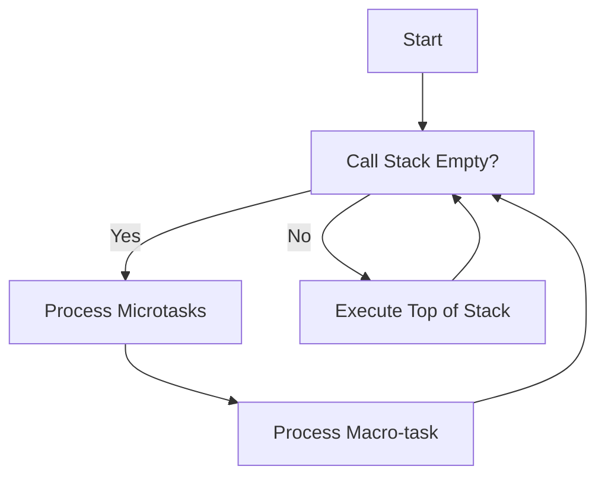

## 8.6 Event Loop and Concurrency

In the world of JavaScript and TypeScript, understanding the event loop and concurrency model is essential for writing efficient and responsive applications. Despite being single-threaded, JavaScript can handle multiple operations concurrently, thanks to its unique event loop mechanism. In this section, we'll delve into the intricacies of the event loop, explore how JavaScript manages concurrency, and provide practical examples to solidify your understanding.

### The Event Loop: An Overview

The event loop is a fundamental concept in JavaScript that allows it to perform non-blocking I/O operations, despite being single-threaded. This mechanism is crucial for handling asynchronous operations, such as network requests, file I/O, and timers, without freezing the main execution thread.

#### Why is the Event Loop Essential?

The event loop enables JavaScript to execute long-running operations without blocking the main thread, allowing the application to remain responsive. This is particularly important in environments like web browsers, where blocking the main thread can lead to a poor user experience.

### Components of the Event Loop

To fully grasp how the event loop works, it's important to understand its key components: the call stack, heap, event loop, task queue (macro-task queue), and microtask queue.

#### Call Stack

The call stack is a data structure that keeps track of function calls. When a function is invoked, it's added to the stack, and when it returns, it's removed. JavaScript executes code from the top of the stack, processing one function at a time.

#### Heap

The heap is a memory space used for storing objects and variables. Unlike the stack, the heap is not limited to a specific order of operations, allowing for dynamic memory allocation.

#### Task Queue (Macro-task Queue)

The task queue is where macro-tasks, such as `setTimeout`, `setInterval`, and I/O operations, are placed. Once the call stack is empty, the event loop picks tasks from this queue and pushes them onto the stack for execution.

#### Microtask Queue

The microtask queue holds tasks that need to be executed after the current operation completes but before the next macro-task. Promises and `MutationObserver` callbacks are examples of microtasks. The event loop processes all microtasks before moving on to the next macro-task.

### Visualizing the Event Loop

To better understand how these components interact, let's visualize the event loop using a flowchart.



**Diagram Description:** This flowchart illustrates the event loop's decision-making process. It checks if the call stack is empty, processes microtasks, and then moves on to macro-tasks.

### Order of Execution: Synchronous Code, Microtasks, and Macro-tasks

Let's explore how JavaScript executes different types of tasks by examining a code example:

```typescript
console.log('Start');

setTimeout(() => {
    console.log('Timeout');
}, 0);

Promise.resolve().then(() => {
    console.log('Promise');
});

console.log('End');
```

**Expected Output:**

```
Start
End
Promise
Timeout
```

**Explanation:**

1. **Synchronous Code:** The `console.log('Start')` and `console.log('End')` statements are executed first, as they are synchronous and placed directly on the call stack.
2. **Microtasks:** The `Promise.resolve().then(...)` callback is added to the microtask queue and executed immediately after the synchronous code, before any macro-tasks.
3. **Macro-tasks:** The `setTimeout(..., 0)` callback is added to the macro-task queue and executed after all microtasks are processed.

### The Impact of the Event Loop on `async`/`await` and Promises

The `async`/`await` syntax in TypeScript provides a more readable way to work with Promises. However, it's essential to understand how the event loop affects their execution.

```typescript
async function fetchData() {
    console.log('Fetching data...');
    const data = await new Promise((resolve) => {
        setTimeout(() => {
            resolve('Data received');
        }, 1000);
    });
    console.log(data);
}

console.log('Before fetch');
fetchData();
console.log('After fetch');
```

**Expected Output:**

```
Before fetch
Fetching data...
After fetch
Data received
```

**Explanation:**

- The `fetchData` function logs "Fetching data..." and then pauses at the `await` keyword.
- The `setTimeout` function schedules the resolution of the Promise after 1 second, adding it to the macro-task queue.
- Meanwhile, the synchronous code continues, logging "Before fetch" and "After fetch".
- Once the Promise resolves, the microtask queue processes the continuation of the `async` function, logging "Data received".

### Common Misconceptions

A prevalent misconception is that `setTimeout(..., 0)` executes immediately. In reality, it schedules the callback to run after the current execution context and all microtasks have completed.

### Debugging and Optimizing Asynchronous Code

Understanding the event loop is crucial for debugging and optimizing asynchronous code. By knowing the order of execution, you can predict how your code will behave and identify potential bottlenecks or race conditions.

### Try It Yourself

Experiment with the provided code examples by modifying the order of operations or adding additional tasks. Observe how changes affect the execution order and output.

### Conclusion

The event loop is a powerful mechanism that allows JavaScript to handle concurrency in a single-threaded environment. By mastering the event loop and its components, you can write more efficient and responsive TypeScript applications. Remember, this is just the beginning. As you progress, you'll build more complex and interactive applications. Keep experimenting, stay curious, and enjoy the journey!

## Quiz Time!



### What is the primary purpose of the event loop in JavaScript?

- [x] To handle asynchronous operations without blocking the main thread.
- [ ] To execute synchronous code faster.
- [ ] To manage memory allocation.
- [ ] To compile JavaScript code.

> **Explanation:** The event loop allows JavaScript to perform non-blocking I/O operations, enabling asynchronous operations without freezing the main execution thread.

### Which component is responsible for storing objects and variables in JavaScript?

- [ ] Call Stack
- [x] Heap
- [ ] Task Queue
- [ ] Microtask Queue

> **Explanation:** The heap is a memory space used for storing objects and variables, allowing for dynamic memory allocation.

### In the provided code example, which statement is executed first?

- [x] `console.log('Start');`
- [ ] `setTimeout(() => { console.log('Timeout'); }, 0);`
- [ ] `Promise.resolve().then(() => { console.log('Promise'); });`
- [ ] `console.log('End');`

> **Explanation:** The `console.log('Start');` statement is executed first because it is synchronous code placed directly on the call stack.

### What is the correct order of execution for the provided code example?

- [x] Start, End, Promise, Timeout
- [ ] Start, Promise, Timeout, End
- [ ] Start, Timeout, Promise, End
- [ ] Start, End, Timeout, Promise

> **Explanation:** The correct order is Start, End, Promise, Timeout. Synchronous code runs first, followed by microtasks (Promises), and then macro-tasks (setTimeout).

### How does the event loop handle `async`/`await` in TypeScript?

- [x] It pauses execution at `await` and resumes once the Promise resolves.
- [ ] It executes `await` immediately and skips the Promise.
- [ ] It blocks the main thread until the Promise resolves.
- [ ] It converts `await` into a synchronous operation.

> **Explanation:** The event loop pauses execution at `await` and resumes once the Promise resolves, allowing other tasks to run in the meantime.

### What is a common misconception about `setTimeout(..., 0)`?

- [x] It executes immediately.
- [ ] It never executes.
- [ ] It blocks the main thread.
- [ ] It runs before synchronous code.

> **Explanation:** A common misconception is that `setTimeout(..., 0)` executes immediately, but it actually schedules the callback to run after the current execution context and all microtasks have completed.

### Why is understanding the event loop critical for debugging asynchronous code?

- [x] It helps predict execution order and identify bottlenecks.
- [ ] It allows for faster code execution.
- [ ] It simplifies memory management.
- [ ] It ensures code compiles correctly.

> **Explanation:** Understanding the event loop helps predict how code will behave, identify potential bottlenecks, and debug asynchronous operations effectively.

### Which queue processes tasks before moving on to the next macro-task?

- [ ] Task Queue
- [x] Microtask Queue
- [ ] Call Stack
- [ ] Heap

> **Explanation:** The microtask queue processes tasks before moving on to the next macro-task, ensuring all microtasks are completed first.

### What is the role of the call stack in JavaScript's event loop?

- [x] To keep track of function calls and execute code from the top.
- [ ] To store objects and variables.
- [ ] To manage asynchronous operations.
- [ ] To compile JavaScript code.

> **Explanation:** The call stack keeps track of function calls and executes code from the top, processing one function at a time.

### True or False: JavaScript is multi-threaded.

- [ ] True
- [x] False

> **Explanation:** JavaScript is single-threaded, meaning it executes one operation at a time. However, it can handle concurrency through the event loop.


