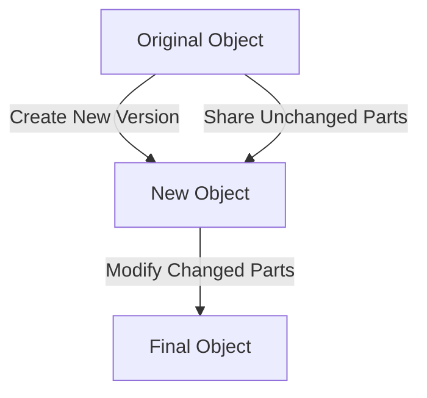

## 9.1.1 Implementing Immutable Objects in TypeScript

Immutability is a cornerstone of functional programming, offering numerous benefits such as easier reasoning about code, improved performance through structural sharing, and safer concurrent programming. In TypeScript, we can achieve immutability using built-in features like `Readonly` types and third-party libraries such as Immutable.js, Immer, and Mori. In this section, we will explore how to implement immutable objects in TypeScript, compare different approaches, and discuss best practices for managing immutable data.

### Understanding Immutability

Immutability refers to the concept where an object's state cannot be modified after it is created. Instead of altering the original object, any changes result in the creation of a new object. This approach helps prevent side effects and makes it easier to track changes over time.

### Using TypeScript's `Readonly` Keyword

TypeScript provides the `Readonly` keyword, which can be used to enforce immutability at the type level. This keyword can be applied to properties, arrays, and entire objects to prevent modifications.

#### Declaring Readonly Properties

To declare a readonly property in a TypeScript class or interface, simply prepend the `readonly` keyword to the property declaration.

```typescript
class User {
  readonly id: number;
  readonly name: string;

  constructor(id: number, name: string) {
    this.id = id;
    this.name = name;
  }
}

const user = new User(1, "Alice");
// user.id = 2; // Error: Cannot assign to 'id' because it is a read-only property.
```

In this example, the `id` and `name` properties are immutable, meaning they cannot be changed after the object is created.

#### Readonly Arrays

TypeScript also allows you to create readonly arrays, which prevent modifications to the array's contents.

```typescript
const numbers: ReadonlyArray<number> = [1, 2, 3];
// numbers.push(4); // Error: Property 'push' does not exist on type 'readonly number[]'.
```

The `ReadonlyArray` type ensures that the array cannot be modified, providing a safe way to handle collections of data.

#### Readonly Interfaces and Types

You can define entire interfaces or types as readonly, ensuring that all properties within the structure are immutable.

```typescript
interface ReadonlyUser {
  readonly id: number;
  readonly name: string;
}

const readonlyUser: ReadonlyUser = { id: 1, name: "Alice" };
// readonlyUser.name = "Bob"; // Error: Cannot assign to 'name' because it is a read-only property.
```

### Leveraging Third-Party Libraries

While TypeScript's `Readonly` keyword provides basic immutability, third-party libraries offer more advanced features and performance optimizations. Let's explore some popular libraries for managing immutable data in TypeScript.

#### Immutable.js

Immutable.js is a library that provides persistent immutable data structures, such as `List`, `Map`, and `Set`. These structures are designed to be efficient and easy to use.

##### Integrating Immutable.js

To use Immutable.js in a TypeScript project, you need to install the library and its type definitions.

```bash
npm install immutable
npm install @types/immutable
```

##### Creating and Manipulating Immutable Data

Immutable.js provides a variety of data structures that can be used to create and manipulate immutable data.

```typescript
import { List, Map } from "immutable";

const list = List([1, 2, 3]);
const newList = list.push(4);

console.log(list.toArray()); // [1, 2, 3]
console.log(newList.toArray()); // [1, 2, 3, 4]

const map = Map({ key: "value" });
const newMap = map.set("key", "newValue");

console.log(map.get("key")); // "value"
console.log(newMap.get("key")); // "newValue"
```

In this example, the `List` and `Map` structures are immutable, and any modifications result in new instances.

#### Immer

Immer is another library that simplifies working with immutable data by using a "copy-on-write" mechanism. It allows you to work with immutable data using a mutable syntax.

##### Integrating Immer

To use Immer in a TypeScript project, install the library.

```bash
npm install immer
```

##### Using Immer to Handle Immutability

Immer provides a `produce` function that takes a base state and a recipe function, allowing you to create a new state by applying changes.

```typescript
import produce from "immer";

const baseState = { name: "Alice", age: 25 };

const newState = produce(baseState, draft => {
  draft.age = 26;
});

console.log(baseState); // { name: "Alice", age: 25 }
console.log(newState); // { name: "Alice", age: 26 }
```

Immer makes it easy to work with immutable data by allowing you to write code as if you were modifying the original object.

#### Mori

Mori is a library inspired by Clojure's immutable data structures. It provides a set of functions for working with immutable collections.

##### Integrating Mori

To use Mori in a TypeScript project, install the library.

```bash
npm install mori
```

##### Using Mori for Immutable Data

Mori provides functions for creating and manipulating immutable data structures.

```typescript
import * as mori from "mori";

const vector = mori.vector(1, 2, 3);
const newVector = mori.conj(vector, 4);

console.log(mori.toJs(vector)); // [1, 2, 3]
console.log(mori.toJs(newVector)); // [1, 2, 3, 4]
```

Mori's API is functional and provides a rich set of operations for working with immutable data.

### Comparing TypeScript Features and Libraries

When deciding between TypeScript's built-in features and third-party libraries, consider the following trade-offs:

- **Performance**: Libraries like Immutable.js and Mori are optimized for performance, especially when dealing with large data sets.
- **Ease of Use**: Immer provides a simple API that allows you to work with immutable data using a mutable syntax.
- **Type Safety**: TypeScript's `Readonly` types offer strong type safety, while third-party libraries may require additional type definitions.

### Handling Updates to Immutable Objects

When working with immutable objects, updates are handled by creating new instances with the desired changes. This approach can be achieved using structural sharing or copy-on-write patterns.

#### Structural Sharing

Structural sharing is a technique where unchanged parts of an object are shared between the old and new versions, reducing memory usage and improving performance.

#### Copy-on-Write

Copy-on-write involves creating a shallow copy of an object and applying changes to the copy. This approach is used by libraries like Immer to provide a mutable syntax for immutable data.

### Best Practices for Managing Immutable Data

- **Use Immutable Data Structures**: Choose the appropriate data structures for your use case, considering performance and ease of use.
- **Leverage TypeScript's Type System**: Use `Readonly` types to enforce immutability at the type level.
- **Integrate Libraries When Necessary**: Consider using libraries like Immutable.js, Immer, or Mori for advanced features and optimizations.
- **Optimize Performance**: Use techniques like structural sharing to minimize memory usage and improve performance.

### Try It Yourself

Experiment with the code examples provided in this section. Try modifying the immutable objects and observe how changes result in new instances. Consider integrating a library like Immutable.js or Immer into a TypeScript project and explore the features they offer.

### Visualizing Immutability

To better understand how immutability works, let's visualize the process of updating an immutable object using structural sharing.



In this diagram, the original object is used to create a new version, sharing unchanged parts and modifying only the necessary parts to produce the final object.

### Knowledge Check

- What is immutability, and why is it important in functional programming?
- How does the `Readonly` keyword in TypeScript enforce immutability?
- What are the benefits of using libraries like Immutable.js or Immer?
- How does structural sharing improve performance when working with immutable data?
- What are some best practices for managing immutable data in TypeScript applications?

### Conclusion

Implementing immutable objects in TypeScript can greatly enhance the safety and performance of your applications. By leveraging TypeScript's `Readonly` types and third-party libraries, you can create efficient and maintainable code that is easy to reason about. Remember to choose the right tools and techniques for your specific use case, and keep experimenting to find the best solutions for your projects.

## Quiz Time!



### What is immutability?

- [x] The concept where an object's state cannot be modified after it is created.
- [ ] The ability to change an object's state at any time.
- [ ] A method for optimizing memory usage.
- [ ] A feature exclusive to TypeScript.

> **Explanation:** Immutability refers to the concept where an object's state cannot be modified after it is created, which helps prevent side effects and makes it easier to track changes over time.

### How does TypeScript enforce immutability with the `Readonly` keyword?

- [x] By preventing modifications to properties marked as `readonly`.
- [ ] By making all properties of an object immutable by default.
- [ ] By allowing changes only through specific methods.
- [ ] By using a special compiler flag.

> **Explanation:** TypeScript enforces immutability by preventing modifications to properties marked as `readonly`, ensuring that they cannot be changed after initialization.

### Which library uses a "copy-on-write" mechanism for immutability?

- [ ] Immutable.js
- [x] Immer
- [ ] Mori
- [ ] Lodash

> **Explanation:** Immer uses a "copy-on-write" mechanism, allowing you to work with immutable data using a mutable syntax.

### What is structural sharing?

- [x] A technique where unchanged parts of an object are shared between versions.
- [ ] A method for copying all parts of an object.
- [ ] A feature of TypeScript's type system.
- [ ] A way to optimize function calls.

> **Explanation:** Structural sharing is a technique where unchanged parts of an object are shared between the old and new versions, reducing memory usage and improving performance.

### Which of the following is a best practice for managing immutable data?

- [x] Use `Readonly` types to enforce immutability at the type level.
- [ ] Always use mutable data structures for flexibility.
- [x] Consider using libraries like Immutable.js for advanced features.
- [ ] Avoid using third-party libraries to keep dependencies minimal.

> **Explanation:** Using `Readonly` types and considering libraries like Immutable.js are best practices for managing immutable data, as they provide type safety and advanced features.

### What is a key benefit of using immutable data structures?

- [x] Easier reasoning about code and improved performance.
- [ ] Increased complexity in code management.
- [ ] Reduced type safety in applications.
- [ ] Limited compatibility with TypeScript.

> **Explanation:** Immutable data structures offer easier reasoning about code and improved performance, as they prevent side effects and enable efficient updates.

### How can you create a readonly array in TypeScript?

- [x] By using the `ReadonlyArray` type.
- [ ] By using the `Array` type with a `readonly` modifier.
- [ ] By setting a compiler option.
- [ ] By using a special function.

> **Explanation:** You can create a readonly array in TypeScript by using the `ReadonlyArray` type, which prevents modifications to the array's contents.

### What is the main advantage of using Immer over other libraries?

- [x] It allows you to work with immutable data using a mutable syntax.
- [ ] It provides the fastest performance for all operations.
- [ ] It is the only library that supports TypeScript.
- [ ] It requires no additional type definitions.

> **Explanation:** Immer's main advantage is that it allows you to work with immutable data using a mutable syntax, making it easier to use while maintaining immutability.

### Which of the following libraries is inspired by Clojure's immutable data structures?

- [ ] Immutable.js
- [ ] Immer
- [x] Mori
- [ ] Lodash

> **Explanation:** Mori is inspired by Clojure's immutable data structures and provides a set of functions for working with immutable collections.

### True or False: Immutable.js provides persistent immutable data structures.

- [x] True
- [ ] False

> **Explanation:** Immutable.js provides persistent immutable data structures, such as `List`, `Map`, and `Set`, designed to be efficient and easy to use.


