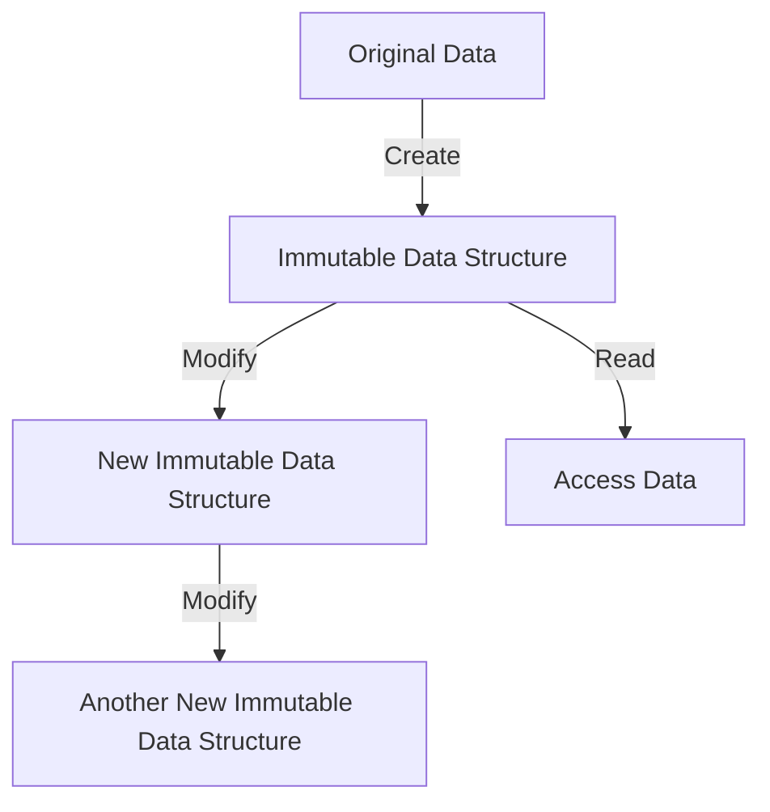

## 9.1.2 Benefits of Immutability

In the realm of software engineering, immutability is a powerful concept that can lead to more predictable, maintainable, and efficient code. By understanding and leveraging immutable data structures, developers can eliminate side effects, simplify debugging, enhance performance, and improve reliability, especially in complex environments. Let's delve into the various benefits of immutability and how it can transform your TypeScript applications.

### Understanding Immutability

Immutability refers to the state of an object being unchangeable after its creation. In programming, this means that once a data structure is created, it cannot be altered. Instead, any modification results in the creation of a new data structure. This concept is fundamental in functional programming and is gaining traction in modern software development due to its numerous advantages.

### Eliminating Side Effects

One of the primary benefits of immutability is the elimination of side effects. A side effect occurs when a function modifies some state outside its scope or has an observable interaction with the outside world beyond returning a value. Immutability ensures that functions are pure, meaning they consistently produce the same output for the same input without altering any external state.

#### Example of Pure Functions with Immutability

```typescript
// Pure function with immutable data
function add(a: number, b: number): number {
  return a + b;
}

// Immutable data structure
const numbers = Object.freeze([1, 2, 3, 4]);

// Attempting to modify the immutable array
const newNumbers = [...numbers, 5]; // Creates a new array instead of modifying the original

console.log(numbers); // Output: [1, 2, 3, 4]
console.log(newNumbers); // Output: [1, 2, 3, 4, 5]
```

In the example above, the `add` function is pure because it does not modify any external state. The `numbers` array is immutable, ensuring that any attempt to modify it results in a new array, preserving the original data.

### Simplifying Debugging

Immutability simplifies debugging by ensuring that data does not change unexpectedly. When data structures are immutable, developers can be confident that once a value is set, it remains the same throughout the program's execution. This predictability makes it easier to trace and understand the flow of data, reducing the likelihood of bugs.

#### Debugging with Immutable Data

Consider a scenario where a function modifies a global state, leading to unexpected behavior:

```typescript
let globalState = { count: 0 };

function increment() {
  globalState.count += 1;
}

increment();
console.log(globalState.count); // Output: 1
```

In contrast, using immutable data structures:

```typescript
const initialState = Object.freeze({ count: 0 });

function increment(state: { count: number }): { count: number } {
  return { ...state, count: state.count + 1 };
}

const newState = increment(initialState);
console.log(initialState.count); // Output: 0
console.log(newState.count); // Output: 1
```

By avoiding direct modification of `initialState`, the code becomes more predictable and easier to debug.

### Benefits in Multi-threaded or Asynchronous Environments

In multi-threaded or asynchronous environments, immutability is particularly advantageous as it prevents race conditions. Race conditions occur when multiple threads or asynchronous operations attempt to modify the same data concurrently, leading to unpredictable results.

#### Preventing Race Conditions with Immutability

```typescript
// Immutable state
const state = Object.freeze({ value: 42 });

function asyncOperation(state: { value: number }): Promise<{ value: number }> {
  return new Promise((resolve) => {
    setTimeout(() => {
      resolve({ ...state, value: state.value + 1 });
    }, 1000);
  });
}

asyncOperation(state).then((newState) => {
  console.log(newState.value); // Output: 43
});
console.log(state.value); // Output: 42
```

In this example, the immutable `state` ensures that concurrent operations do not interfere with each other, preventing race conditions and maintaining data integrity.

### Enhancing Performance Optimizations

Immutability can also enhance performance optimizations, such as memoization and efficient change detection. Memoization is a technique where the results of expensive function calls are cached, allowing subsequent calls with the same inputs to return the cached result.

#### Memoization with Immutable Data

```typescript
function memoize(fn: Function) {
  const cache = new Map();
  return function (...args: any[]) {
    const key = JSON.stringify(args);
    if (cache.has(key)) {
      return cache.get(key);
    }
    const result = fn(...args);
    cache.set(key, result);
    return result;
  };
}

const add = (a: number, b: number) => a + b;
const memoizedAdd = memoize(add);

console.log(memoizedAdd(1, 2)); // Output: 3 (calculated)
console.log(memoizedAdd(1, 2)); // Output: 3 (cached)
```

Immutability ensures that the inputs to the memoized function remain unchanged, allowing the cache to be reliable and effective.

### Improving Code Maintainability and Reducing Bugs

Immutable data structures improve code maintainability by making it easier to reason about the code. When developers know that data does not change, they can focus on the logic without worrying about unintended side effects. This clarity reduces bugs and makes the codebase more robust.

#### Example of Maintainable Code with Immutability

```typescript
type User = {
  name: string;
  age: number;
};

const user: User = Object.freeze({ name: "Alice", age: 30 });

function updateUser(user: User, newName: string): User {
  return { ...user, name: newName };
}

const updatedUser = updateUser(user, "Bob");
console.log(user.name); // Output: Alice
console.log(updatedUser.name); // Output: Bob
```

By using immutable data structures, developers can ensure that the original `user` object remains unchanged, making the code easier to maintain and understand.

### Compatibility with Functional Programming Paradigms

Immutability works well with functional programming paradigms, which emphasize pure functions, higher-order functions, and function composition. Functional programming encourages the use of immutable data to create predictable and reliable code.

#### Functional Programming with Immutability

```typescript
const numbers = [1, 2, 3, 4, 5];

// Pure function using map
const doubled = numbers.map((n) => n * 2);

console.log(numbers); // Output: [1, 2, 3, 4, 5]
console.log(doubled); // Output: [2, 4, 6, 8, 10]
```

In this example, the `map` function is a pure function that operates on immutable data, aligning with functional programming principles.

### Studies and Authoritative Sources

Numerous studies and authoritative sources support the benefits of immutability. For instance, a study by [OOPSLA](https://dl.acm.org/doi/10.1145/1297027.1297033) highlights how immutability can reduce the complexity of concurrent programming. Additionally, the book "Functional Programming in JavaScript" by Luis Atencio emphasizes the advantages of immutability in creating robust and maintainable code.

### Try It Yourself

To fully grasp the benefits of immutability, try modifying the code examples provided. Experiment with creating your own immutable data structures and observe how they impact the predictability and reliability of your code. Consider implementing memoization in a real-world scenario and see how it improves performance.

### Visualizing Immutability

To better understand the concept of immutability, let's visualize how immutable data structures work in a program:



**Caption:** This diagram illustrates how immutable data structures are created and modified. Each modification results in a new data structure, preserving the original data.

### Knowledge Check

- Explain how immutability eliminates side effects in functions.
- Describe how immutability simplifies debugging in complex applications.
- Discuss the advantages of immutability in multi-threaded environments.
- Provide an example of how immutability enhances performance through memoization.
- Explain how immutability aligns with functional programming paradigms.

### Embrace the Journey

As you continue your journey in software development, remember that immutability is a powerful tool that can lead to more reliable and maintainable code. By embracing immutable data structures, you'll be better equipped to tackle complex challenges and create robust applications. Keep experimenting, stay curious, and enjoy the journey!

## Quiz Time!



### How does immutability eliminate side effects in functions?

- [x] By ensuring functions do not modify external state
- [ ] By allowing functions to change global variables
- [ ] By making functions dependent on external input
- [ ] By enabling functions to alter their own logic

> **Explanation:** Immutability ensures that functions do not modify external state, making them pure and predictable.

### What is a primary benefit of immutability in debugging?

- [x] Data does not change unexpectedly
- [ ] It allows for more complex code
- [ ] It increases the number of variables
- [ ] It requires more memory usage

> **Explanation:** Immutability ensures that data does not change unexpectedly, simplifying the debugging process.

### How does immutability prevent race conditions in multi-threaded environments?

- [x] By ensuring data cannot be modified concurrently
- [ ] By allowing threads to modify shared data
- [ ] By increasing the number of threads
- [ ] By making data mutable

> **Explanation:** Immutability ensures that data cannot be modified concurrently, preventing race conditions.

### What performance optimization technique is enhanced by immutability?

- [x] Memoization
- [ ] Recursion
- [ ] Iteration
- [ ] Compilation

> **Explanation:** Immutability enhances memoization by ensuring that inputs remain unchanged, allowing for reliable caching.

### How does immutability improve code maintainability?

- [x] By making data easier to reason about
- [ ] By increasing the complexity of data structures
- [x] By reducing unintended side effects
- [ ] By allowing data to be modified at any time

> **Explanation:** Immutability makes data easier to reason about and reduces unintended side effects, improving code maintainability.

### In what programming paradigm is immutability a fundamental concept?

- [x] Functional programming
- [ ] Object-oriented programming
- [ ] Procedural programming
- [ ] Imperative programming

> **Explanation:** Immutability is a fundamental concept in functional programming, which emphasizes pure functions and immutable data.

### What is a common technique for creating new data from immutable structures?

- [x] Using spread operators or methods like `map`
- [ ] Directly modifying the original data
- [ ] Using global variables
- [ ] Altering the data in place

> **Explanation:** Using spread operators or methods like `map` allows for creating new data from immutable structures without modifying the original.

### Which of the following is a benefit of immutability in asynchronous environments?

- [x] It prevents data corruption due to concurrent modifications
- [ ] It allows for more complex asynchronous logic
- [ ] It increases the number of asynchronous operations
- [ ] It requires more memory for each operation

> **Explanation:** Immutability prevents data corruption due to concurrent modifications, making it beneficial in asynchronous environments.

### What is a key characteristic of pure functions?

- [x] They do not modify external state
- [ ] They rely on global variables
- [ ] They change their behavior based on external input
- [ ] They alter their own logic

> **Explanation:** Pure functions do not modify external state, ensuring consistent behavior and predictability.

### True or False: Immutability can enhance performance by allowing efficient change detection.

- [x] True
- [ ] False

> **Explanation:** True. Immutability allows for efficient change detection, as changes result in new data structures, making it easier to identify modifications.


