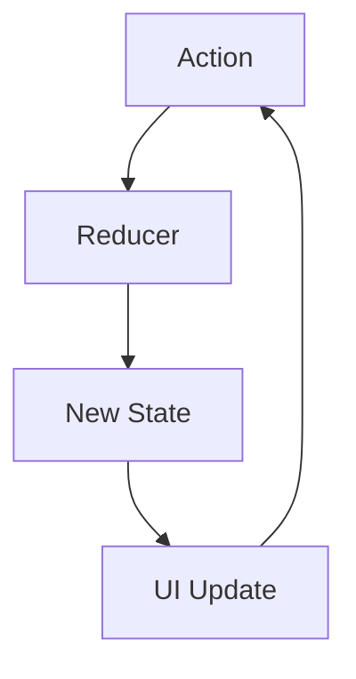

## 9.1.3 Use Cases and Examples

In the realm of software engineering, immutable data structures have emerged as a pivotal concept, especially in the context of functional programming and modern application development. By ensuring that data cannot be altered once created, immutability offers a host of benefits, including easier reasoning about code, improved performance in certain scenarios, and enhanced reliability. In this section, we will delve into the practical applications of immutable data structures across various domains, including front-end frameworks, concurrent systems, and server-side applications.

### Immutability in Front-End Frameworks: React with Redux

One of the most prominent use cases for immutable data structures is in front-end development, particularly with frameworks like React and state management libraries like Redux. In these environments, immutability is not just a preference but a necessity for maintaining predictable state changes and ensuring efficient rendering.

#### State Management with Redux

Redux, a popular state management library for React, relies heavily on the concept of immutability. By treating the state as immutable, Redux ensures that each state change results in a new state object, allowing for straightforward state tracking and debugging.

```typescript
import { createStore } from 'redux';

// Define initial state
const initialState = {
  count: 0,
};

// Define a reducer with immutable state updates
function counterReducer(state = initialState, action: { type: string }) {
  switch (action.type) {
    case 'INCREMENT':
      return { ...state, count: state.count + 1 }; // Create a new state object
    case 'DECREMENT':
      return { ...state, count: state.count - 1 };
    default:
      return state;
  }
}

// Create a Redux store
const store = createStore(counterReducer);

// Dispatch actions
store.dispatch({ type: 'INCREMENT' });
console.log(store.getState()); // { count: 1 }
```

In this example, each action dispatched to the Redux store results in a new state object, ensuring that the previous state remains unchanged. This immutability is crucial for features like time-travel debugging, where developers can navigate through state changes as if they were stepping through time.

#### Time-Travel Debugging and State Auditing

Immutability enables powerful debugging tools, such as time-travel debugging, which allows developers to step backward and forward through state changes. This capability is invaluable for identifying the root cause of issues and understanding the flow of data through an application.


*Figure 1: Visualizing state changes over time with time-travel debugging.*

### Immutability in Concurrent and Distributed Systems

In concurrent or distributed systems, immutability simplifies data sharing and synchronization. By ensuring that data cannot be altered once created, immutable data structures eliminate race conditions and make it easier to reason about the state of the system.

#### Simplifying Data Sharing

In systems where multiple threads or processes need to access shared data, immutability provides a straightforward solution. Since immutable data cannot be changed, there is no need for complex locking mechanisms to prevent concurrent modifications.

```typescript
class ImmutablePoint {
  constructor(private readonly x: number, private readonly y: number) {}

  getX() {
    return this.x;
  }

  getY() {
    return this.y;
  }

  move(dx: number, dy: number): ImmutablePoint {
    return new ImmutablePoint(this.x + dx, this.y + dy);
  }
}

const point = new ImmutablePoint(0, 0);
const newPoint = point.move(5, 10);

console.log(point.getX(), point.getY()); // 0, 0
console.log(newPoint.getX(), newPoint.getY()); // 5, 10
```

In this example, the `ImmutablePoint` class represents a point in a 2D space. The `move` method returns a new instance of `ImmutablePoint`, ensuring that the original point remains unchanged. This immutability makes it easy to share instances of `ImmutablePoint` across threads without worrying about concurrent modifications.

#### Facilitating State Replication

In distributed systems, immutability can simplify state replication and synchronization. By treating state as immutable, changes can be propagated across nodes as a series of new state objects, reducing the complexity of ensuring consistency.

### Immutability in Server-Side Applications

Server-side applications can also benefit from immutable data structures, particularly in terms of reliability and logic simplification.

#### Improving Reliability

Immutability can enhance the reliability of server-side applications by reducing the likelihood of unintended side effects. When data cannot be altered, developers can be confident that functions will not inadvertently modify shared state, leading to more predictable and reliable behavior.

```typescript
function processRequest(request: ImmutableRequest): ImmutableResponse {
  // Process the request and return a new response
  return new ImmutableResponse(request.getData());
}

class ImmutableRequest {
  constructor(private readonly data: string) {}

  getData() {
    return this.data;
  }
}

class ImmutableResponse {
  constructor(private readonly data: string) {}

  getData() {
    return this.data;
  }
}

const request = new ImmutableRequest('Hello, world!');
const response = processRequest(request);

console.log(response.getData()); // 'Hello, world!'
```

In this example, the `processRequest` function processes an `ImmutableRequest` and returns an `ImmutableResponse`. By ensuring that both the request and response are immutable, the function can be confident that it will not inadvertently modify the input data, leading to more reliable behavior.

#### Simplifying Logic

Immutable data structures can also simplify the logic of server-side applications by reducing the need for complex state management. When data is immutable, developers can focus on transforming data rather than managing state changes.

### Encouraging Immutability in Projects

Given the numerous benefits of immutability, developers are encouraged to incorporate immutable data structures into their projects where appropriate. By doing so, they can improve the reliability, performance, and maintainability of their applications.

#### Try It Yourself

To gain a deeper understanding of immutability, try modifying the code examples provided in this section. Experiment with adding new methods to the `ImmutablePoint` class or creating additional immutable data structures. Consider how immutability affects the behavior of your code and the ease with which you can reason about its operation.

### Visualizing Immutability in Action

To further illustrate the concept of immutability, consider the following diagram, which depicts the flow of data through a Redux application:



*Figure 2: Data flow in a Redux application, highlighting the creation of new state objects.*

In this diagram, each action dispatched to the Redux store is processed by a reducer, resulting in a new state object. This new state is then used to update the UI, demonstrating the seamless integration of immutability into the application architecture.

### References and Further Reading

For more information on immutable data structures and their applications, consider exploring the following resources:

- [MDN Web Docs: Immutable Data Structures](https://developer.mozilla.org/en-US/docs/Web/JavaScript/Reference/Global_Objects/Object/freeze)
- [Redux Documentation: Immutability](https://redux.js.org/recipes/structuring-reducers/immutable-update-patterns)
- [Immutable.js: Immutable Collections for JavaScript](https://immutable-js.github.io/immutable-js/)

### Knowledge Check

To reinforce your understanding of immutability, consider the following questions:

1. How does immutability facilitate time-travel debugging in Redux?
2. What are the benefits of using immutable data structures in concurrent systems?
3. How can immutability improve the reliability of server-side applications?
4. What are some potential drawbacks of using immutable data structures?

### Embrace the Journey

Remember, immutability is just one tool in your software engineering toolkit. As you continue to explore and experiment with immutable data structures, you'll discover new ways to enhance the reliability, performance, and maintainability of your applications. Keep experimenting, stay curious, and enjoy the journey!

## Quiz Time!



### How does immutability facilitate time-travel debugging in Redux?

- [x] By ensuring each state change results in a new state object
- [ ] By allowing direct modification of the state
- [ ] By preventing any state changes
- [ ] By storing state changes in a database

> **Explanation:** Immutability ensures that each state change results in a new state object, which allows developers to navigate through state changes as if they were stepping through time.

### What is a key benefit of using immutable data structures in concurrent systems?

- [x] They eliminate race conditions
- [ ] They increase memory usage
- [ ] They require complex locking mechanisms
- [ ] They make data sharing impossible

> **Explanation:** Immutable data structures eliminate race conditions by ensuring that data cannot be altered once created, thus avoiding the need for complex locking mechanisms.

### How can immutability improve the reliability of server-side applications?

- [x] By reducing the likelihood of unintended side effects
- [ ] By allowing functions to modify shared state
- [ ] By increasing the complexity of state management
- [ ] By making data mutable

> **Explanation:** Immutability reduces the likelihood of unintended side effects by ensuring that data cannot be altered, leading to more predictable and reliable behavior.

### In which scenario is immutability particularly beneficial?

- [x] When multiple threads need to access shared data
- [ ] When data needs to be frequently modified
- [ ] When state changes are rare
- [ ] When performance is not a concern

> **Explanation:** Immutability is particularly beneficial when multiple threads need to access shared data, as it eliminates the need for complex locking mechanisms.

### What is a potential drawback of using immutable data structures?

- [x] Increased memory usage
- [ ] Reduced reliability
- [ ] Increased likelihood of race conditions
- [ ] Difficulty in reasoning about code

> **Explanation:** A potential drawback of using immutable data structures is increased memory usage, as each state change results in a new state object.

### How does immutability simplify logic in server-side applications?

- [x] By reducing the need for complex state management
- [ ] By allowing direct modification of data
- [ ] By increasing the complexity of data transformations
- [ ] By making data mutable

> **Explanation:** Immutability simplifies logic by reducing the need for complex state management, allowing developers to focus on transforming data rather than managing state changes.

### What is the role of a reducer in a Redux application?

- [x] To process actions and return a new state object
- [ ] To directly modify the state
- [ ] To dispatch actions
- [ ] To update the UI

> **Explanation:** In a Redux application, a reducer processes actions and returns a new state object, ensuring that the state remains immutable.

### How does immutability facilitate state replication in distributed systems?

- [x] By treating state as immutable and propagating changes as new state objects
- [ ] By allowing direct modification of state
- [ ] By making state changes infrequent
- [ ] By storing state changes in a database

> **Explanation:** Immutability facilitates state replication by treating state as immutable and propagating changes as new state objects, reducing the complexity of ensuring consistency.

### What is the benefit of using the `Readonly` type in TypeScript?

- [x] It prevents modification of object properties
- [ ] It allows direct modification of object properties
- [ ] It increases the complexity of code
- [ ] It reduces the reliability of code

> **Explanation:** The `Readonly` type in TypeScript prevents modification of object properties, ensuring that data remains immutable.

### True or False: Immutability is only beneficial in front-end development.

- [ ] True
- [x] False

> **Explanation:** False. Immutability is beneficial in various domains, including front-end development, concurrent systems, and server-side applications.


