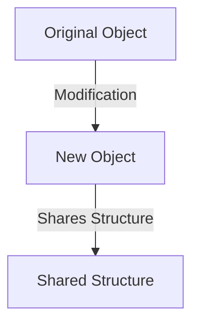

## 9.1 Immutable Data Structures

In the realm of software engineering, especially within the context of functional programming, immutability is a cornerstone concept that significantly influences how we design and interact with data structures. In this section, we will delve into the concept of immutable data structures, their importance, and how they can be effectively implemented in TypeScript to enhance code reliability, prevent side effects, and facilitate easier debugging.

### Understanding Immutability

**Immutability** refers to the state of an object that cannot be modified after it has been created. This concept is pivotal in functional programming, where functions are expected to have no side effects. By ensuring that data structures are immutable, we can prevent accidental changes to data, leading to safer and more predictable code.

#### Importance in Functional Programming

Functional programming emphasizes the use of pure functions—functions that do not cause side effects and return the same output for the same input. Immutability aligns perfectly with this paradigm, as it ensures that data passed to functions remains unchanged, thereby maintaining the purity of functions.

### Mutable vs. Immutable Objects

To fully appreciate the benefits of immutability, it's crucial to understand the distinction between mutable and immutable objects.

#### Mutable Objects

Mutable objects are those whose state or content can be changed after they are created. While this flexibility can be useful, it often leads to unintended side effects, especially in concurrent or multi-threaded environments where multiple operations might attempt to modify the same object simultaneously.

**Example of Mutable Object in TypeScript:**

```typescript
let mutableArray: number[] = [1, 2, 3];
mutableArray.push(4); // The original array is modified
console.log(mutableArray); // Output: [1, 2, 3, 4]
```

#### Immutable Objects

Immutable objects, on the other hand, cannot be altered once created. Any modification results in the creation of a new object, leaving the original object unchanged. This immutability ensures that data remains consistent and predictable throughout the application lifecycle.

**Example of Immutable Object in TypeScript:**

```typescript
const immutableArray: ReadonlyArray<number> = [1, 2, 3];
const newArray = [...immutableArray, 4]; // Creates a new array
console.log(immutableArray); // Output: [1, 2, 3]
console.log(newArray); // Output: [1, 2, 3, 4]
```

### Benefits of Immutability

#### Preventing Accidental Mutations

Immutable data structures inherently prevent accidental mutations, which are common pitfalls in mutable state management. By ensuring that data cannot be altered, we eliminate a significant source of bugs and inconsistencies.

#### Easier Reasoning and Debugging

With immutable data, the state of an object is predictable and consistent. This predictability simplifies reasoning about code behavior, making it easier to debug and understand. Developers can confidently trace the flow of data without worrying about unexpected changes.

#### Supporting Concurrency

In concurrent programming, immutability plays a crucial role by eliminating race conditions. Since immutable objects cannot be changed, multiple threads can safely access them without the need for synchronization mechanisms, leading to more efficient and error-free concurrent applications.

### Performance Considerations

While immutability offers numerous benefits, it can introduce performance overhead due to the creation of new objects. However, this can be mitigated through techniques such as **structural sharing**, where new objects share parts of their structure with existing ones to minimize duplication.

#### Structural Sharing in TypeScript

Structural sharing allows for efficient memory usage by reusing parts of data structures that remain unchanged. Libraries like Immutable.js implement this concept, providing immutable data structures that optimize performance.

**Example of Structural Sharing with Immutable.js:**

```typescript
import { Map } from 'immutable';

const originalMap = Map({ key: 'value' });
const updatedMap = originalMap.set('key', 'newValue');

console.log(originalMap.get('key')); // Output: 'value'
console.log(updatedMap.get('key')); // Output: 'newValue'
```

### Real-World Applications

Immutability is not just a theoretical concept; it has practical applications that enhance the robustness of real-world applications.

#### State Management in Frontend Frameworks

Frameworks like React and Redux heavily rely on immutability for state management. By treating state as immutable, these frameworks can efficiently detect changes and update the UI accordingly.

**Example of Immutability in Redux:**

```typescript
const initialState = { count: 0 };

function counterReducer(state = initialState, action: { type: string }) {
  switch (action.type) {
    case 'INCREMENT':
      return { ...state, count: state.count + 1 };
    default:
      return state;
  }
}
```

#### Concurrent Systems

In systems where multiple processes interact with shared data, immutability ensures that data remains consistent and free from race conditions. This is particularly important in distributed systems and microservices architectures.

### Implementing Immutability in TypeScript

TypeScript provides several features that facilitate the implementation of immutability, allowing developers to leverage its type system to enforce immutable patterns.

#### Readonly Types

TypeScript's `Readonly` types allow you to create immutable versions of objects and arrays, preventing any modifications to their properties.

**Example of Readonly Types:**

```typescript
interface User {
  name: string;
  age: number;
}

const user: Readonly<User> = { name: 'Alice', age: 30 };
// user.age = 31; // Error: Cannot assign to 'age' because it is a read-only property.
```

#### Immutable Libraries

Libraries like Immutable.js provide a suite of immutable data structures such as Lists, Maps, and Sets, which are optimized for performance and ease of use.

**Example of Immutable.js in TypeScript:**

```typescript
import { List } from 'immutable';

const list = List([1, 2, 3]);
const newList = list.push(4);

console.log(list.toArray()); // Output: [1, 2, 3]
console.log(newList.toArray()); // Output: [1, 2, 3, 4]
```

### Advanced Techniques and Considerations

For expert developers, understanding the nuances of immutability and its implications on performance and design is crucial.

#### Persistent Data Structures

Persistent data structures are a form of immutable data structures that preserve previous versions of themselves when modified. They are particularly useful in applications that require versioning or undo functionality.

#### Immutability and Garbage Collection

While immutability can lead to increased memory usage, modern garbage collectors are optimized to handle short-lived objects efficiently. Understanding how garbage collection interacts with immutable data can help in optimizing performance.

### Try It Yourself

Experiment with the following code examples to deepen your understanding of immutability in TypeScript. Try modifying the code to see how immutability affects the behavior and performance of your applications.

**Exercise: Implement a Simple Immutable Stack**

```typescript
class ImmutableStack<T> {
  private readonly items: T[];

  constructor(items: T[] = []) {
    this.items = items;
  }

  push(item: T): ImmutableStack<T> {
    return new ImmutableStack([...this.items, item]);
  }

  pop(): { stack: ImmutableStack<T>; item: T | undefined } {
    const newItems = this.items.slice(0, -1);
    return { stack: new ImmutableStack(newItems), item: this.items[this.items.length - 1] };
  }

  peek(): T | undefined {
    return this.items[this.items.length - 1];
  }

  isEmpty(): boolean {
    return this.items.length === 0;
  }
}

const stack = new ImmutableStack<number>();
const stack1 = stack.push(1);
const stack2 = stack1.push(2);
const { stack: stack3, item } = stack2.pop();

console.log(stack.isEmpty()); // Output: true
console.log(stack1.peek()); // Output: 1
console.log(stack2.peek()); // Output: 2
console.log(stack3.peek()); // Output: 1
console.log(item); // Output: 2
```

### Visualizing Immutability

To better understand the concept of immutability, let's visualize how immutable data structures work using a simple diagram.



**Diagram Description:** The diagram illustrates how modifying an immutable object results in the creation of a new object that shares structure with the original, minimizing duplication and optimizing memory usage.

### References and Further Reading

- [MDN Web Docs: Immutability](https://developer.mozilla.org/en-US/docs/Glossary/Immutable)
- [Immutable.js Documentation](https://immutable-js.github.io/immutable-js/)
- [TypeScript Handbook: Readonly](https://www.typescriptlang.org/docs/handbook/utility-types.html#readonlytype)

### Knowledge Check

- How does immutability prevent accidental mutations?
- What are the performance considerations when using immutable data structures?
- How do libraries like Immutable.js optimize for immutability?

### Embrace the Journey

Remember, mastering immutability is a journey. As you continue to explore and implement immutable data structures, you'll discover new ways to enhance the reliability and maintainability of your applications. Keep experimenting, stay curious, and enjoy the journey!

## Quiz Time!



### What is immutability in the context of programming?

- [x] The state of an object that cannot be modified after it is created.
- [ ] The ability to change an object's state at any time.
- [ ] The process of making objects mutable.
- [ ] A design pattern for creating mutable objects.

> **Explanation:** Immutability refers to objects that cannot be changed after their creation, which is a key concept in functional programming.

### What is a common benefit of using immutable data structures?

- [x] Preventing accidental mutations.
- [ ] Increasing the complexity of code.
- [ ] Making code harder to understand.
- [ ] Reducing code performance.

> **Explanation:** Immutable data structures prevent accidental changes to data, leading to safer and more predictable code.

### How does immutability support concurrency?

- [x] By eliminating race conditions.
- [ ] By allowing multiple threads to modify data simultaneously.
- [ ] By requiring synchronization mechanisms.
- [ ] By increasing the complexity of concurrent programming.

> **Explanation:** Immutability eliminates race conditions by ensuring that data cannot be changed, allowing safe concurrent access.

### What is structural sharing?

- [x] A technique to optimize memory usage by reusing parts of data structures.
- [ ] A method to duplicate data structures.
- [ ] A way to make data structures mutable.
- [ ] A process of sharing data between different applications.

> **Explanation:** Structural sharing optimizes memory usage by reusing unchanged parts of data structures, minimizing duplication.

### Which TypeScript feature helps enforce immutability?

- [x] Readonly types.
- [ ] Mutable arrays.
- [ ] Dynamic typing.
- [ ] Any type.

> **Explanation:** Readonly types in TypeScript prevent modifications to object properties, enforcing immutability.

### What is a persistent data structure?

- [x] A data structure that preserves previous versions when modified.
- [ ] A data structure that cannot be changed.
- [ ] A data structure that is always mutable.
- [ ] A data structure that is deleted after use.

> **Explanation:** Persistent data structures maintain previous versions, allowing for features like undo functionality.

### How do modern garbage collectors handle immutable data?

- [x] They are optimized for short-lived objects.
- [ ] They ignore immutable data.
- [ ] They increase memory usage for immutable data.
- [ ] They require manual memory management.

> **Explanation:** Modern garbage collectors efficiently handle short-lived objects, which is common with immutable data.

### What is a real-world application of immutability?

- [x] State management in frontend frameworks like React.
- [ ] Modifying data in place for performance.
- [ ] Using mutable objects in concurrent systems.
- [ ] Ignoring data consistency in distributed systems.

> **Explanation:** Immutability is crucial in state management for frameworks like React, ensuring consistent and predictable updates.

### What is the role of libraries like Immutable.js?

- [x] To provide optimized immutable data structures.
- [ ] To make data structures mutable.
- [ ] To increase code complexity.
- [ ] To reduce code reliability.

> **Explanation:** Libraries like Immutable.js offer immutable data structures optimized for performance and ease of use.

### True or False: Immutability can lead to increased memory usage.

- [x] True
- [ ] False

> **Explanation:** While immutability can lead to increased memory usage due to new object creation, techniques like structural sharing help mitigate this.


