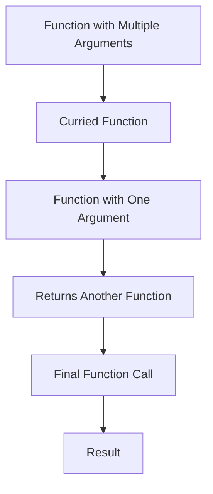

## 9.2.1 Implementing Currying in TypeScript

Currying is a powerful concept in functional programming that allows us to transform a function with multiple arguments into a sequence of functions, each taking a single argument. This technique is particularly useful in TypeScript, where type safety and functional patterns can lead to more robust and maintainable code. In this section, we will delve into the intricacies of implementing currying in TypeScript, exploring manual implementations, leveraging utility libraries, and ensuring type safety with advanced TypeScript features.

### Understanding Currying

Currying transforms a function that takes multiple arguments into a series of functions that each take a single argument. This allows for partial application, where some arguments are fixed, and the resulting function can be reused with different remaining arguments.

**Example of Currying:**

```typescript
function add(a: number, b: number): number {
    return a + b;
}

const curriedAdd = (a: number) => (b: number) => a + b;

const addFive = curriedAdd(5);
console.log(addFive(10)); // Outputs: 15
```

In the example above, `curriedAdd` is a curried version of the `add` function, allowing us to create a new function `addFive` by partially applying the first argument.

### Implementing Currying Manually in TypeScript

To implement currying manually, we need to define functions that return other functions, each accepting one argument. Let's break this down step-by-step.

#### Step 1: Basic Curried Function

Start by defining a simple curried function manually:

```typescript
function multiply(a: number): (b: number) => number {
    return function(b: number): number {
        return a * b;
    };
}

const double = multiply(2);
console.log(double(5)); // Outputs: 10
```

Here, `multiply` is a function that returns another function. The inner function takes the second argument and performs the multiplication.

#### Step 2: Handling Multiple Parameters

For functions with more than two parameters, we can extend the concept by nesting functions:

```typescript
function curriedSum(a: number): (b: number) => (c: number) => number {
    return function(b: number): (c: number) => number {
        return function(c: number): number {
            return a + b + c;
        };
    };
}

const sumWithFive = curriedSum(5);
const sumWithFiveAndTen = sumWithFive(10);
console.log(sumWithFiveAndTen(15)); // Outputs: 30
```

This approach can become cumbersome as the number of parameters increases. Let's explore more scalable solutions.

### Using Variadic and Higher-Order Functions

Variadic functions accept a variable number of arguments. In TypeScript, we can use rest parameters to handle variadic functions, but currying requires a different approach since each function in the chain should accept exactly one argument.

#### Higher-Order Functions

Higher-order functions are functions that take other functions as arguments or return them. We can use them to create more flexible currying implementations.

```typescript
function curry(fn: Function): Function {
    return function curried(...args: any[]) {
        if (args.length >= fn.length) {
            return fn.apply(this, args);
        }
        return function(...nextArgs: any[]) {
            return curried.apply(this, args.concat(nextArgs));
        };
    };
}

function sum(a: number, b: number, c: number): number {
    return a + b + c;
}

const curriedSum = curry(sum);
console.log(curriedSum(1)(2)(3)); // Outputs: 6
```

In this example, `curry` is a higher-order function that transforms a regular function into a curried function. It checks if the number of provided arguments is sufficient to call the original function; if not, it returns a new function to collect more arguments.

### Challenges with TypeScript's Type Inference

TypeScript's type inference can struggle with curried functions, especially when dealing with variadic arguments. Ensuring type safety requires careful use of TypeScript's advanced type features.

#### Using Generics and Overloads

Generics allow us to define functions that can work with any data type, while overloads let us specify multiple function signatures. Combining these features can help us create type-safe curried functions.

```typescript
type CurriedFunction<T extends any[], R> = 
    T extends [infer A, ...infer Rest]
        ? (arg: A) => CurriedFunction<Rest, R>
        : R;

function curry<T extends any[], R>(fn: (...args: T) => R): CurriedFunction<T, R> {
    return function curried(...args: any[]): any {
        if (args.length >= fn.length) {
            return fn(...args);
        }
        return function(...nextArgs: any[]) {
            return curried(...args.concat(nextArgs));
        };
    };
}

const curriedSumTyped = curry(sum);
console.log(curriedSumTyped(1)(2)(3)); // Outputs: 6
```

Here, `CurriedFunction` is a recursive type that defines the structure of a curried function. The `curry` function uses this type to ensure type safety.

### Leveraging Utility Libraries

Libraries like Lodash and Ramda provide built-in curry functions that handle many of the complexities for us. These libraries are well-tested and widely used in the JavaScript community.

#### Using Lodash

Lodash's `curry` function can be used with TypeScript, thanks to its comprehensive type definitions.

```typescript
import { curry } from 'lodash';

const curriedSumLodash = curry(sum);
console.log(curriedSumLodash(1)(2)(3)); // Outputs: 6
```

Lodash's `curry` function automatically handles argument collection and function invocation, simplifying the process.

#### Using Ramda

Ramda is another functional programming library that offers a `curry` function with excellent TypeScript support.

```typescript
import * as R from 'ramda';

const curriedSumRamda = R.curry(sum);
console.log(curriedSumRamda(1)(2)(3)); // Outputs: 6
```

Ramda's `curry` function is similar to Lodash's but is part of a library focused entirely on functional programming.

### Writing Type-Safe Curry Functions

To ensure our curry functions are type-safe, we can leverage TypeScript's advanced type features like generics and conditional types.

#### Example of Type-Safe Curry Function

```typescript
type Curried<T extends any[], R> = 
    T extends [infer A, ...infer Rest]
        ? (arg: A) => Curried<Rest, R>
        : R;

function currySafe<T extends any[], R>(fn: (...args: T) => R): Curried<T, R> {
    return function curried(...args: any[]): any {
        if (args.length >= fn.length) {
            return fn(...args);
        }
        return function(...nextArgs: any[]) {
            return curried(...args.concat(nextArgs));
        };
    };
}

const curriedSumSafe = currySafe(sum);
console.log(curriedSumSafe(1)(2)(3)); // Outputs: 6
```

This implementation uses a recursive type to define the structure of a curried function, ensuring that each step in the currying process is type-safe.

### Best Practices for Currying in TypeScript

1. **Ensure Readability**: Currying can make code harder to read if overused. Use it judiciously and document its purpose clearly.
2. **Leverage Libraries**: Use libraries like Lodash or Ramda to handle currying, especially in complex applications.
3. **Type Safety**: Always ensure your curried functions are type-safe by using TypeScript's advanced type features.
4. **Test Thoroughly**: Currying can introduce subtle bugs if not implemented correctly. Write comprehensive tests to cover all use cases.
5. **Consider Performance**: Currying can impact performance, especially in performance-critical applications. Profile and optimize as needed.

### Try It Yourself

Experiment with the code examples provided. Try modifying the `curry` function to handle different types of functions, or explore using Lodash or Ramda in your projects. Consider creating your own utility library for currying if you have specific needs.

### Visualizing Currying

To better understand currying, let's visualize the process using a flowchart:



This flowchart illustrates how a function with multiple arguments is transformed into a series of functions, each accepting one argument, culminating in the final function call that produces the result.

### References and Links

- [MDN Web Docs on Currying](https://developer.mozilla.org/en-US/docs/Glossary/Currying)
- [TypeScript Handbook](https://www.typescriptlang.org/docs/handbook/2/functions.html)
- [Lodash Documentation](https://lodash.com/docs/4.17.15#curry)
- [Ramda Documentation](https://ramdajs.com/docs/#curry)

### Knowledge Check

- What is currying, and how does it differ from partial application?
- How can you implement a curried function manually in TypeScript?
- What challenges does TypeScript's type inference present when dealing with curried functions?
- How can utility libraries like Lodash and Ramda simplify currying in TypeScript?
- What are some best practices for using currying in TypeScript?

### Embrace the Journey

Remember, mastering currying in TypeScript is just one step in your journey to becoming a functional programming expert. Keep experimenting, stay curious, and enjoy the process of learning and applying these powerful concepts in your projects.

## Quiz Time!



### What is currying in functional programming?

- [x] Transforming a function with multiple arguments into a sequence of functions each taking a single argument.
- [ ] Combining multiple functions into one.
- [ ] Reducing the number of arguments a function takes.
- [ ] Creating a function that can be called with any number of arguments.

> **Explanation:** Currying is a technique that transforms a function with multiple arguments into a series of functions, each taking a single argument.

### How can you manually implement a curried function in TypeScript?

- [x] By defining a function that returns another function for each argument.
- [ ] By using TypeScript's built-in curry function.
- [ ] By using a loop to iterate over arguments.
- [ ] By creating a single function that takes all arguments at once.

> **Explanation:** A curried function is implemented by defining a function that returns another function for each argument, allowing for partial application.

### Which TypeScript feature is crucial for ensuring type safety in curried functions?

- [x] Generics and overloads.
- [ ] Type assertions.
- [ ] Type casting.
- [ ] Any type.

> **Explanation:** Generics and overloads allow for defining type-safe curried functions by specifying multiple function signatures.

### What is a higher-order function?

- [x] A function that takes other functions as arguments or returns them.
- [ ] A function that is called before other functions.
- [ ] A function that has more than one argument.
- [ ] A function that is defined inside another function.

> **Explanation:** Higher-order functions are functions that take other functions as arguments or return them, enabling functional programming patterns like currying.

### How does Lodash's curry function simplify currying in TypeScript?

- [x] By automatically handling argument collection and function invocation.
- [ ] By providing built-in TypeScript types for curried functions.
- [ ] By converting functions into arrow functions.
- [ ] By removing the need for TypeScript typings.

> **Explanation:** Lodash's curry function simplifies currying by automatically managing argument collection and function invocation.

### What is a potential downside of using currying excessively?

- [x] It can make code harder to read and understand.
- [ ] It increases the number of arguments a function takes.
- [ ] It decreases code performance.
- [ ] It removes type safety from functions.

> **Explanation:** Excessive use of currying can lead to code that is difficult to read and understand, especially for developers unfamiliar with functional programming.

### Which library is focused entirely on functional programming and offers a curry function?

- [x] Ramda
- [ ] Lodash
- [ ] jQuery
- [ ] Underscore

> **Explanation:** Ramda is a library focused entirely on functional programming and offers a curry function with excellent TypeScript support.

### What is the main benefit of using curried functions?

- [x] They enable partial application and reuse of functions with fixed arguments.
- [ ] They reduce the number of functions in a codebase.
- [ ] They increase the speed of function execution.
- [ ] They allow functions to be called with any number of arguments.

> **Explanation:** Curried functions enable partial application, allowing for the reuse of functions with fixed arguments, enhancing code modularity.

### How can you visualize the process of currying?

- [x] Using a flowchart to illustrate the transformation of a function with multiple arguments into a series of functions.
- [ ] By writing a detailed essay.
- [ ] By creating a class diagram.
- [ ] By drawing a sequence diagram.

> **Explanation:** A flowchart can effectively illustrate the process of currying, showing how a function with multiple arguments is transformed into a series of functions.

### True or False: Currying is only applicable to functions with two arguments.

- [ ] True
- [x] False

> **Explanation:** False. Currying can be applied to functions with any number of arguments, transforming them into a series of functions each taking a single argument.


