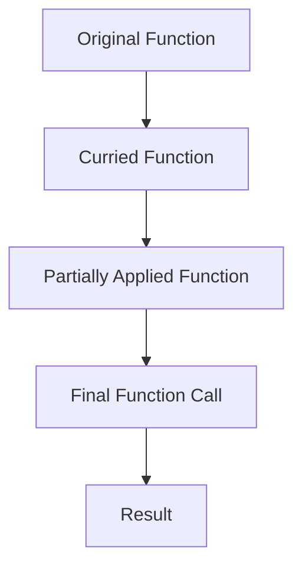

## 9.2.2 Use Cases and Examples

Currying and partial application are powerful techniques in functional programming that can significantly enhance the flexibility and reusability of your code. By transforming functions and enabling partial application of arguments, these techniques allow developers to create more modular and maintainable codebases. In this section, we'll explore practical examples of how currying and partial application can simplify code, support function composition, and improve code clarity.

### Understanding Currying and Partial Application

Before diving into use cases, let's briefly revisit what currying and partial application mean:

- **Currying**: This is the process of transforming a function with multiple arguments into a sequence of functions, each taking a single argument. This transformation allows for the gradual application of arguments, enabling more flexible function composition.

- **Partial Application**: This involves creating a new function by pre-filling some of the arguments of an existing function. This technique is particularly useful for creating specialized versions of more general-purpose functions.

### Practical Examples of Currying

Currying can simplify code by allowing you to configure functions with common parameters. Let's explore some scenarios where currying proves beneficial.

#### Example 1: Configuring a Logger Function

Imagine you have a logging function that requires a log level and a message. Currying allows you to create a specialized logger for a specific log level:

```typescript
// A generic logger function
function log(level: string, message: string): void {
  console.log(`[${level.toUpperCase()}] ${message}`);
}

// Curried version of the logger function
const curriedLog = (level: string) => (message: string) => log(level, message);

// Creating specialized loggers
const infoLog = curriedLog('info');
const errorLog = curriedLog('error');

// Using the specialized loggers
infoLog('This is an informational message.');
errorLog('An error has occurred.');
```

In this example, `curriedLog` transforms the `log` function into a curried version, allowing us to create `infoLog` and `errorLog` functions that are pre-configured with specific log levels.

#### Example 2: Configuring an HTTP Client

Currying can also be used to configure HTTP clients with common headers or base URLs:

```typescript
// A generic HTTP request function
function request(method: string, url: string, headers: Record<string, string>): void {
  console.log(`Making a ${method} request to ${url} with headers:`, headers);
}

// Curried version of the request function
const curriedRequest = (method: string) => (url: string) => (headers: Record<string, string>) => request(method, url, headers);

// Creating specialized request functions
const getRequest = curriedRequest('GET');
const postRequest = curriedRequest('POST');

// Using the specialized request functions
getRequest('https://api.example.com/data')({ 'Authorization': 'Bearer token' });
postRequest('https://api.example.com/data')({ 'Content-Type': 'application/json' });
```

Here, `curriedRequest` allows us to create `getRequest` and `postRequest` functions that are pre-configured with HTTP methods, simplifying the creation of HTTP requests.

### Partial Application in Action

Partial application can be used to create specialized versions of general-purpose functions, reducing redundancy and improving code clarity.

#### Example 3: Event Handling

In event handling, partial application can be used to bind specific event types or handlers:

```typescript
// A generic event handler function
function handleEvent(eventType: string, handler: (event: Event) => void, event: Event): void {
  if (event.type === eventType) {
    handler(event);
  }
}

// Partially applied event handler for click events
const handleClickEvent = (handler: (event: Event) => void) => (event: Event) => handleEvent('click', handler, event);

// Using the specialized event handler
document.addEventListener('click', handleClickEvent((event) => {
  console.log('Click event handled:', event);
}));
```

In this example, `handleClickEvent` is a partially applied function that simplifies handling click events by pre-filling the `eventType` argument.

#### Example 4: Data Transformation

Partial application can also be used in data transformation pipelines to create reusable transformation functions:

```typescript
// A generic data transformation function
function transformData(transformFn: (data: any) => any, data: any): any {
  return transformFn(data);
}

// Partially applied transformation function for doubling numbers
const doubleNumbers = (data: number[]) => transformData((num: number) => num * 2, data);

// Using the specialized transformation function
const numbers = [1, 2, 3, 4];
const doubled = numbers.map(doubleNumbers);
console.log('Doubled numbers:', doubled);
```

Here, `doubleNumbers` is a partially applied function that simplifies the transformation of number arrays by pre-filling the transformation function.

### Function Composition with Currying

Currying supports function composition, allowing developers to build complex functionality from simple functions.

#### Example 5: Composing Functions for Data Processing

Let's explore how currying and function composition can be used to create a data processing pipeline:

```typescript
// Simple functions for data processing
const add = (a: number) => (b: number) => a + b;
const multiply = (a: number) => (b: number) => a * b;

// Composing functions using currying
const addAndMultiply = (a: number) => (b: number) => (c: number) => multiply(a)(add(b)(c));

// Using the composed function
const result = addAndMultiply(2)(3)(4); // (3 + 4) * 2 = 14
console.log('Result of add and multiply:', result);
```

In this example, `addAndMultiply` is a composed function that combines addition and multiplication, demonstrating how currying facilitates function composition.

### Currying and Partial Application in Real-World Contexts

Currying and partial application can be applied in various real-world contexts, such as event handling, data transformation, and configuration of HTTP clients.

#### Example 6: Configuring Middleware in Express.js

In web development, currying can be used to configure middleware functions with common parameters:

```typescript
import express from 'express';

const app = express();

// A generic middleware function
function middleware(config: { logLevel: string }) {
  return (req: express.Request, res: express.Response, next: express.NextFunction) => {
    if (config.logLevel === 'verbose') {
      console.log(`Request to ${req.url}`);
    }
    next();
  };
}

// Curried middleware function
const curriedMiddleware = (logLevel: string) => middleware({ logLevel });

// Using the curried middleware
app.use(curriedMiddleware('verbose'));

// Start the server
app.listen(3000, () => {
  console.log('Server is running on port 3000');
});
```

Here, `curriedMiddleware` allows us to create middleware functions that are pre-configured with a specific log level, simplifying middleware configuration.

#### Example 7: Creating Specialized HTTP Clients

Partial application can be used to create specialized HTTP clients with common headers or base URLs:

```typescript
// A generic HTTP client function
function httpClient(baseUrl: string, headers: Record<string, string>, endpoint: string): void {
  console.log(`Request to ${baseUrl}${endpoint} with headers:`, headers);
}

// Partially applied HTTP client for a specific base URL
const apiClient = (endpoint: string) => httpClient('https://api.example.com', { 'Authorization': 'Bearer token' }, endpoint);

// Using the specialized HTTP client
apiClient('/users');
apiClient('/posts');
```

In this example, `apiClient` is a partially applied function that simplifies making requests to a specific API by pre-filling the base URL and headers.

### Improving Code Clarity and Reducing Redundancy

Currying and partial application improve code clarity by reducing redundancy and making functions more modular and reusable. By pre-filling common arguments, these techniques allow developers to create specialized functions that are easier to understand and maintain.

### Encouraging Exploration and Application

As you explore currying and partial application, consider identifying opportunities for using these techniques in your own codebases. Look for functions with common parameters or repetitive argument patterns, and experiment with transforming them into curried or partially applied functions.

### Try It Yourself

To deepen your understanding, try modifying the code examples provided in this section. Experiment with creating your own curried and partially applied functions, and explore how these techniques can be applied in different contexts.

### Visualizing Currying and Partial Application

To better understand the flow of currying and partial application, let's visualize the process using a diagram:



**Diagram Explanation**: This diagram illustrates the transformation of an original function into a curried function, followed by partial application to create a specialized function, and finally, the execution of the function call to produce a result.

### References and Further Reading

For more information on currying and partial application, consider exploring the following resources:

- [MDN Web Docs: Function Currying](https://developer.mozilla.org/en-US/docs/Glossary/Currying)
- [Functional Programming in JavaScript](https://www.oreilly.com/library/view/functional-programming-in/9781492042173/)
- [TypeScript Handbook: Functions](https://www.typescriptlang.org/docs/handbook/functions.html)

### Knowledge Check

To reinforce your understanding, consider the following questions:

- How can currying simplify the configuration of functions with common parameters?
- What are the benefits of using partial application in event handling?
- How does currying support function composition in data processing pipelines?

### Embrace the Journey

Remember, this is just the beginning. As you progress, you'll discover more opportunities to apply currying and partial application in your projects. Keep experimenting, stay curious, and enjoy the journey!

## Quiz Time!



### What is the primary benefit of currying a function?

- [x] It allows for gradual application of arguments.
- [ ] It increases the number of arguments a function can take.
- [ ] It decreases the function's execution time.
- [ ] It automatically optimizes the function for performance.

> **Explanation:** Currying transforms a function so that it can be called with a sequence of arguments, allowing for gradual application.

### How does partial application differ from currying?

- [x] Partial application pre-fills some arguments, while currying transforms the function.
- [ ] Partial application transforms the function, while currying pre-fills arguments.
- [ ] Both are identical in functionality.
- [ ] Neither involves argument transformation.

> **Explanation:** Partial application involves pre-filling some arguments of a function, whereas currying transforms a function into a series of unary functions.

### Which of the following is a use case for partial application?

- [x] Creating specialized versions of general-purpose functions.
- [ ] Automatically optimizing function performance.
- [ ] Increasing the number of function arguments.
- [ ] Reducing the function's execution time.

> **Explanation:** Partial application is used to create specialized functions by pre-filling some arguments of a general-purpose function.

### How does currying support function composition?

- [x] By allowing functions to be combined into more complex operations.
- [ ] By reducing the number of arguments a function takes.
- [ ] By automatically optimizing composed functions.
- [ ] By increasing the execution speed of composed functions.

> **Explanation:** Currying enables the combination of simple functions into more complex operations, supporting function composition.

### What is a practical application of currying in web development?

- [x] Configuring middleware functions with common parameters.
- [ ] Automatically optimizing HTTP requests.
- [ ] Increasing the number of HTTP request parameters.
- [ ] Reducing the execution time of HTTP requests.

> **Explanation:** Currying can be used to configure middleware functions with common parameters, simplifying web development.

### Which of the following best describes a curried function?

- [x] A function that returns a series of unary functions.
- [ ] A function that takes multiple arguments at once.
- [ ] A function that automatically optimizes for performance.
- [ ] A function that decreases execution time.

> **Explanation:** A curried function is one that returns a series of unary functions, each taking a single argument.

### What is the advantage of using partially applied functions in event handling?

- [x] They simplify the binding of specific event types or handlers.
- [ ] They automatically optimize event handling performance.
- [ ] They increase the number of event handler arguments.
- [ ] They reduce the execution time of event handlers.

> **Explanation:** Partially applied functions simplify event handling by pre-filling specific event types or handlers.

### How can currying improve code clarity?

- [x] By reducing redundancy and making functions more modular.
- [ ] By automatically optimizing code for performance.
- [ ] By increasing the number of function arguments.
- [ ] By reducing the execution time of functions.

> **Explanation:** Currying improves code clarity by reducing redundancy and making functions more modular and reusable.

### What is a benefit of using partial application in data transformation?

- [x] It creates reusable transformation functions.
- [ ] It automatically optimizes data transformation performance.
- [ ] It increases the number of transformation arguments.
- [ ] It reduces the execution time of transformations.

> **Explanation:** Partial application creates reusable transformation functions by pre-filling some arguments, improving code clarity.

### Currying and partial application are only useful in functional programming.

- [ ] True
- [x] False

> **Explanation:** While currying and partial application are common in functional programming, they can be applied in various programming paradigms to improve code flexibility and reusability.


