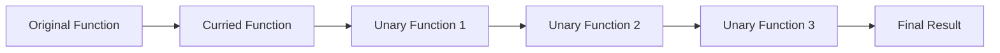

## 9.2 Currying and Partial Application

In the realm of functional programming, currying and partial application are two powerful techniques that enable developers to create more modular, reusable, and composable code. These techniques allow us to transform functions and manage their arguments in a way that enhances flexibility and readability. In this section, we'll delve into the concepts of currying and partial application, explore their distinctions, and demonstrate how they can be effectively implemented in TypeScript.

### Understanding Currying and Partial Application

**Currying** is a technique in functional programming where a function with multiple arguments is transformed into a sequence of functions, each taking a single argument. This transformation allows us to call a function with fewer arguments than it expects, returning a new function that takes the remaining arguments.

**Partial Application**, on the other hand, involves fixing a few arguments of a function and producing another function of smaller arity. While currying transforms a function into a series of unary functions, partial application allows us to "preset" some arguments, creating a new function with the remaining arguments.

#### Distinction Between Currying and Partial Application

- **Currying**: Transforms a function into a chain of single-argument functions.
- **Partial Application**: Fixes a few arguments of a function, returning a new function that takes the rest.

### Supporting Functional Programming

Currying and partial application are foundational to functional programming, as they enable the creation of specialized functions. By transforming functions and managing their arguments, we can create more modular and reusable code. These techniques support function composition, allowing us to build complex operations from simpler ones.

### Practical Examples in TypeScript

Let's explore how we can implement currying and partial application in TypeScript with practical examples.

#### Currying in TypeScript

Consider a simple function that adds three numbers:

```typescript
function add(x: number, y: number, z: number): number {
    return x + y + z;
}
```

To curry this function, we transform it into a series of unary functions:

```typescript
function curryAdd(x: number): (y: number) => (z: number) => number {
    return (y: number) => (z: number) => x + y + z;
}

const add5 = curryAdd(5);
const add5and3 = add5(3);
const result = add5and3(10); // 18
```

In this example, `curryAdd` is a curried version of `add`. We first call `curryAdd` with `5`, which returns a function expecting the next argument. This process continues until all arguments are supplied.

#### Partial Application in TypeScript

Partial application allows us to fix some arguments of a function, creating a new function with the remaining arguments:

```typescript
function partialAdd(x: number, y: number): (z: number) => number {
    return (z: number) => x + y + z;
}

const add7 = partialAdd(3, 4);
const result = add7(10); // 17
```

Here, `partialAdd` fixes the first two arguments, `3` and `4`, and returns a new function that takes the final argument.

### Benefits of Currying and Partial Application

Currying and partial application offer several benefits:

- **Code Reusability**: By breaking down functions into smaller parts, we can reuse them in different contexts.
- **Readability**: Functions become easier to read and understand when they are broken down into smaller, more manageable pieces.
- **Flexibility**: These techniques allow us to create specialized functions tailored to specific needs without altering the original function.

### Facilitating Function Composition

Function composition is the process of combining simple functions to build more complex ones. Currying and partial application facilitate this by allowing us to create functions that can be easily composed.

Consider the following example:

```typescript
const multiply = (a: number) => (b: number) => a * b;
const double = multiply(2);

const increment = (x: number) => x + 1;

const doubleThenIncrement = (x: number) => increment(double(x));

const result = doubleThenIncrement(3); // 7
```

In this example, we use currying to create a `double` function and then compose it with `increment` to create `doubleThenIncrement`.

### TypeScript Typings for Curried Functions

TypeScript's static typing system ensures that curried functions maintain correct type inference. Let's see how we can define types for curried functions:

```typescript
type CurriedFunction = (x: number) => (y: number) => (z: number) => number;

const curriedAdd: CurriedFunction = (x) => (y) => (z) => x + y + z;

const add5 = curriedAdd(5);
const add5and3 = add5(3);
const result = add5and3(10); // 18
```

By defining a type for our curried function, we ensure that TypeScript can infer the correct types at each step.

### Caveats and Limitations

While currying and partial application are powerful, there are some caveats and limitations to consider:

- **Complexity**: Overusing these techniques can lead to complex and difficult-to-read code.
- **Performance**: Currying can introduce performance overhead due to the creation of intermediate functions.
- **TypeScript Limitations**: TypeScript's type inference can sometimes struggle with deeply nested curried functions, requiring explicit type annotations.

### Best Practices and Patterns

To effectively use currying and partial application in TypeScript, consider the following best practices:

- **Use Sparingly**: Avoid overusing these techniques to prevent code complexity.
- **Type Annotations**: Use type annotations to aid TypeScript's type inference.
- **Function Composition**: Leverage currying and partial application to facilitate function composition.
- **Readability**: Ensure that curried and partially applied functions are easy to read and understand.

### Try It Yourself

Experiment with the following code examples to deepen your understanding of currying and partial application:

1. Modify the `curryAdd` function to handle four arguments instead of three.
2. Create a partially applied function that subtracts two numbers from a given number.
3. Compose two curried functions to perform a series of mathematical operations.

### Visualizing Currying and Partial Application

To better understand the flow of currying and partial application, let's visualize the process using a flowchart:



**Figure 1**: Visualizing the transformation of a function through currying.

### Knowledge Check

- What is the primary difference between currying and partial application?
- How do currying and partial application support function composition?
- What are the benefits of using currying and partial application in TypeScript?

### Embrace the Journey

Remember, mastering currying and partial application is a journey. These techniques are powerful tools in the functional programming toolkit, enabling you to write more modular, reusable, and composable code. As you experiment and apply these concepts, you'll discover new ways to enhance your TypeScript codebases. Keep exploring, stay curious, and enjoy the journey!

## Quiz Time!



### What is currying?

- [x] Transforming a function with multiple arguments into a sequence of functions each taking a single argument.
- [ ] Fixing a few arguments of a function and producing another function of smaller arity.
- [ ] A technique to improve performance by reducing function calls.
- [ ] A method for handling asynchronous operations.

> **Explanation:** Currying is a technique where a function with multiple arguments is transformed into a sequence of functions, each taking a single argument.

### What is partial application?

- [ ] Transforming a function with multiple arguments into a sequence of functions each taking a single argument.
- [x] Fixing a few arguments of a function and producing another function of smaller arity.
- [ ] A technique to improve performance by reducing function calls.
- [ ] A method for handling asynchronous operations.

> **Explanation:** Partial application involves fixing a few arguments of a function and producing another function that takes the rest of the arguments.

### How does currying support function composition?

- [x] By allowing functions to be broken down into smaller, composable parts.
- [ ] By reducing the number of arguments a function takes.
- [ ] By improving the performance of function calls.
- [ ] By enabling asynchronous operations.

> **Explanation:** Currying supports function composition by breaking functions into smaller parts, making it easier to compose them into more complex operations.

### What is a benefit of using currying in TypeScript?

- [x] It enhances code reusability and readability.
- [ ] It improves the performance of function calls.
- [ ] It simplifies asynchronous programming.
- [ ] It reduces the need for type annotations.

> **Explanation:** Currying enhances code reusability and readability by breaking functions into smaller, more manageable pieces.

### What is a potential caveat of using currying?

- [x] It can introduce complexity and performance overhead.
- [ ] It simplifies code and reduces complexity.
- [ ] It eliminates the need for type annotations.
- [ ] It automatically improves code performance.

> **Explanation:** Currying can introduce complexity and performance overhead due to the creation of intermediate functions.

### How can TypeScript typings help with curried functions?

- [x] By ensuring correct type inference at each step of the curried function.
- [ ] By automatically generating type annotations.
- [ ] By improving the performance of curried functions.
- [ ] By reducing the need for function composition.

> **Explanation:** TypeScript typings help ensure correct type inference at each step of the curried function, maintaining type safety.

### What is a best practice when using currying in TypeScript?

- [x] Use type annotations to aid TypeScript's type inference.
- [ ] Avoid using currying to prevent complexity.
- [ ] Always use currying for every function.
- [ ] Ignore type annotations for simpler code.

> **Explanation:** Using type annotations helps TypeScript's type inference and maintains type safety when using currying.

### What is the primary goal of partial application?

- [x] To fix some arguments of a function and create a new function with the remaining arguments.
- [ ] To transform a function into a sequence of unary functions.
- [ ] To improve the performance of function calls.
- [ ] To handle asynchronous operations more effectively.

> **Explanation:** The primary goal of partial application is to fix some arguments of a function and create a new function with the remaining arguments.

### How does partial application enhance code flexibility?

- [x] By allowing the creation of specialized functions tailored to specific needs.
- [ ] By reducing the number of arguments a function takes.
- [ ] By improving the performance of function calls.
- [ ] By enabling asynchronous operations.

> **Explanation:** Partial application enhances code flexibility by allowing the creation of specialized functions tailored to specific needs.

### True or False: Currying and partial application are the same.

- [ ] True
- [x] False

> **Explanation:** Currying and partial application are not the same. Currying transforms a function into a sequence of unary functions, while partial application fixes some arguments of a function, returning a new function with the remaining arguments.


