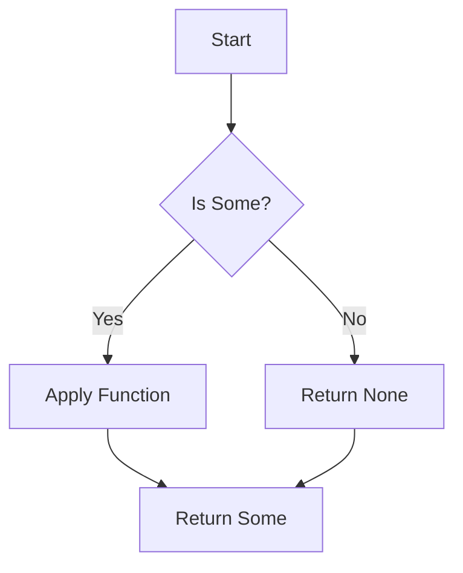
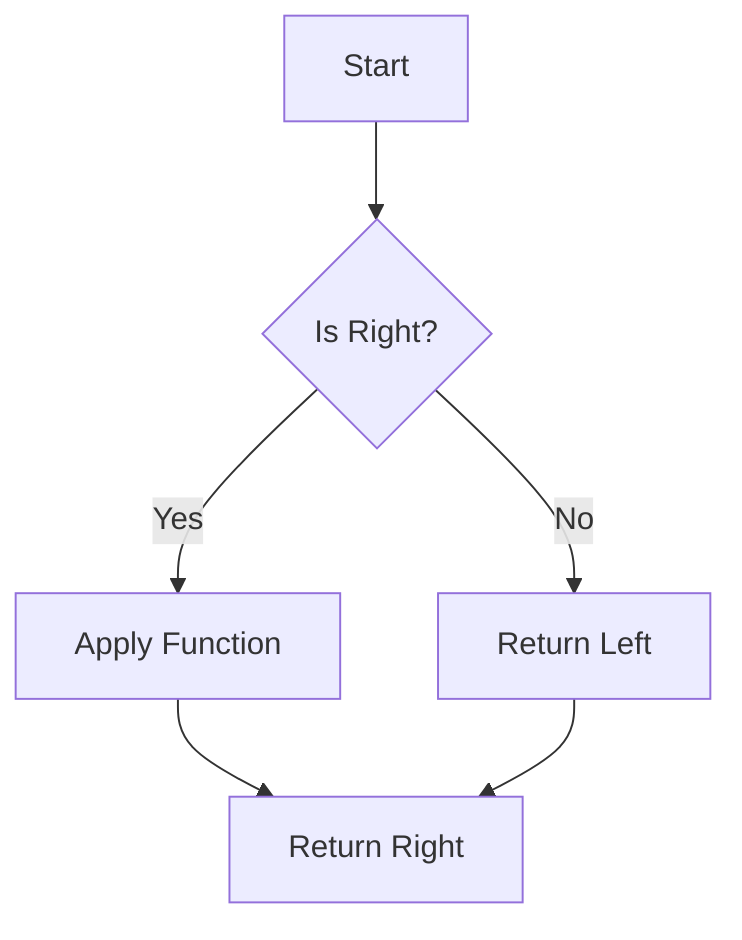

## 9.3.1 Implementing Maybe and Either Monads

In the realm of functional programming, monads are powerful constructs that help manage side effects, handle errors, and work with optional values in a clean and concise manner. In this section, we will delve into the implementation of two widely-used monads: the Maybe (or Option) monad and the Either monad. These constructs are particularly useful in TypeScript for handling nullable values and computations that may fail, providing a more robust alternative to traditional error handling techniques.

### Understanding the Maybe Monad

The **Maybe** monad is a design pattern used to represent optional values. It encapsulates a value that might be present (Some) or absent (None). This pattern helps eliminate null checks scattered throughout your code, leading to more readable and maintainable codebases.

#### Purpose and Benefits

- **Eliminates Null Checks**: By using Maybe, you can avoid the pervasive null checks that often clutter code.
- **Encourages Safe Access**: Methods like `map` and `flatMap` allow you to safely operate on the value if it exists.
- **Improves Code Readability**: The intent of handling optional values is explicit, making the code easier to understand.

#### Implementing the Maybe Monad in TypeScript

Let's start by implementing the Maybe monad in TypeScript. We'll define a generic class `Maybe<T>` with two subclasses: `Some<T>` and `None`.

```typescript
// Define the Maybe base class
abstract class Maybe<T> {
  abstract isSome(): boolean;
  abstract isNone(): boolean;
  abstract map<U>(fn: (value: T) => U): Maybe<U>;
  abstract flatMap<U>(fn: (value: T) => Maybe<U>): Maybe<U>;
  abstract getOrElse(defaultValue: T): T;
}

// Define the Some class
class Some<T> extends Maybe<T> {
  constructor(private value: T) {
    super();
  }

  isSome(): boolean {
    return true;
  }

  isNone(): boolean {
    return false;
  }

  map<U>(fn: (value: T) => U): Maybe<U> {
    return new Some(fn(this.value));
  }

  flatMap<U>(fn: (value: T) => Maybe<U>): Maybe<U> {
    return fn(this.value);
  }

  getOrElse(defaultValue: T): T {
    return this.value;
  }
}

// Define the None class
class None<T> extends Maybe<T> {
  isSome(): boolean {
    return false;
  }

  isNone(): boolean {
    return true;
  }

  map<U>(fn: (value: T) => U): Maybe<U> {
    return new None<U>();
  }

  flatMap<U>(fn: (value: T) => Maybe<U>): Maybe<U> {
    return new None<U>();
  }

  getOrElse(defaultValue: T): T {
    return defaultValue;
  }
}

// Factory functions for creating Maybe instances
function some<T>(value: T): Maybe<T> {
  return new Some(value);
}

function none<T>(): Maybe<T> {
  return new None<T>();
}
```

#### Key Methods Explained

- **`map`**: Transforms the value inside the `Some` using the provided function, returning a new `Maybe`.
- **`flatMap` (bind)**: Similar to `map`, but the function returns a `Maybe`, allowing for chaining operations.
- **`getOrElse`**: Returns the contained value if it's `Some`, otherwise returns the provided default value.

#### Usage Example

Let's see how the Maybe monad can simplify handling optional values:

```typescript
function findUserById(id: number): Maybe<User> {
  const user = database.find(user => user.id === id);
  return user ? some(user) : none();
}

const userMaybe = findUserById(1);
const userName = userMaybe.map(user => user.name).getOrElse("Guest");

console.log(userName); // Outputs the user's name or "Guest" if not found
```

### Understanding the Either Monad

The **Either** monad is used for computations that may result in a value or an error. It has two cases: `Left` (usually representing an error) and `Right` (representing a successful computation).

#### Purpose and Benefits

- **Encapsulates Errors**: Instead of throwing exceptions, errors are encapsulated within the `Left`.
- **Encourages Explicit Error Handling**: The presence of `Left` and `Right` makes it clear when errors need to be handled.
- **Improves Code Clarity**: By making error handling explicit, the code becomes more predictable and easier to follow.

#### Implementing the Either Monad in TypeScript

We will define a generic class `Either<L, R>` with two subclasses: `Left<L>` and `Right<R>`.

```typescript
// Define the Either base class
abstract class Either<L, R> {
  abstract isLeft(): boolean;
  abstract isRight(): boolean;
  abstract map<U>(fn: (value: R) => U): Either<L, U>;
  abstract flatMap<U>(fn: (value: R) => Either<L, U>): Either<L, U>;
  abstract fold<U>(leftFn: (left: L) => U, rightFn: (right: R) => U): U;
}

// Define the Left class
class Left<L, R> extends Either<L, R> {
  constructor(private value: L) {
    super();
  }

  isLeft(): boolean {
    return true;
  }

  isRight(): boolean {
    return false;
  }

  map<U>(fn: (value: R) => U): Either<L, U> {
    return new Left<L, U>(this.value);
  }

  flatMap<U>(fn: (value: R) => Either<L, U>): Either<L, U> {
    return new Left<L, U>(this.value);
  }

  fold<U>(leftFn: (left: L) => U, rightFn: (right: R) => U): U {
    return leftFn(this.value);
  }
}

// Define the Right class
class Right<L, R> extends Either<L, R> {
  constructor(private value: R) {
    super();
  }

  isLeft(): boolean {
    return false;
  }

  isRight(): boolean {
    return true;
  }

  map<U>(fn: (value: R) => U): Either<L, U> {
    return new Right<L, U>(fn(this.value));
  }

  flatMap<U>(fn: (value: R) => Either<L, U>): Either<L, U> {
    return fn(this.value);
  }

  fold<U>(leftFn: (left: L) => U, rightFn: (right: R) => U): U {
    return rightFn(this.value);
  }
}

// Factory functions for creating Either instances
function left<L, R>(value: L): Either<L, R> {
  return new Left(value);
}

function right<L, R>(value: R): Either<L, R> {
  return new Right(value);
}
```

#### Key Methods Explained

- **`map`**: Transforms the value inside the `Right` using the provided function, returning a new `Either`.
- **`flatMap` (bind)**: Similar to `map`, but the function returns an `Either`, allowing for chaining operations.
- **`fold`**: Applies one of two functions depending on whether the instance is `Left` or `Right`.

#### Usage Example

Let's see how the Either monad can simplify error handling:

```typescript
function divide(a: number, b: number): Either<string, number> {
  if (b === 0) {
    return left("Division by zero");
  } else {
    return right(a / b);
  }
}

const result = divide(4, 2);
const message = result.fold(
  error => `Error: ${error}`,
  value => `Result: ${value}`
);

console.log(message); // Outputs "Result: 2"
```

### Integrating Monads with Asynchronous Code

Monads like Maybe and Either can be seamlessly integrated with asynchronous code, especially when dealing with promises. This allows for elegant error handling and optional value management in asynchronous workflows.

#### Example: Using Maybe with Promises

```typescript
async function fetchData(url: string): Promise<Maybe<string>> {
  try {
    const response = await fetch(url);
    if (!response.ok) {
      return none();
    }
    const data = await response.text();
    return some(data);
  } catch {
    return none();
  }
}

fetchData("https://api.example.com/data")
  .then(dataMaybe => dataMaybe.map(data => console.log(data)).getOrElse("No data"));
```

#### Example: Using Either with Promises

```typescript
async function fetchJson(url: string): Promise<Either<string, any>> {
  try {
    const response = await fetch(url);
    if (!response.ok) {
      return left("Failed to fetch");
    }
    const data = await response.json();
    return right(data);
  } catch (error) {
    return left(`Error: ${error.message}`);
  }
}

fetchJson("https://api.example.com/data")
  .then(result => result.fold(
    error => console.error(error),
    data => console.log(data)
  ));
```

### Best Practices and Common Pitfalls

- **Use Monads Consistently**: When you start using monads, apply them consistently across your codebase to maintain uniformity.
- **Avoid Overcomplicating**: While monads are powerful, they can add complexity if overused. Use them where they provide clear benefits.
- **Leverage TypeScript's Type System**: Ensure that your monad implementations are type-safe, leveraging TypeScript's type system to catch errors at compile time.
- **Handle Errors Gracefully**: Use the Either monad to encapsulate errors and handle them gracefully, avoiding exceptions where possible.

### Visualizing Monad Operations

To better understand how monads like Maybe and Either work, let's visualize their operations using Mermaid.js diagrams.

#### Maybe Monad Operations



*Caption*: This diagram illustrates the flow of operations in the Maybe monad, where a function is applied only if the value is present (Some).

#### Either Monad Operations



*Caption*: This diagram shows the flow of operations in the Either monad, where a function is applied only if the computation is successful (Right).

### Try It Yourself

Experiment with the provided code examples by modifying them to suit different scenarios. For instance, try implementing additional methods for the Maybe and Either monads, such as `filter` or `orElse`. Consider integrating these monads into a larger TypeScript project to see how they can improve error handling and optional value management.

### Summary

In this section, we've explored the implementation of the Maybe and Either monads in TypeScript, demonstrating how they can elegantly handle errors and nullable values. By leveraging these monads, you can write more robust and maintainable code, reducing the need for pervasive null checks and exception handling. Remember, this is just the beginning. As you continue your journey in functional programming, you'll discover even more powerful patterns and techniques to enhance your TypeScript applications.

## Quiz Time!



### What is the primary purpose of the Maybe monad?

- [x] To represent optional values and eliminate null checks
- [ ] To handle asynchronous operations
- [ ] To encapsulate errors in computations
- [ ] To manage state transitions

> **Explanation:** The Maybe monad is designed to represent optional values, providing a way to eliminate null checks by encapsulating the presence or absence of a value.

### Which method in the Maybe monad allows chaining operations that return another Maybe?

- [ ] map
- [x] flatMap
- [ ] getOrElse
- [ ] fold

> **Explanation:** The `flatMap` method allows chaining operations that return another Maybe, enabling the composition of multiple operations.

### In the Either monad, what does the Left case typically represent?

- [ ] A successful computation
- [x] An error or failure
- [ ] An optional value
- [ ] A null value

> **Explanation:** In the Either monad, the Left case typically represents an error or failure, while the Right case represents a successful computation.

### What is the purpose of the fold method in the Either monad?

- [ ] To transform the value inside Right
- [x] To apply one of two functions depending on whether the instance is Left or Right
- [ ] To encapsulate asynchronous operations
- [ ] To manage state transitions

> **Explanation:** The `fold` method in the Either monad applies one of two functions depending on whether the instance is Left or Right, allowing for handling both success and error cases.

### How can monads be integrated with asynchronous code in TypeScript?

- [x] By using promises and chaining monadic operations
- [ ] By using callbacks exclusively
- [ ] By throwing exceptions
- [ ] By using synchronous loops

> **Explanation:** Monads can be integrated with asynchronous code in TypeScript by using promises and chaining monadic operations, allowing for elegant error handling and optional value management.

### What is a common pitfall to avoid when using monads in TypeScript?

- [ ] Using monads consistently across the codebase
- [x] Overcomplicating code by overusing monads
- [ ] Leveraging TypeScript's type system
- [ ] Handling errors gracefully

> **Explanation:** A common pitfall to avoid is overcomplicating code by overusing monads. It's important to use them where they provide clear benefits without adding unnecessary complexity.

### What is the benefit of using the Either monad over traditional error handling?

- [x] It encapsulates errors, making error handling explicit and predictable
- [ ] It eliminates the need for null checks
- [ ] It simplifies asynchronous code
- [ ] It improves performance

> **Explanation:** The Either monad encapsulates errors, making error handling explicit and predictable, which is a key benefit over traditional error handling techniques.

### Which TypeScript feature is essential for ensuring type-safe monad implementations?

- [ ] Any type
- [ ] Implicit typing
- [x] Generics
- [ ] Dynamic typing

> **Explanation:** Generics are essential for ensuring type-safe monad implementations in TypeScript, allowing for flexible and reusable monadic structures.

### What does the map method do in the Maybe monad?

- [x] Transforms the value inside Some using the provided function
- [ ] Transforms the value inside None using the provided function
- [ ] Applies one of two functions depending on the instance
- [ ] Handles asynchronous operations

> **Explanation:** The `map` method in the Maybe monad transforms the value inside Some using the provided function, returning a new Maybe.

### True or False: The Either monad can only be used for error handling.

- [ ] True
- [x] False

> **Explanation:** False. While the Either monad is commonly used for error handling, it can also represent any computation that may result in one of two outcomes, not limited to errors.


