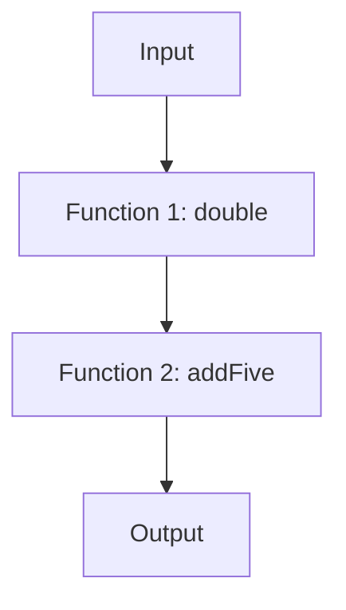

## 9.3.2 Functional Composition Techniques

In the realm of functional programming, function composition is a cornerstone concept that allows developers to build complex operations by combining simpler functions. This approach not only enhances code modularity and reusability but also aligns with the principles of immutability and statelessness, which are pivotal in functional programming. In this section, we will delve into the art of function composition in TypeScript, exploring its significance, techniques, and practical applications.

### Understanding Function Composition

Function composition is the process of combining two or more functions to produce a new function. The output of one function becomes the input of the next, creating a pipeline of operations. This technique is valuable because it allows us to break down complex problems into smaller, more manageable pieces, each represented by a function.

#### Why is Function Composition Valuable?

1. **Modularity**: By composing functions, we can create modular code where each function has a single responsibility. This makes it easier to understand, test, and maintain.

2. **Reusability**: Composed functions can be reused across different parts of an application, reducing code duplication.

3. **Immutability**: Function composition encourages the use of pure functions, which do not alter their inputs and have no side effects, leading to more predictable code.

4. **Declarative Code**: Composed functions often result in code that reads like a series of transformations, making it easier to reason about the flow of data.

### Basic Function Composition in TypeScript

Let's start with a simple example of function composition in TypeScript. Suppose we have two functions: one that doubles a number and another that adds five to a number.

```typescript
function double(x: number): number {
  return x * 2;
}

function addFive(x: number): number {
  return x + 5;
}

// Composing the functions manually
function doubleThenAddFive(x: number): number {
  return addFive(double(x));
}

console.log(doubleThenAddFive(10)); // Output: 25
```

In this example, `doubleThenAddFive` is a composed function that first doubles a number and then adds five to it. This manual composition works, but as the number of functions increases, it becomes cumbersome.

### Utility Functions for Composition

To streamline the composition process, we can use utility functions like `compose` and `pipe`. These functions abstract the composition logic, allowing us to focus on the operations themselves.

#### The `compose` Function

The `compose` function applies functions from right to left. Let's implement a simple version of `compose` in TypeScript:

```typescript
function compose<T>(...fns: Array<(arg: T) => T>): (arg: T) => T {
  return (arg: T) => fns.reduceRight((acc, fn) => fn(acc), arg);
}

const composedFunction = compose(addFive, double);
console.log(composedFunction(10)); // Output: 25
```

#### The `pipe` Function

Conversely, the `pipe` function applies functions from left to right, which can be more intuitive when reading code. Here's how you can implement `pipe`:

```typescript
function pipe<T>(...fns: Array<(arg: T) => T>): (arg: T) => T {
  return (arg: T) => fns.reduce((acc, fn) => fn(acc), arg);
}

const pipedFunction = pipe(double, addFive);
console.log(pipedFunction(10)); // Output: 25
```

### Leveraging Libraries for Function Composition

While implementing `compose` and `pipe` manually is educational, in real-world applications, we often rely on libraries that provide these utilities. Libraries like [Ramda](https://ramdajs.com/) and [Lodash](https://lodash.com/) offer robust implementations of these functions.

#### Using Ramda for Composition

Ramda is a functional programming library for JavaScript that emphasizes immutability and side-effect-free functions. Here's how you can use Ramda's `compose` and `pipe`:

```typescript
import { compose, pipe } from 'ramda';

const composedWithRamda = compose(addFive, double);
console.log(composedWithRamda(10)); // Output: 25

const pipedWithRamda = pipe(double, addFive);
console.log(pipedWithRamda(10)); // Output: 25
```

### Function Composition with Asynchronous Code

In modern applications, dealing with asynchronous operations is common. Function composition can be extended to handle asynchronous functions, often using Promises or async/await syntax.

#### Composing Asynchronous Functions

Let's consider two asynchronous functions: one that fetches user data and another that processes it.

```typescript
async function fetchUserData(userId: string): Promise<{ name: string }> {
  // Simulate an API call
  return new Promise((resolve) =>
    setTimeout(() => resolve({ name: 'John Doe' }), 1000)
  );
}

async function processUserData(user: { name: string }): Promise<string> {
  return `Processed user: ${user.name}`;
}

// Composing asynchronous functions
async function fetchAndProcessUser(userId: string): Promise<string> {
  const user = await fetchUserData(userId);
  return processUserData(user);
}

fetchAndProcessUser('123').then(console.log); // Output: Processed user: John Doe
```

#### Using `async`/`await` with Composition

When composing asynchronous functions, `async`/`await` can make the code more readable and maintainable.

```typescript
async function composedAsyncFunction(userId: string): Promise<string> {
  const user = await fetchUserData(userId);
  return await processUserData(user);
}

composedAsyncFunction('123').then(console.log); // Output: Processed user: John Doe
```

### Monads and Functional Composition

Monads are a powerful abstraction in functional programming that enable function composition, especially with side effects like asynchronous operations. In TypeScript, Promises can be seen as a monadic structure.

#### Understanding Monads

A Monad is a design pattern used to handle program-wide concerns in a functional way. It provides a way to chain operations while abstracting away the underlying complexity, such as error handling or asynchronous execution.

#### Using Monads for Composition

Consider the use of Promises as a Monad for composing asynchronous operations. The `then` method allows us to chain operations in a clean and functional manner.

```typescript
fetchUserData('123')
  .then(processUserData)
  .then(console.log); // Output: Processed user: John Doe
```

### Combining Multiple Transformations

Function composition shines when we need to apply multiple transformations or computations to data. Let's explore a practical example involving data transformation.

#### Example: Data Transformation Pipeline

Suppose we have a list of numbers, and we want to apply a series of transformations: double each number, filter out numbers greater than 10, and then sum the remaining numbers.

```typescript
const numbers = [1, 2, 3, 4, 5, 6];

const double = (x: number) => x * 2;
const isLessThanOrEqualToTen = (x: number) => x <= 10;
const sum = (acc: number, x: number) => acc + x;

const transformAndSum = pipe(
  (nums: number[]) => nums.map(double),
  (nums: number[]) => nums.filter(isLessThanOrEqualToTen),
  (nums: number[]) => nums.reduce(sum, 0)
);

console.log(transformAndSum(numbers)); // Output: 20
```

### Type Considerations in Function Composition

TypeScript's type system plays a crucial role in ensuring that composed functions are type-safe. When composing functions, it's essential to ensure that the output type of one function matches the input type of the next.

#### Type Inference and Composition

TypeScript can often infer types in composed functions, but explicit type annotations can help prevent errors and improve readability.

```typescript
function composeTyped<A, B, C>(
  f: (b: B) => C,
  g: (a: A) => B
): (a: A) => C {
  return (a: A) => f(g(a));
}

const doubleThenAddFiveTyped = composeTyped(addFive, double);
console.log(doubleThenAddFiveTyped(10)); // Output: 25
```

### Best Practices for Function Composition

To effectively use function composition in TypeScript applications, consider the following best practices:

1. **Use Pure Functions**: Ensure that functions do not have side effects and do not alter their inputs.

2. **Leverage Libraries**: Use libraries like Ramda or Lodash for robust composition utilities.

3. **Type Safety**: Pay attention to TypeScript's type system to ensure that composed functions are type-safe.

4. **Readability**: Use `pipe` for left-to-right composition, which often aligns with the natural reading order.

5. **Modularity**: Break down complex operations into smaller, reusable functions.

6. **Testing**: Test individual functions and composed functions to ensure correctness.

### Try It Yourself

Experiment with the following code snippets to deepen your understanding of function composition. Try modifying the functions or adding new transformations to see how the composed functions behave.

```typescript
// Define your own transformations
const increment = (x: number) => x + 1;
const square = (x: number) => x * x;

// Compose them
const incrementThenSquare = pipe(increment, square);

console.log(incrementThenSquare(3)); // Output: 16
```

### Visualizing Function Composition

To better understand how function composition works, let's visualize the process using a flowchart.



This diagram illustrates the flow of data through a composed function, where each function transforms the data before passing it to the next.

### References and Further Reading

- [MDN Web Docs: Function](https://developer.mozilla.org/en-US/docs/Web/JavaScript/Reference/Global_Objects/Function)
- [Ramda Documentation](https://ramdajs.com/docs/)
- [Lodash Documentation](https://lodash.com/docs/)

### Knowledge Check

- What is function composition, and why is it valuable?
- How do `compose` and `pipe` differ in their application order?
- What role do monads play in function composition?
- How can TypeScript's type system aid in composing functions?

### Embrace the Journey

Remember, mastering function composition is a journey. As you progress, you'll find new ways to leverage this powerful technique to write cleaner, more maintainable code. Keep experimenting, stay curious, and enjoy the journey!

## Quiz Time!



### What is function composition?

- [x] Combining two or more functions to produce a new function
- [ ] Writing a function that calls itself
- [ ] A technique for optimizing code execution
- [ ] A method for handling asynchronous operations

> **Explanation:** Function composition involves combining multiple functions to create a new function, where the output of one function becomes the input of the next.

### What is the main difference between `compose` and `pipe`?

- [x] `compose` applies functions from right to left, while `pipe` applies them from left to right
- [ ] `compose` is used for asynchronous functions, while `pipe` is for synchronous functions
- [ ] `compose` is a TypeScript-specific function, while `pipe` is JavaScript-specific
- [ ] `compose` is used for mathematical operations, while `pipe` is for string operations

> **Explanation:** The `compose` function applies functions from right to left, whereas `pipe` applies them from left to right, aligning with natural reading order.

### Which library is commonly used for function composition in JavaScript?

- [x] Ramda
- [ ] jQuery
- [ ] Angular
- [ ] React

> **Explanation:** Ramda is a functional programming library that provides utilities for function composition and other functional programming techniques.

### How can monads facilitate function composition?

- [x] By allowing chaining of operations while abstracting away complexity
- [ ] By providing a way to execute functions in parallel
- [ ] By optimizing memory usage during function execution
- [ ] By ensuring functions are executed in a specific order

> **Explanation:** Monads enable chaining of operations, abstracting complexities like error handling or asynchronous execution, thus facilitating function composition.

### What is a key benefit of using pure functions in composition?

- [x] Predictable and testable code
- [ ] Faster execution times
- [ ] Reduced memory usage
- [ ] Simplified syntax

> **Explanation:** Pure functions, which do not have side effects, lead to predictable and testable code, making them ideal for composition.

### Which TypeScript feature ensures type safety in function composition?

- [x] Type inference and explicit type annotations
- [ ] Automatic variable declaration
- [ ] Dynamic typing
- [ ] Implicit type conversion

> **Explanation:** TypeScript's type inference and explicit type annotations help ensure that composed functions are type-safe.

### What is the purpose of the `pipe` function?

- [x] To apply functions from left to right
- [ ] To execute functions in parallel
- [ ] To handle errors in function execution
- [ ] To optimize function execution time

> **Explanation:** The `pipe` function applies functions from left to right, which often aligns with the natural reading order and improves code readability.

### What is a Monad in functional programming?

- [x] A design pattern used to handle program-wide concerns functionally
- [ ] A type of loop used in functional programming
- [ ] A method for optimizing function execution
- [ ] A tool for debugging functional code

> **Explanation:** A Monad is a design pattern that handles program-wide concerns, such as error handling or asynchronous execution, in a functional way.

### What is the benefit of using libraries like Ramda for function composition?

- [x] They provide robust and tested utilities for composition
- [ ] They automatically optimize code execution
- [ ] They are specifically designed for TypeScript
- [ ] They reduce the need for type annotations

> **Explanation:** Libraries like Ramda offer robust and tested utilities for function composition, making it easier to implement functional programming techniques.

### True or False: Function composition can only be used with synchronous functions.

- [ ] True
- [x] False

> **Explanation:** Function composition can be used with both synchronous and asynchronous functions, often utilizing Promises or async/await for the latter.


