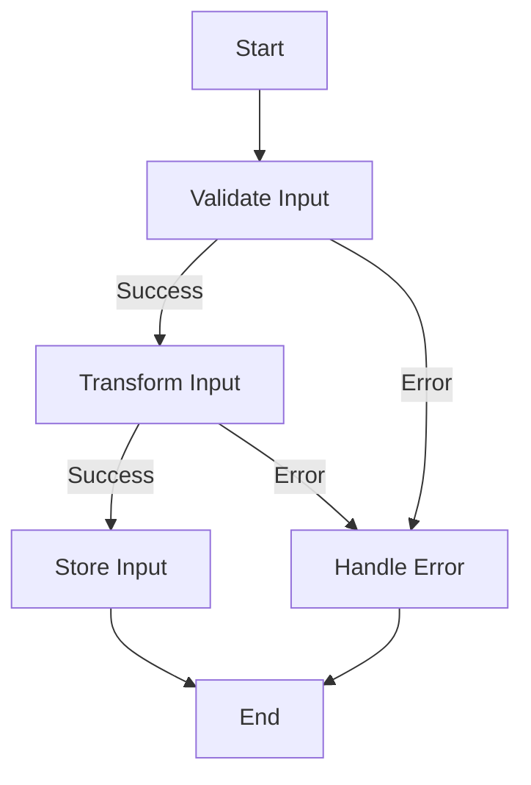

## 9.3.3 Use Cases and Examples

In this section, we delve into the practical applications of monads and functional composition within TypeScript. These concepts, rooted in functional programming, offer powerful tools for managing data transformations and error handling, leading to cleaner and more maintainable codebases. Let's explore some scenarios where these patterns shine.

### Chaining Data Processing Steps

One of the most compelling use cases for monads is in chaining data processing steps, where each step may produce a valid result or an error. This is particularly useful in scenarios where operations need to be performed sequentially, and each operation depends on the success of the previous one.

#### Example: Processing User Input

Consider a scenario where we need to process user input, validate it, and then transform it into a format suitable for storage. Each step in this process could potentially fail, and we want to handle these failures gracefully.

```typescript
type Result<T> = { isSuccess: true; value: T } | { isSuccess: false; error: string };

function validateInput(input: string): Result<string> {
    if (input.trim() === "") {
        return { isSuccess: false, error: "Input cannot be empty" };
    }
    return { isSuccess: true, value: input.trim() };
}

function transformInput(input: string): Result<number> {
    const number = parseInt(input, 10);
    if (isNaN(number)) {
        return { isSuccess: false, error: "Input must be a number" };
    }
    return { isSuccess: true, value: number };
}

function storeInput(input: number): Result<string> {
    // Simulate storage operation
    return { isSuccess: true, value: `Stored number: ${input}` };
}

function processInput(input: string): Result<string> {
    return validateInput(input)
        .flatMap(transformInput)
        .flatMap(storeInput);
}

const result = processInput("42");
if (result.isSuccess) {
    console.log(result.value);
} else {
    console.error(result.error);
}
```

In this example, we define a `Result` type to encapsulate success and error states. Each function returns a `Result`, and we use a hypothetical `flatMap` method to chain these operations, propagating errors automatically.

#### Performance Implications

Using monads for chaining can introduce some overhead due to the additional function calls and object allocations. However, the benefits in terms of code clarity and maintainability often outweigh these costs, especially in complex workflows.

### Simplifying Complex Conditional Logic

Functional composition allows us to simplify complex conditional logic by composing functions that handle nullable or optional values. This is particularly useful in scenarios where data may be incomplete or optional, and we want to apply a series of transformations only if the data is present.

#### Example: Optional User Profile Updates

Imagine a scenario where we want to update a user's profile, but only if certain optional fields are provided.

```typescript
type UserProfile = {
    name?: string;
    age?: number;
    email?: string;
};

function updateName(profile: UserProfile, name?: string): UserProfile {
    return name ? { ...profile, name } : profile;
}

function updateAge(profile: UserProfile, age?: number): UserProfile {
    return age ? { ...profile, age } : profile;
}

function updateEmail(profile: UserProfile, email?: string): UserProfile {
    return email ? { ...profile, email } : profile;
}

function updateUserProfile(profile: UserProfile, updates: Partial<UserProfile>): UserProfile {
    return [updateName, updateAge, updateEmail].reduce(
        (updatedProfile, updateFn) => updateFn(updatedProfile, updates[updateFn.name as keyof UserProfile]),
        profile
    );
}

const initialProfile: UserProfile = { name: "Alice" };
const updatedProfile = updateUserProfile(initialProfile, { age: 30, email: "alice@example.com" });
console.log(updatedProfile);
```

In this example, we use functional composition to apply a series of update functions to a user profile. Each function checks if the corresponding field is present and updates the profile accordingly.

#### Trade-offs

While functional composition can simplify code, it may also obscure the logic flow if overused. It's important to strike a balance between readability and abstraction.

### Managing Asynchronous Operations

Monads and functional composition are also effective for managing asynchronous operations with consistent error handling paths. This is particularly useful in modern web applications where asynchronous data fetching and processing are common.

#### Example: Fetching and Processing API Data

Consider a scenario where we need to fetch data from an API, process it, and handle any errors that occur during the process.

```typescript
type AsyncResult<T> = Promise<Result<T>>;

async function fetchData(url: string): AsyncResult<string> {
    try {
        const response = await fetch(url);
        if (!response.ok) {
            throw new Error(`HTTP error! status: ${response.status}`);
        }
        const data = await response.text();
        return { isSuccess: true, value: data };
    } catch (error) {
        return { isSuccess: false, error: error.message };
    }
}

async function processData(data: string): AsyncResult<number> {
    try {
        const processedData = parseInt(data, 10);
        if (isNaN(processedData)) {
            throw new Error("Data is not a valid number");
        }
        return { isSuccess: true, value: processedData };
    } catch (error) {
        return { isSuccess: false, error: error.message };
    }
}

async function execute(url: string): Promise<void> {
    const result = await fetchData(url)
        .then(result => result.isSuccess ? processData(result.value) : Promise.resolve(result));

    if (result.isSuccess) {
        console.log(`Processed data: ${result.value}`);
    } else {
        console.error(`Error: ${result.error}`);
    }
}

execute("https://api.example.com/data");
```

In this example, we use `AsyncResult` to represent asynchronous operations that can succeed or fail. We chain these operations using `then`, ensuring that errors are propagated consistently.

#### Encouragement to Explore

By embracing functional programming concepts like monads and functional composition, you can enhance your TypeScript codebases, making them more robust and maintainable. These patterns encourage a declarative style of coding, where the focus is on what to do rather than how to do it.

### Visualizing the Monad Workflow

To better understand how monads work in chaining operations, let's visualize the workflow using a flowchart.



This flowchart illustrates the sequential processing of input data, where each step can either succeed and pass the result to the next step or fail and trigger error handling.

### Knowledge Check

- **Question**: What are the benefits of using monads for error handling in TypeScript?
  - Monads provide a consistent way to handle errors across multiple operations, reducing boilerplate code and improving readability.

- **Question**: How can functional composition simplify complex conditional logic?
  - By composing functions that handle nullable or optional values, we can apply transformations only when data is present, reducing the need for nested conditionals.

### Try It Yourself

Experiment with the code examples provided by modifying them to suit different scenarios. For instance, try adding additional validation steps or transforming different types of data. This hands-on approach will deepen your understanding of monads and functional composition.

### Conclusion

Monads and functional composition are powerful patterns that can transform how we handle data and errors in TypeScript. By applying these patterns, we can create code that is not only more robust and maintainable but also easier to understand and extend. As you continue to explore functional programming concepts, you'll discover new ways to enhance your TypeScript codebases, leading to more efficient and effective software solutions.

## Quiz Time!



### What is a primary benefit of using monads in TypeScript?

- [x] Consistent error handling
- [ ] Faster execution
- [ ] Reduced memory usage
- [ ] Simplified syntax

> **Explanation:** Monads provide a consistent way to handle errors across multiple operations, improving code readability and maintainability.

### How does functional composition help in managing nullable values?

- [x] By composing functions that apply transformations only when data is present
- [ ] By using nested conditionals
- [ ] By eliminating the need for error handling
- [ ] By increasing code complexity

> **Explanation:** Functional composition allows us to apply transformations only when data is present, reducing the need for complex conditional logic.

### What is the trade-off of using monads for chaining operations?

- [x] Potential performance overhead
- [ ] Increased code complexity
- [ ] Reduced readability
- [ ] Less maintainable code

> **Explanation:** Using monads can introduce performance overhead due to additional function calls, but they improve code clarity and maintainability.

### In the context of monads, what does `flatMap` typically do?

- [x] Chains operations while handling errors
- [ ] Maps values to new types
- [ ] Filters out invalid data
- [ ] Reduces data to a single value

> **Explanation:** `flatMap` is used to chain operations, propagating errors and results through the chain.

### What is a key advantage of using functional composition in TypeScript?

- [x] Simplifies complex logic
- [ ] Increases execution speed
- [ ] Reduces memory usage
- [ ] Eliminates the need for functions

> **Explanation:** Functional composition simplifies complex logic by allowing functions to be composed and applied in a clear and concise manner.

### How can monads improve asynchronous operations?

- [x] By providing consistent error handling paths
- [ ] By eliminating the need for Promises
- [ ] By reducing network latency
- [ ] By increasing data throughput

> **Explanation:** Monads provide a consistent way to handle errors in asynchronous operations, improving code readability and reliability.

### What is a common use case for functional composition?

- [x] Simplifying data transformations
- [ ] Increasing code complexity
- [ ] Reducing execution time
- [ ] Eliminating the need for functions

> **Explanation:** Functional composition is commonly used to simplify data transformations by composing functions in a clear and concise manner.

### What does the `Result` type represent in the examples?

- [x] A success or error state
- [ ] A data transformation
- [ ] A network request
- [ ] A user input

> **Explanation:** The `Result` type represents either a success with a value or an error with a message, encapsulating the outcome of an operation.

### How can you visualize the workflow of monads in TypeScript?

- [x] Using flowcharts
- [ ] Using bar charts
- [ ] Using pie charts
- [ ] Using scatter plots

> **Explanation:** Flowcharts are effective for visualizing the sequential processing and error handling workflow of monads.

### True or False: Monads eliminate the need for error handling in TypeScript.

- [ ] True
- [x] False

> **Explanation:** Monads do not eliminate the need for error handling; instead, they provide a consistent and structured way to handle errors across operations.



Remember, this is just the beginning. As you progress, you'll build more complex and interactive applications. Keep experimenting, stay curious, and enjoy the journey!
