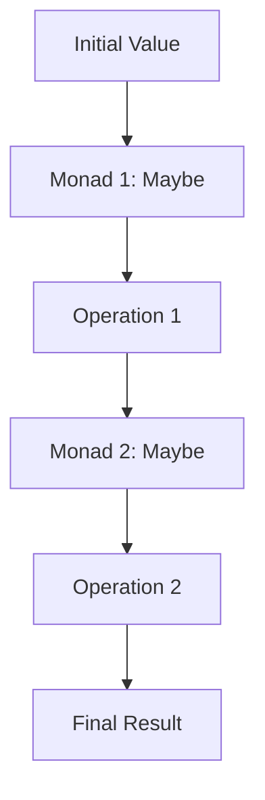

## 9.3 Monads and Functional Composition

In this section, we delve into the fascinating world of monads and functional composition in TypeScript. These concepts are pivotal in functional programming, offering a robust framework for managing side effects, handling nullability, and structuring asynchronous code. By the end of this chapter, you'll understand how to leverage monads to create clean, predictable, and maintainable code.

### Introduction to Monads

Monads are a fundamental concept in functional programming, often described as design patterns that allow for the chaining of operations while abstracting away side effects. They provide a way to wrap values and define how to apply functions to these wrapped values, thereby enabling a clean and consistent way to handle computations.

#### What is a Monad?

A monad is a type that implements three key operations:

1. **Unit (or Return)**: Wraps a value into a monad.
2. **Bind (or FlatMap)**: Chains operations on monadic values.
3. **Map**: Applies a function to the wrapped value.

In TypeScript, monads can be implemented using classes or interfaces that encapsulate these operations. Let's explore how monads help manage side effects and structure code effectively.

### Managing Side Effects with Monads

Side effects are changes in state that occur outside the scope of a function, such as modifying a global variable, performing I/O operations, or throwing exceptions. Monads provide a structured way to handle these side effects, ensuring that functions remain pure and predictable.

#### Example: The Maybe Monad

The Maybe monad is a common pattern used to handle nullability and optional values. It encapsulates a value that might be present (`Just`) or absent (`Nothing`), allowing you to chain operations without having to constantly check for null or undefined.

```typescript
class Maybe<T> {
  private constructor(private value: T | null) {}

  static just<T>(value: T): Maybe<T> {
    return new Maybe(value);
  }

  static nothing<T>(): Maybe<T> {
    return new Maybe<T>(null);
  }

  isNothing(): boolean {
    return this.value === null;
  }

  map<U>(fn: (value: T) => U): Maybe<U> {
    return this.isNothing() ? Maybe.nothing<U>() : Maybe.just(fn(this.value as T));
  }

  flatMap<U>(fn: (value: T) => Maybe<U>): Maybe<U> {
    return this.isNothing() ? Maybe.nothing<U>() : fn(this.value as T);
  }

  getOrElse(defaultValue: T): T {
    return this.isNothing() ? defaultValue : (this.value as T);
  }
}

// Usage example
const maybeValue = Maybe.just(5);
const result = maybeValue.map(x => x * 2).getOrElse(0);
console.log(result); // Outputs: 10
```

In this example, the `Maybe` monad allows us to safely perform operations on a value that might be absent, without the need for explicit null checks.

### Handling Errors with the Either Monad

The Either monad is another powerful tool for error handling. It represents a value that can be one of two types: a success (`Right`) or a failure (`Left`). This allows you to handle errors gracefully without resorting to exceptions.

```typescript
class Either<L, R> {
  private constructor(private left: L | null, private right: R | null) {}

  static left<L, R>(value: L): Either<L, R> {
    return new Either(value, null);
  }

  static right<L, R>(value: R): Either<L, R> {
    return new Either(null, value);
  }

  isLeft(): boolean {
    return this.left !== null;
  }

  isRight(): boolean {
    return this.right !== null;
  }

  map<U>(fn: (value: R) => U): Either<L, U> {
    return this.isRight() ? Either.right<L, U>(fn(this.right as R)) : Either.left<L, U>(this.left as L);
  }

  flatMap<U>(fn: (value: R) => Either<L, U>): Either<L, U> {
    return this.isRight() ? fn(this.right as R) : Either.left<L, U>(this.left as L);
  }

  getOrElse(defaultValue: R): R {
    return this.isRight() ? (this.right as R) : defaultValue;
  }
}

// Usage example
const divide = (a: number, b: number): Either<string, number> => {
  if (b === 0) {
    return Either.left("Division by zero");
  }
  return Either.right(a / b);
};

const result = divide(10, 2).map(x => x * 2).getOrElse(0);
console.log(result); // Outputs: 10
```

The `Either` monad provides a clean way to propagate errors through a chain of computations, allowing you to focus on the happy path while still handling failures.

### Functional Composition with Monads

Functional composition is the process of combining simple functions to build more complex ones. Monads facilitate this by providing a consistent interface for chaining operations, allowing you to build complex workflows from simple, reusable components.

#### Chaining Operations with Monads

Monads enable chaining operations in a clean and predictable manner. By using the `flatMap` method, you can sequence computations that depend on the results of previous computations.

```typescript
const safeDivide = (a: number, b: number): Maybe<number> => {
  return b === 0 ? Maybe.nothing() : Maybe.just(a / b);
};

const compute = (a: number, b: number, c: number): Maybe<number> => {
  return safeDivide(a, b).flatMap(result => safeDivide(result, c));
};

const finalResult = compute(10, 2, 5).getOrElse(0);
console.log(finalResult); // Outputs: 1
```

In this example, we use the `Maybe` monad to chain division operations, ensuring that we handle division by zero gracefully.

#### Visualizing Monad Composition

To better understand how monads facilitate functional composition, let's visualize the process:



This diagram illustrates how monads wrap values, apply operations, and pass results to subsequent operations, enabling a seamless flow of data through a series of transformations.

### Practical Applications of Monads

Monads are not just theoretical constructs; they have practical applications in real-world programming. Let's explore some scenarios where monads can simplify code and improve maintainability.

#### Asynchronous Computations

Monads can be used to structure asynchronous code, providing a clean way to handle promises and asynchronous operations.

```typescript
class Async<T> {
  constructor(private promise: Promise<T>) {}

  static of<T>(value: T): Async<T> {
    return new Async(Promise.resolve(value));
  }

  map<U>(fn: (value: T) => U): Async<U> {
    return new Async(this.promise.then(fn));
  }

  flatMap<U>(fn: (value: T) => Async<U>): Async<U> {
    return new Async(this.promise.then(value => fn(value).promise));
  }

  get(): Promise<T> {
    return this.promise;
  }
}

// Usage example
const fetchData = (url: string): Async<string> => {
  return new Async(fetch(url).then(response => response.text()));
};

fetchData("https://api.example.com/data")
  .map(data => JSON.parse(data))
  .flatMap(parsedData => Async.of(parsedData.someProperty))
  .get()
  .then(result => console.log(result))
  .catch(error => console.error(error));
```

In this example, the `Async` monad provides a way to compose asynchronous operations, allowing you to focus on the logic rather than the mechanics of promise chaining.

#### Try It Yourself

Experiment with the code examples provided. Try modifying the `Maybe` and `Either` monads to handle different types of computations. Consider implementing additional monads, such as the `List` monad, to explore their potential in functional composition.

### Intuitive Explanations and Practical Applications

Monads can be complex, but they offer powerful abstractions for handling side effects and composing functions. By understanding their core principles and applying them in practical scenarios, you can write cleaner, more maintainable code.

#### Key Takeaways

- **Monads** provide a consistent interface for chaining operations and managing side effects.
- **Maybe Monad** handles nullability and optional values, simplifying code that deals with potentially absent data.
- **Either Monad** offers a robust framework for error handling, allowing you to propagate errors without exceptions.
- **Functional Composition** is achieved by chaining monadic operations, enabling the construction of complex workflows from simple functions.

### References and Further Reading

- [MDN Web Docs: JavaScript Promises](https://developer.mozilla.org/en-US/docs/Web/JavaScript/Guide/Using_promises)
- [Functional Programming in JavaScript](https://www.oreilly.com/library/view/functional-programming-in/9781491958726/)
- [Learn You a Haskell for Great Good!](http://learnyouahaskell.com/)

### Embrace the Journey

As you explore monads and functional composition, remember that this is just the beginning. These concepts open up new possibilities for writing expressive, maintainable code. Keep experimenting, stay curious, and enjoy the journey!

## Quiz Time!



### What is a monad in functional programming?

- [x] A design pattern that allows for chaining operations while abstracting away side effects.
- [ ] A type of loop used in functional programming.
- [ ] A class that handles exceptions.
- [ ] A function that returns multiple values.

> **Explanation:** Monads are design patterns that enable chaining operations and managing side effects in functional programming.

### Which monad is commonly used to handle nullability?

- [x] Maybe Monad
- [ ] Either Monad
- [ ] List Monad
- [ ] Async Monad

> **Explanation:** The Maybe Monad is used to handle optional values and nullability.

### What is the primary purpose of the Either Monad?

- [x] To handle errors gracefully without using exceptions.
- [ ] To manage asynchronous operations.
- [ ] To perform mathematical calculations.
- [ ] To create complex data structures.

> **Explanation:** The Either Monad is used for error handling, providing a way to propagate errors without exceptions.

### How do monads facilitate functional composition?

- [x] By providing a consistent interface for chaining operations.
- [ ] By allowing functions to modify global variables.
- [ ] By enabling the use of loops in functional programming.
- [ ] By creating complex data structures.

> **Explanation:** Monads provide a consistent interface for chaining operations, enabling functional composition.

### What is the role of the `flatMap` method in monads?

- [x] To chain operations that depend on the results of previous computations.
- [ ] To wrap a value into a monad.
- [ ] To apply a function to a wrapped value.
- [ ] To handle errors in computations.

> **Explanation:** The `flatMap` method is used to chain operations that depend on the results of previous computations.

### Which monad is used to structure asynchronous code?

- [x] Async Monad
- [ ] Maybe Monad
- [ ] Either Monad
- [ ] List Monad

> **Explanation:** The Async Monad is used to structure asynchronous code, providing a clean way to handle promises.

### What is the purpose of the `getOrElse` method in the Maybe Monad?

- [x] To provide a default value if the monad is `Nothing`.
- [ ] To chain operations on the monad.
- [ ] To handle errors in computations.
- [ ] To wrap a value into a monad.

> **Explanation:** The `getOrElse` method provides a default value if the monad is `Nothing`.

### How does the `Either` monad represent a failure?

- [x] Using the `Left` type.
- [ ] Using the `Right` type.
- [ ] Using the `Nothing` type.
- [ ] Using the `Async` type.

> **Explanation:** The `Either` monad represents a failure using the `Left` type.

### What is the benefit of using monads for error handling?

- [x] They allow for error propagation without exceptions.
- [ ] They enable the use of loops in functional programming.
- [ ] They create complex data structures.
- [ ] They modify global variables.

> **Explanation:** Monads allow for error propagation without exceptions, providing a clean way to handle errors.

### Monads are only useful in functional programming languages.

- [ ] True
- [x] False

> **Explanation:** Monads can be used in any programming language that supports functional programming concepts, including TypeScript.


