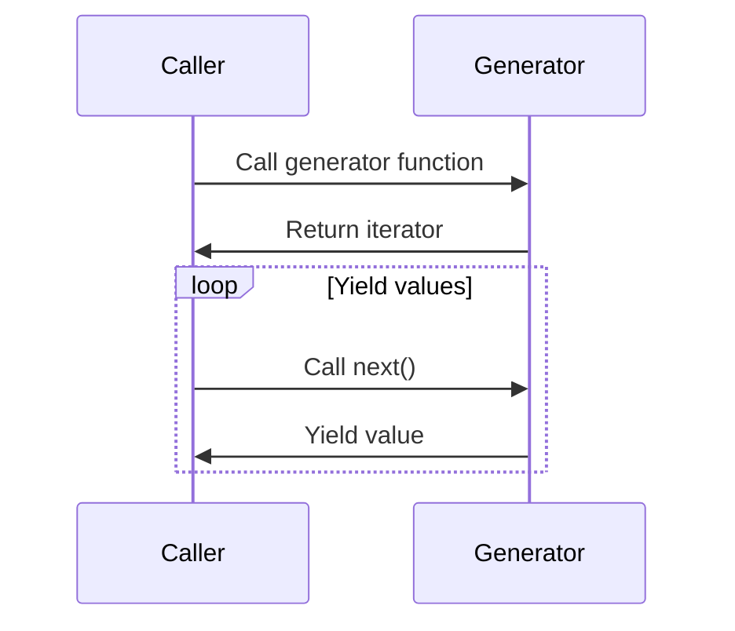

## 9.4.1 Implementing Lazy Evaluation in TypeScript

Lazy evaluation is a powerful concept in programming that allows computations to be deferred until their results are needed. This can lead to performance improvements, especially when dealing with large datasets or complex computations. In TypeScript, lazy evaluation can be effectively implemented using generators, closures, and higher-order functions. In this section, we will explore how to create lazy sequences and computations in TypeScript, providing you with the tools to write efficient and scalable code.

### Introduction to Generators in TypeScript

Generators in TypeScript are special functions that can pause execution and resume later, enabling the creation of lazy sequences. They are defined using the `function*` syntax and can yield multiple values over time.

```typescript
function* numberGenerator() {
  let num = 1;
  while (true) {
    yield num++;
  }
}

const numbers = numberGenerator();
console.log(numbers.next().value); // 1
console.log(numbers.next().value); // 2
console.log(numbers.next().value); // 3
```

In this example, the `numberGenerator` function yields an infinite sequence of numbers. The `yield` keyword pauses the function's execution, allowing it to resume from the same point later. This is the essence of lazy evaluation: values are computed only when requested.

### Creating Lazy Sequences

Lazy sequences are collections of values that are computed on demand. Generators are ideal for creating such sequences, as they allow you to define potentially infinite lists without precomputing all values.

#### Example: Infinite Fibonacci Sequence

Let's create a generator for the Fibonacci sequence, which is infinite by nature.

```typescript
function* fibonacciGenerator() {
  let [prev, curr] = [0, 1];
  while (true) {
    yield curr;
    [prev, curr] = [curr, prev + curr];
  }
}

const fibonacci = fibonacciGenerator();
console.log(fibonacci.next().value); // 1
console.log(fibonacci.next().value); // 1
console.log(fibonacci.next().value); // 2
console.log(fibonacci.next().value); // 3
```

This generator yields Fibonacci numbers one at a time, calculating each new number only when requested.

### Consuming Generator Functions

To consume values from a generator, you can use a `for...of` loop or the iterator protocol. The `for...of` loop is particularly useful for iterating over finite sequences.

#### Example: Iterating with `for...of`

```typescript
function* finiteSequence() {
  yield 1;
  yield 2;
  yield 3;
}

for (const value of finiteSequence()) {
  console.log(value); // 1, 2, 3
}
```

For infinite sequences, you must be cautious to avoid infinite loops. You can use conditions to break out of the loop when necessary.

### Implementing Lazy Properties

Lazy properties are class properties whose values are computed only when accessed for the first time. This can be achieved using closures and getters.

#### Example: Lazy Property in a Class

```typescript
class LazyClass {
  private _expensiveValue: number | null = null;

  get expensiveValue() {
    if (this._expensiveValue === null) {
      console.log("Computing expensive value...");
      this._expensiveValue = Math.random() * 100; // Simulate expensive computation
    }
    return this._expensiveValue;
  }
}

const instance = new LazyClass();
console.log(instance.expensiveValue); // Computes and logs the value
console.log(instance.expensiveValue); // Returns cached value
```

In this example, the `expensiveValue` property is computed only once, and subsequent accesses return the cached result.

### Higher-Order Functions and Closures

Higher-order functions and closures are fundamental to functional programming and can be used to implement lazy evaluation. A higher-order function is a function that takes another function as an argument or returns a function.

#### Example: Lazy Evaluation with Closures

```typescript
function lazyAdd(a: number, b: number) {
  return () => a + b;
}

const add = lazyAdd(5, 10);
console.log(add()); // 15
```

Here, `lazyAdd` returns a function that computes the sum of `a` and `b` only when invoked.

### Integrating with Functional Programming Libraries

Functional programming libraries, such as [Lodash](https://lodash.com/) or [Ramda](https://ramdajs.com/), provide utilities that can be combined with lazy evaluation.

#### Example: Using Lodash with Lazy Evaluation

```typescript
import _ from 'lodash';

const numbers = [1, 2, 3, 4, 5];
const lazySquares = _.map(numbers, n => n * n);

console.log(lazySquares); // [1, 4, 9, 16, 25]
```

While Lodash itself doesn't inherently support lazy evaluation, its functions can be combined with generators to create lazy pipelines.

### Considerations for Lazy Evaluation

When implementing lazy evaluation, consider the following:

- **State Management**: Ensure that state is managed correctly, especially in generators that maintain internal state.
- **Side Effects**: Be cautious of side effects, as lazy evaluation can defer their execution, leading to unexpected behavior.
- **Performance**: While lazy evaluation can improve performance by deferring computations, it can also introduce overhead if not used judiciously.

### Best Practices for Lazy Computations

- **Use Generators for Sequences**: Leverage generators for creating lazy sequences, especially when dealing with potentially infinite data.
- **Cache Results**: Cache results of expensive computations to avoid redundant calculations.
- **Combine with Functional Patterns**: Integrate lazy evaluation with functional programming patterns for cleaner and more expressive code.
- **Test Thoroughly**: Ensure that lazy computations are thoroughly tested, particularly for edge cases and potential side effects.

### Visualizing Lazy Evaluation

To better understand how lazy evaluation works, let's visualize the flow of a generator function using a sequence diagram.



This diagram illustrates the interaction between a caller and a generator function, highlighting the lazy nature of value computation.

### Try It Yourself

Experiment with the concepts discussed by modifying the code examples:

- Create a generator that yields prime numbers.
- Implement a lazy property that computes a complex mathematical formula.
- Use closures to create a lazy multiplier function.

### Conclusion

Lazy evaluation is a powerful technique that can enhance the performance and scalability of your TypeScript applications. By leveraging generators, closures, and higher-order functions, you can defer computations until they are truly needed, reducing unnecessary processing and improving efficiency. Remember to consider state management and side effects when implementing lazy evaluation, and always strive for clean, maintainable code.

## Quiz Time!



### What is the primary benefit of lazy evaluation?

- [x] Deferring computations until their results are needed
- [ ] Precomputing all values in advance
- [ ] Increasing memory usage
- [ ] Reducing code readability

> **Explanation:** Lazy evaluation defers computations until their results are needed, which can improve performance and reduce unnecessary processing.

### Which TypeScript feature is primarily used to implement lazy sequences?

- [x] Generators
- [ ] Promises
- [ ] Async/Await
- [ ] Interfaces

> **Explanation:** Generators, defined using the `function*` syntax, are used to create lazy sequences by yielding values on demand.

### How can you consume values from a generator in TypeScript?

- [x] Using a `for...of` loop
- [ ] Using a `while` loop
- [ ] Using a `do...while` loop
- [ ] Using a `switch` statement

> **Explanation:** A `for...of` loop can be used to iterate over values yielded by a generator.

### What is a lazy property in a class?

- [x] A property whose value is computed only when accessed for the first time
- [ ] A property that is always precomputed
- [ ] A property that cannot be modified
- [ ] A property that is computed in the constructor

> **Explanation:** A lazy property is computed only when accessed for the first time, and its value is cached for subsequent accesses.

### Which of the following is a consideration when using lazy evaluation?

- [x] Managing state correctly
- [ ] Increasing code complexity
- [ ] Reducing code readability
- [ ] Avoiding all side effects

> **Explanation:** Managing state correctly is crucial when using lazy evaluation, as deferred computations can lead to unexpected behavior if state is not handled properly.

### What is a higher-order function?

- [x] A function that takes another function as an argument or returns a function
- [ ] A function that only performs arithmetic operations
- [ ] A function that cannot be nested
- [ ] A function that is always asynchronous

> **Explanation:** A higher-order function is one that takes another function as an argument or returns a function, enabling functional programming patterns.

### How can lazy evaluation improve performance?

- [x] By deferring computations until they are needed
- [ ] By increasing the number of computations
- [ ] By precomputing all possible values
- [ ] By reducing the number of functions

> **Explanation:** Lazy evaluation improves performance by deferring computations until they are needed, reducing unnecessary processing.

### What is a closure in TypeScript?

- [x] A function that captures variables from its surrounding scope
- [ ] A function that cannot be called
- [ ] A function that is always asynchronous
- [ ] A function that does not return a value

> **Explanation:** A closure is a function that captures variables from its surrounding scope, allowing it to maintain state between calls.

### True or False: Lazy evaluation can introduce overhead if not used judiciously.

- [x] True
- [ ] False

> **Explanation:** Lazy evaluation can introduce overhead if not used judiciously, as deferred computations may require additional resources to manage state and execution flow.

### Which library can be used to integrate functional programming patterns with lazy evaluation?

- [x] Lodash
- [ ] Express
- [ ] Axios
- [ ] Sequelize

> **Explanation:** Lodash is a functional programming library that can be combined with lazy evaluation techniques to create efficient and expressive code.


