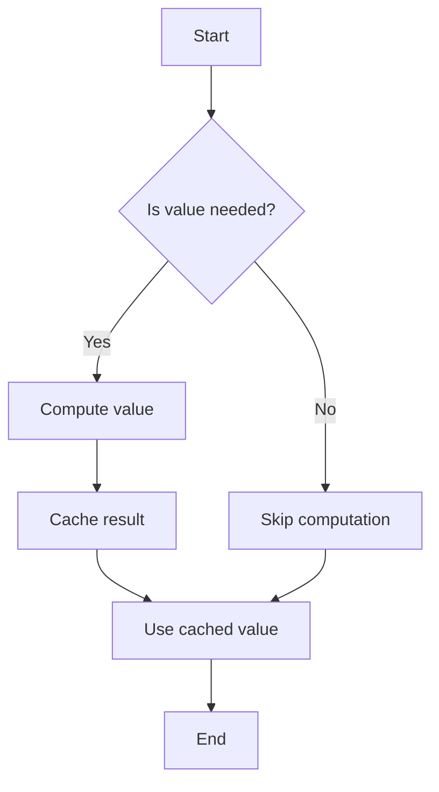

## 9.4.2 Benefits and Trade-offs

Lazy evaluation is a powerful concept in functional programming that defers the computation of expressions until their values are actually needed. This approach can lead to significant performance improvements and memory savings, but it also introduces certain complexities and potential pitfalls. In this section, we will explore the benefits and trade-offs of lazy evaluation, particularly in the context of TypeScript, a language that combines object-oriented and functional programming paradigms.

### Understanding Lazy Evaluation

Lazy evaluation, also known as call-by-need, is a strategy that delays the evaluation of an expression until its value is required by the program. This contrasts with eager evaluation (or strict evaluation), where expressions are evaluated as soon as they are bound to a variable.

#### Key Concepts

- **Deferred Computation**: Computations are postponed until their results are needed.
- **Memoization**: Once a lazy expression is evaluated, its result is cached to avoid redundant computations.
- **Thunks**: A thunk is a parameterless function used to encapsulate a computation, delaying its execution.

### Benefits of Lazy Evaluation

Lazy evaluation offers several advantages, particularly in scenarios where not all computed values are needed, or when dealing with potentially infinite data structures.

#### Performance Gains

1. **Avoiding Unnecessary Computations**: By deferring computations, lazy evaluation can significantly reduce the number of operations performed by a program. This is especially beneficial in scenarios where only a subset of the computed values is required.

    ```typescript
    function expensiveComputation(): number {
        console.log("Computing...");
        return 42;
    }

    const lazyValue = () => expensiveComputation();

    // The computation is not performed until lazyValue() is called.
    console.log("Before calling lazyValue");
    console.log(lazyValue()); // Output: Computing... 42
    ```

2. **Improved Efficiency with Short-Circuiting**: Lazy evaluation can optimize logical operations by short-circuiting. For example, in a logical AND operation, if the first operand is false, the second operand is not evaluated.

    ```typescript
    const isTrue = false;
    const result = isTrue && expensiveComputation(); // expensiveComputation is never called
    ```

3. **Handling Large or Infinite Data Structures**: Lazy evaluation is particularly useful when working with large datasets or infinite sequences, as it allows processing elements one at a time without loading the entire structure into memory.

    ```typescript
    function* infiniteSequence() {
        let i = 0;
        while (true) {
            yield i++;
        }
    }

    const sequence = infiniteSequence();
    console.log(sequence.next().value); // 0
    console.log(sequence.next().value); // 1
    ```

#### Memory Optimization

Lazy evaluation can reduce memory usage by computing values only when needed, thus avoiding the storage of unnecessary data.

- **On-Demand Computation**: Values are computed and stored only when required, which can lead to significant memory savings in applications dealing with large datasets.

    ```typescript
    const largeArray = new Array(1000000).fill(0).map((_, i) => i);
    const lazyArray = largeArray.map(x => () => x * 2);

    // Only computes when accessed
    console.log(lazyArray[0]()); // 0
    console.log(lazyArray[999999]()); // 1999998
    ```

- **Reduced Memory Footprint**: By avoiding the allocation of memory for intermediate results, lazy evaluation can help keep the memory footprint of an application low.

### Trade-offs of Lazy Evaluation

While lazy evaluation offers numerous benefits, it also introduces certain complexities and potential drawbacks that developers must consider.

#### Increased Code Complexity

1. **Complexity in Code Structure**: Lazy evaluation can make code harder to understand and maintain, as the flow of execution is not as straightforward as in eager evaluation.

    ```typescript
    const lazySum = (a: number, b: number) => () => a + b;
    const result = lazySum(3, 4); // A function, not a number
    console.log(result()); // 7
    ```

2. **Debugging Challenges**: Debugging lazy code can be more challenging, as the actual execution of code is deferred. This can make it difficult to trace the source of errors or unexpected behavior.

    ```typescript
    const faultyLazyValue = () => {
        throw new Error("Something went wrong!");
    };

    try {
        const value = faultyLazyValue(); // Error is not thrown here
        console.log(value());
    } catch (error) {
        console.error("Caught error:", error); // Error is caught here
    }
    ```

#### Potential for Stack Overflows

Lazy evaluation can lead to stack overflows in cases of deep recursion, as deferred computations may accumulate on the call stack.

- **Recursive Lazy Computations**: When dealing with recursive lazy computations, developers must be cautious of stack overflows, especially in languages with limited tail call optimization.

    ```typescript
    function lazyFactorial(n: number): () => number {
        return n <= 1 ? () => 1 : () => n * lazyFactorial(n - 1)();
    }

    const fact = lazyFactorial(10000); // Risk of stack overflow
    ```

#### Interaction with TypeScript's Type System

Lazy evaluation can interact with TypeScript's type system in ways that may complicate type inference and checking.

- **Type Inference Challenges**: The use of thunks and deferred computations can obscure the types of values, making it harder for TypeScript to infer types accurately.

    ```typescript
    const lazyValue = () => "Hello, World!";
    const value: string = lazyValue(); // TypeScript infers the type correctly
    ```

- **Type Safety Concerns**: Developers must ensure that lazy computations do not lead to type mismatches or runtime errors due to deferred execution.

    ```typescript
    const lazyNumber = () => 42;
    const lazyString = () => "42";

    const result: number = lazyNumber(); // Safe
    // const result: number = lazyString(); // TypeScript error
    ```

### Guidelines for Choosing Lazy Evaluation

When deciding whether to use lazy evaluation, developers should weigh the benefits against the potential complexities and consider the specific requirements of their application.

1. **When to Use Lazy Evaluation**:
   - When dealing with large or infinite data structures.
   - When computations are expensive and not always needed.
   - When memory usage is a critical concern.

2. **When to Avoid Lazy Evaluation**:
   - When code simplicity and readability are priorities.
   - When debugging complexity is a significant concern.
   - When the application involves deep recursive computations without tail call optimization.

3. **Balancing Complexity and Performance**: Developers should carefully assess whether the performance gains from lazy evaluation justify the added complexity in their codebase.

### Visualizing Lazy Evaluation

To better understand how lazy evaluation works, let's visualize the process using a flowchart.



**Figure 1**: Lazy Evaluation Flowchart - This diagram illustrates the decision-making process in lazy evaluation, where computations are deferred until their results are required.

### Try It Yourself

To deepen your understanding of lazy evaluation, try modifying the code examples provided. Experiment with different data structures, such as arrays or linked lists, and observe how lazy evaluation affects performance and memory usage. Consider implementing a lazy Fibonacci sequence generator and analyze its behavior.

### References and Further Reading

- [MDN Web Docs on Lazy Evaluation](https://developer.mozilla.org/en-US/docs/Web/JavaScript/Guide/Expressions_and_Operators#lazy_evaluation)
- [TypeScript Handbook](https://www.typescriptlang.org/docs/handbook/intro.html)
- [Functional Programming in JavaScript](https://eloquentjavascript.net/1st_edition/chapter6.html)

### Knowledge Check

- What are the primary benefits of lazy evaluation?
- How does lazy evaluation interact with TypeScript's type system?
- What are some potential drawbacks of using lazy evaluation?
- When might lazy evaluation lead to stack overflows?

### Embrace the Journey

Remember, mastering lazy evaluation is just one step in your journey as a software engineer. As you continue to explore design patterns and functional programming, you'll discover new ways to optimize your code and improve performance. Keep experimenting, stay curious, and enjoy the journey!

## Quiz Time!



### What is lazy evaluation?

- [x] A strategy that delays the evaluation of an expression until its value is needed.
- [ ] A method of evaluating all expressions as soon as they are encountered.
- [ ] A technique for optimizing memory usage by pre-computing values.
- [ ] A way to execute functions in parallel.

> **Explanation:** Lazy evaluation defers the computation of expressions until their values are actually required, which can lead to performance improvements and memory savings.

### Which of the following is a benefit of lazy evaluation?

- [x] Avoiding unnecessary computations.
- [ ] Increasing code complexity.
- [ ] Making debugging easier.
- [ ] Increasing memory usage.

> **Explanation:** Lazy evaluation can avoid unnecessary computations by deferring them until needed, which can improve performance.

### What is a potential drawback of lazy evaluation?

- [x] Increased complexity in code structure.
- [ ] Reduced memory usage.
- [ ] Improved performance.
- [ ] Simplified debugging.

> **Explanation:** Lazy evaluation can make code harder to understand and maintain due to deferred execution, which increases complexity.

### How does lazy evaluation affect memory usage?

- [x] It can reduce memory usage by computing values only when needed.
- [ ] It increases memory usage by storing all computed values.
- [ ] It has no effect on memory usage.
- [ ] It requires more memory due to caching.

> **Explanation:** Lazy evaluation reduces memory usage by computing and storing values only when they are needed, avoiding unnecessary data storage.

### What is a thunk in the context of lazy evaluation?

- [x] A parameterless function used to encapsulate a computation.
- [ ] A type of data structure used in lazy evaluation.
- [ ] A method for optimizing memory usage.
- [ ] A way to execute functions in parallel.

> **Explanation:** A thunk is a parameterless function that encapsulates a computation, delaying its execution until needed.

### When should lazy evaluation be avoided?

- [x] When code simplicity and readability are priorities.
- [ ] When dealing with large datasets.
- [ ] When computations are expensive.
- [ ] When memory usage is a concern.

> **Explanation:** Lazy evaluation should be avoided when code simplicity and readability are important, as it can increase complexity.

### How can lazy evaluation lead to stack overflows?

- [x] Through deep recursive lazy computations.
- [ ] By storing too many computed values.
- [ ] By executing functions in parallel.
- [ ] By caching all computed values.

> **Explanation:** Lazy evaluation can lead to stack overflows in cases of deep recursion, as deferred computations may accumulate on the call stack.

### What is a key consideration when choosing between lazy and eager evaluation?

- [x] Balancing complexity and performance.
- [ ] Ensuring all values are pre-computed.
- [ ] Maximizing memory usage.
- [ ] Simplifying code structure.

> **Explanation:** When choosing between lazy and eager evaluation, developers should balance the potential performance gains against the added complexity.

### How does lazy evaluation interact with TypeScript's type system?

- [x] It can obscure types, making inference more challenging.
- [ ] It simplifies type inference.
- [ ] It has no effect on type inference.
- [ ] It requires explicit type annotations.

> **Explanation:** Lazy evaluation can obscure types due to deferred computations, making it harder for TypeScript to infer types accurately.

### True or False: Lazy evaluation always improves performance.

- [ ] True
- [x] False

> **Explanation:** While lazy evaluation can improve performance by avoiding unnecessary computations, it can also introduce complexity and potential drawbacks, such as stack overflows and debugging challenges.


