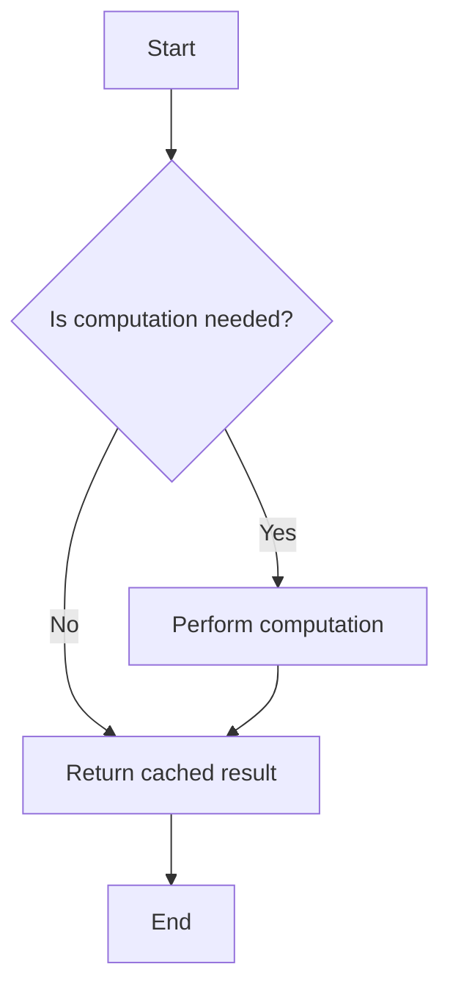

## 9.4 Lazy Evaluation

Lazy evaluation is a powerful concept in programming that defers the computation of expressions until their values are actually needed. This approach can lead to significant performance improvements and reduced memory usage, especially in scenarios involving expensive computations or potentially infinite data structures. In this section, we'll explore lazy evaluation in the context of TypeScript, discuss its benefits and potential drawbacks, and provide practical examples to illustrate how it can be implemented.

### Understanding Lazy Evaluation

Lazy evaluation, also known as call-by-need, is a strategy that delays the evaluation of an expression until its value is required. This contrasts with eager evaluation, where expressions are evaluated as soon as they are bound to a variable. By deferring computations, lazy evaluation can avoid unnecessary calculations, leading to more efficient code execution.

#### Eager vs. Lazy Evaluation

To understand lazy evaluation, it's essential to compare it with eager evaluation:

- **Eager Evaluation**: In eager evaluation, expressions are evaluated immediately. This approach is straightforward and predictable, as all computations are performed upfront. However, it can lead to inefficiencies if the results of some computations are never used.

- **Lazy Evaluation**: Lazy evaluation postpones computation until the result is needed. This can save resources by avoiding unnecessary calculations and can handle infinite data structures by computing only the required parts.

Here's a simple example to illustrate the difference:

```typescript
// Eager Evaluation Example
function eagerSum(a: number, b: number): number {
    console.log("Calculating sum...");
    return a + b;
}

const eagerResult = eagerSum(5, 10); // "Calculating sum..." is logged immediately

// Lazy Evaluation Example
function lazySum(a: number, b: number): () => number {
    return () => {
        console.log("Calculating sum...");
        return a + b;
    };
}

const lazyResult = lazySum(5, 10); // No calculation yet
console.log(lazyResult()); // "Calculating sum..." is logged when the result is needed
```

### Benefits of Lazy Evaluation

Lazy evaluation offers several advantages, particularly in the context of performance optimization and resource management:

1. **Performance Improvements**: By deferring computations, lazy evaluation can reduce the overall number of calculations, especially in cases where not all computed values are used. This can lead to faster program execution.

2. **Reduced Memory Usage**: Lazy evaluation can help manage memory more efficiently by avoiding the allocation of memory for unused computations.

3. **Handling Infinite Data Structures**: In functional programming, lazy evaluation enables the use of infinite data structures by computing only the necessary parts. This is particularly useful for operations like streaming data or processing large datasets.

4. **Improved Modularity**: Lazy evaluation allows developers to write more modular code by separating the definition of computations from their execution. This can lead to cleaner and more maintainable code.

### Lazy Evaluation in Functional Programming

Functional programming languages, such as Haskell, often employ lazy evaluation as a core feature. This allows them to handle infinite lists and perform computations only when necessary. While TypeScript is not inherently a functional language, it can still leverage lazy evaluation techniques to achieve similar benefits.

#### Infinite Data Structures

Consider a scenario where you want to generate an infinite sequence of numbers. With lazy evaluation, you can define the sequence without computing all its elements upfront:

```typescript
function* infiniteSequence(start: number = 0): Generator<number> {
    let i = start;
    while (true) {
        yield i++;
    }
}

const sequence = infiniteSequence();
console.log(sequence.next().value); // 0
console.log(sequence.next().value); // 1
console.log(sequence.next().value); // 2
```

In this example, the `infiniteSequence` function returns a generator, which lazily produces numbers one by one. This allows you to work with potentially infinite sequences without running out of memory.

#### Expensive Computations

Lazy evaluation can also be beneficial for deferring expensive computations until their results are needed. This can be achieved using closures or higher-order functions:

```typescript
function expensiveComputation(): number {
    console.log("Performing expensive computation...");
    return Math.random();
}

function lazyExpensiveComputation(): () => number {
    let result: number | null = null;
    return () => {
        if (result === null) {
            result = expensiveComputation();
        }
        return result;
    };
}

const lazyComputation = lazyExpensiveComputation();
console.log(lazyComputation()); // "Performing expensive computation..." is logged
console.log(lazyComputation()); // No computation, cached result is returned
```

In this example, the `lazyExpensiveComputation` function returns a closure that caches the result of the expensive computation, ensuring it's only performed once.

### Implementing Lazy Evaluation in TypeScript

TypeScript provides several features that facilitate the implementation of lazy evaluation, including closures, generators, and higher-order functions. Let's explore some techniques for implementing lazy evaluation in TypeScript applications.

#### Using Closures

Closures are a fundamental concept in JavaScript and TypeScript that allow functions to capture and remember the environment in which they were created. This makes them ideal for implementing lazy evaluation:

```typescript
function lazyValue<T>(compute: () => T): () => T {
    let value: T | undefined;
    return () => {
        if (value === undefined) {
            value = compute();
        }
        return value;
    };
}

const lazyRandom = lazyValue(() => Math.random());
console.log(lazyRandom()); // Computes and returns a random number
console.log(lazyRandom()); // Returns the cached random number
```

In this example, the `lazyValue` function takes a computation function and returns a closure that caches the result, ensuring the computation is performed only once.

#### Using Generators

Generators provide a powerful way to implement lazy sequences in TypeScript. They allow you to define sequences that produce values on demand:

```typescript
function* lazyRange(start: number, end: number): Generator<number> {
    for (let i = start; i < end; i++) {
        yield i;
    }
}

const range = lazyRange(0, 5);
for (const num of range) {
    console.log(num); // Logs numbers 0 to 4
}
```

The `lazyRange` function defines a generator that produces numbers in a specified range. The values are generated lazily, meaning they are only computed when requested.

#### Using Higher-Order Functions

Higher-order functions, which take other functions as arguments or return them as results, can be used to implement lazy evaluation patterns:

```typescript
function lazyMap<T, U>(array: T[], transform: (item: T) => U): () => U[] {
    let result: U[] | null = null;
    return () => {
        if (result === null) {
            result = array.map(transform);
        }
        return result;
    };
}

const numbers = [1, 2, 3, 4, 5];
const lazySquares = lazyMap(numbers, (n) => n * n);
console.log(lazySquares()); // Computes and returns [1, 4, 9, 16, 25]
console.log(lazySquares()); // Returns the cached result
```

In this example, the `lazyMap` function demonstrates how to lazily apply a transformation to an array, caching the result for subsequent calls.

### Contexts for Lazy Evaluation in TypeScript

Lazy evaluation can be particularly beneficial in various contexts within TypeScript applications:

1. **Data Processing**: When working with large datasets or streams, lazy evaluation can help manage memory usage and improve performance by processing only the necessary data.

2. **UI Rendering**: In web applications, lazy evaluation can optimize rendering performance by deferring the computation of UI elements until they are needed.

3. **Configuration and Initialization**: Lazy evaluation can be used to defer the initialization of configuration settings or resources until they are required, reducing startup time and resource consumption.

4. **Caching and Memoization**: Lazy evaluation is a natural fit for caching strategies, where expensive computations are performed once and their results are reused.

### Potential Drawbacks of Lazy Evaluation

While lazy evaluation offers many benefits, it also introduces some complexities and potential drawbacks:

- **Debugging Challenges**: Lazy evaluation can make debugging more challenging, as the order of computations may not be immediately apparent.

- **Increased Complexity**: Implementing lazy evaluation can add complexity to the codebase, especially if not used judiciously.

- **Unexpected Delays**: If not managed carefully, lazy evaluation can lead to unexpected delays in computation, particularly if the deferred computations are expensive.

- **Resource Management**: Lazy evaluation can complicate resource management, as resources may be held longer than necessary if computations are deferred.

### Try It Yourself

To deepen your understanding of lazy evaluation, try experimenting with the code examples provided. Here are some suggestions for modifications:

- Modify the `infiniteSequence` generator to produce a sequence of even numbers.
- Implement a lazy filter function that filters elements of an array based on a predicate, deferring the computation until the result is needed.
- Create a lazy Fibonacci sequence generator using lazy evaluation techniques.

### Visualizing Lazy Evaluation

To better understand how lazy evaluation works, let's visualize the process using a flowchart:



This flowchart illustrates the decision-making process in lazy evaluation, where computations are performed only when necessary, and cached results are returned otherwise.

### References and Further Reading

For more information on lazy evaluation and related concepts, consider exploring the following resources:

- [MDN Web Docs: Closures](https://developer.mozilla.org/en-US/docs/Web/JavaScript/Closures)
- [MDN Web Docs: Generators](https://developer.mozilla.org/en-US/docs/Web/JavaScript/Reference/Statements/function*)
- [Functional Programming in JavaScript](https://www.oreilly.com/library/view/functional-programming-in/9781491958749/)

### Knowledge Check

Before moving on, take a moment to reflect on the key concepts covered in this section:

- What is lazy evaluation, and how does it differ from eager evaluation?
- How can lazy evaluation improve performance and reduce memory usage?
- What are some potential drawbacks of using lazy evaluation?
- How can lazy evaluation be implemented in TypeScript using closures, generators, and higher-order functions?

### Embrace the Journey

Remember, mastering lazy evaluation is just one step in your journey to becoming a more proficient TypeScript developer. As you continue to explore functional design patterns, you'll discover new ways to optimize your code and create more efficient applications. Keep experimenting, stay curious, and enjoy the journey!

## Quiz Time!



### What is lazy evaluation?

- [x] A strategy that delays computation until the result is needed
- [ ] A strategy that computes all expressions immediately
- [ ] A method for optimizing memory usage
- [ ] A technique for handling infinite data structures

> **Explanation:** Lazy evaluation is a strategy that defers computation until the result is required, which can optimize performance and memory usage.

### How does lazy evaluation differ from eager evaluation?

- [x] Lazy evaluation defers computation until needed, while eager evaluation computes immediately
- [ ] Lazy evaluation computes immediately, while eager evaluation defers computation
- [ ] Both lazy and eager evaluation compute expressions immediately
- [ ] Both lazy and eager evaluation defer computation until needed

> **Explanation:** Lazy evaluation defers computation until the result is needed, whereas eager evaluation computes expressions as soon as they are bound to variables.

### Which of the following is a benefit of lazy evaluation?

- [x] Improved performance by avoiding unnecessary computations
- [ ] Increased memory usage
- [ ] Immediate computation of all expressions
- [ ] Simplified debugging

> **Explanation:** Lazy evaluation can improve performance by deferring unnecessary computations, thus optimizing resource usage.

### In which programming paradigm is lazy evaluation commonly used?

- [x] Functional programming
- [ ] Object-oriented programming
- [ ] Procedural programming
- [ ] Imperative programming

> **Explanation:** Lazy evaluation is commonly used in functional programming to handle infinite data structures and optimize computations.

### What is a potential drawback of lazy evaluation?

- [x] Debugging challenges due to deferred computations
- [ ] Immediate computation of all expressions
- [ ] Increased memory usage
- [ ] Simplified code complexity

> **Explanation:** Lazy evaluation can make debugging more challenging because the order of computations is not immediately apparent.

### How can lazy evaluation be implemented in TypeScript?

- [x] Using closures, generators, and higher-order functions
- [ ] Using only classes and interfaces
- [ ] Using synchronous loops
- [ ] Using immediate function execution

> **Explanation:** Lazy evaluation in TypeScript can be implemented using closures, generators, and higher-order functions to defer computations.

### What is a common use case for lazy evaluation?

- [x] Handling infinite data structures
- [ ] Immediate computation of all expressions
- [ ] Simplified debugging
- [ ] Increased memory usage

> **Explanation:** Lazy evaluation is useful for handling infinite data structures by computing only the necessary parts.

### Which TypeScript feature is ideal for implementing lazy sequences?

- [x] Generators
- [ ] Classes
- [ ] Interfaces
- [ ] Modules

> **Explanation:** Generators in TypeScript are ideal for implementing lazy sequences, as they produce values on demand.

### What is the primary goal of lazy evaluation?

- [x] To defer computation until the result is needed
- [ ] To compute all expressions immediately
- [ ] To increase memory usage
- [ ] To simplify debugging

> **Explanation:** The primary goal of lazy evaluation is to defer computation until the result is needed, optimizing performance and resource usage.

### True or False: Lazy evaluation can complicate resource management.

- [x] True
- [ ] False

> **Explanation:** Lazy evaluation can complicate resource management because resources may be held longer than necessary if computations are deferred.


