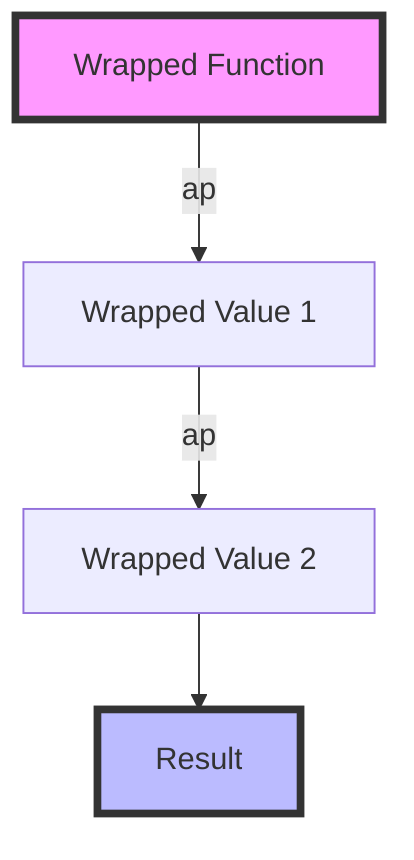

## 9.5.2 Using Applicatives

In the realm of functional programming, Applicatives serve as a powerful abstraction that extends the capabilities of Functors. They allow us to apply functions wrapped in a context to values also wrapped in a context, thus enabling the combination of independent computations. In this section, we will explore Applicative Functors in TypeScript, delve into their implementation, and examine practical use cases.

### Understanding Applicatives

An **Applicative Functor** is a design pattern that builds upon the Functor pattern. While Functors allow us to map a function over a wrapped value, Applicatives take this a step further by enabling the application of wrapped functions to wrapped values.

#### Key Methods

1. **`ap` (apply)**: This method allows us to apply a function wrapped in a context to a value wrapped in a context. It is the core of the Applicative pattern.

2. **`of` (pure/unit)**: This method is used to wrap a value in the minimal context required by the Applicative. It is akin to creating a default or initial context for a value.

### Implementing Applicatives in TypeScript

Let's implement a simple Applicative in TypeScript to illustrate these concepts. We'll start by defining a basic structure for an Applicative.

```typescript
// Define a generic Applicative interface
interface Applicative<T> {
  // Wrap a value in the Applicative context
  of<U>(value: U): Applicative<U>;

  // Apply a wrapped function to a wrapped value
  ap<U, V>(this: Applicative<(value: U) => V>, wrappedValue: Applicative<U>): Applicative<V>;
}

// Example implementation of an Applicative using a simple container
class Container<T> implements Applicative<T> {
  constructor(private value: T) {}

  static of<U>(value: U): Container<U> {
    return new Container(value);
  }

  ap<U, V>(this: Container<(value: U) => V>, wrappedValue: Container<U>): Container<V> {
    const func = this.value;
    const value = wrappedValue.value;
    return new Container(func(value));
  }
}

// Usage example
const wrappedFunc = Container.of((x: number) => x + 1);
const wrappedValue = Container.of(2);
const result = wrappedFunc.ap(wrappedValue);
console.log(result); // Container { value: 3 }
```

In this example, we define a `Container` class that implements the `Applicative` interface. The `of` method wraps a value in a `Container`, while the `ap` method applies a wrapped function to a wrapped value.

### Practical Use Cases

Applicatives are particularly useful in scenarios where we need to combine multiple computations that are independent of each other. One common use case is working with asynchronous operations, such as combining multiple Promises.

#### Combining Asynchronous Computations

Consider a scenario where we need to fetch data from two different APIs and combine the results. Using Applicatives, we can elegantly handle this with Promises.

```typescript
// Function to simulate an API call
function fetchData(url: string): Promise<number> {
  return new Promise((resolve) => {
    setTimeout(() => resolve(Math.random() * 100), 1000);
  });
}

// Applicative instance for Promises
class PromiseApplicative<T> implements Applicative<T> {
  constructor(private promise: Promise<T>) {}

  static of<U>(value: U): PromiseApplicative<U> {
    return new PromiseApplicative(Promise.resolve(value));
  }

  ap<U, V>(this: PromiseApplicative<(value: U) => V>, wrappedValue: PromiseApplicative<U>): PromiseApplicative<V> {
    return new PromiseApplicative(
      this.promise.then((func) => wrappedValue.promise.then((value) => func(value)))
    );
  }
}

// Usage example with Promises
const wrappedFunc = PromiseApplicative.of((x: number, y: number) => x + y);
const promise1 = new PromiseApplicative(fetchData('https://api.example.com/data1'));
const promise2 = new PromiseApplicative(fetchData('https://api.example.com/data2'));

const combined = wrappedFunc.ap(promise1).ap(promise2);
combined.promise.then(console.log); // Logs the sum of two random numbers
```

In this example, we define a `PromiseApplicative` class that wraps a Promise and implements the `Applicative` interface. We then use it to combine two asynchronous computations.

### Applicative Laws

To ensure correctness, Applicatives must adhere to certain laws:

1. **Identity**: Applying the identity function should not alter the value.
   - `A.of(x => x).ap(v) ≡ v`

2. **Homomorphism**: Wrapping a function and applying it to a wrapped value should be the same as applying the function directly.
   - `A.of(f).ap(A.of(x)) ≡ A.of(f(x))`

3. **Interchange**: Applying a wrapped function to a wrapped value should be the same as applying the function to the value directly.
   - `u.ap(A.of(y)) ≡ A.of(f => f(y)).ap(u)`

4. **Composition**: Applying composed functions should be the same as composing applications.
   - `A.of(compose).ap(u).ap(v).ap(w) ≡ u.ap(v.ap(w))`

These laws ensure that Applicatives behave predictably and consistently, which is crucial for maintaining code correctness.

### Challenges with TypeScript's Type System

One of the challenges when working with Applicatives in TypeScript is representing higher-kinded types. TypeScript's type system does not natively support higher-kinded types, which can make it difficult to express certain abstractions.

#### Workarounds

To work around this limitation, we can use techniques such as:

- **Type Aliases**: Create type aliases to simulate higher-kinded types.
- **Generic Interfaces**: Use generic interfaces to represent different contexts.
- **Type Inference**: Leverage TypeScript's type inference capabilities to reduce boilerplate.

Here's an example using type aliases:

```typescript
// Type alias for a higher-kinded type
type HK<F, A> = F extends { _A: A } ? F : never;

// Example usage with a generic interface
interface Functor<F> {
  map<A, B>(fa: HK<F, A>, f: (a: A) => B): HK<F, B>;
}
```

### Improving Code Clarity and Reducing Boilerplate

Applicatives can significantly improve code clarity by reducing boilerplate associated with handling multiple computations. By abstracting the application of functions to wrapped values, Applicatives allow us to focus on the logic rather than the mechanics of combining computations.

### Try It Yourself

To deepen your understanding, try modifying the code examples provided. Experiment with different types of computations, such as combining arrays or other data structures. Explore how Applicatives can simplify complex workflows in your own projects.

### Visualizing Applicatives

To better understand how Applicatives work, let's visualize the process of applying a wrapped function to wrapped values using a flowchart.



This diagram illustrates the sequential application of a wrapped function to multiple wrapped values, resulting in a final computed result.

### References and Links

For further reading on Applicatives and functional programming in TypeScript, consider exploring the following resources:

- [MDN Web Docs on Promises](https://developer.mozilla.org/en-US/docs/Web/JavaScript/Guide/Using_promises)
- [Functional Programming in JavaScript](https://www.freecodecamp.org/news/functional-programming-in-javascript/)
- [TypeScript Handbook](https://www.typescriptlang.org/docs/handbook/intro.html)

### Knowledge Check

Before we conclude, let's reinforce what we've learned with a few questions and exercises:

- **Question**: What is the primary advantage of using Applicatives over Functors?
- **Exercise**: Implement an Applicative for a custom data structure and demonstrate its usage.
- **Question**: How do Applicative laws ensure correctness?

### Embrace the Journey

Remember, mastering Applicatives is just one step in your journey to becoming a proficient functional programmer. As you continue to explore and experiment, you'll discover new ways to leverage these patterns to write more expressive and maintainable code. Keep pushing the boundaries, stay curious, and enjoy the journey!

## Quiz Time!



### What is the primary method that distinguishes Applicatives from Functors?

- [x] `ap`
- [ ] `map`
- [ ] `filter`
- [ ] `reduce`

> **Explanation:** The `ap` method is what distinguishes Applicatives from Functors, allowing the application of wrapped functions to wrapped values.

### Which method in Applicatives is used to wrap a value in the minimal context?

- [x] `of`
- [ ] `ap`
- [ ] `map`
- [ ] `flatMap`

> **Explanation:** The `of` method is used to wrap a value in the minimal context required by the Applicative.

### What is a common use case for Applicatives in TypeScript?

- [x] Combining multiple asynchronous computations
- [ ] Sorting arrays
- [ ] Filtering lists
- [ ] Parsing JSON

> **Explanation:** Applicatives are commonly used to combine multiple asynchronous computations, such as Promises.

### Which of the following is NOT an Applicative law?

- [ ] Identity
- [ ] Homomorphism
- [x] Monoid
- [ ] Interchange

> **Explanation:** Monoid is not an Applicative law. The Applicative laws include Identity, Homomorphism, Interchange, and Composition.

### How can Applicatives improve code clarity?

- [x] By reducing boilerplate
- [ ] By increasing complexity
- [ ] By adding more functions
- [ ] By using more loops

> **Explanation:** Applicatives improve code clarity by reducing boilerplate associated with handling multiple computations.

### What challenge does TypeScript face with Applicatives?

- [x] Representing higher-kinded types
- [ ] Handling synchronous operations
- [ ] Parsing XML
- [ ] Sorting numbers

> **Explanation:** TypeScript's type system does not natively support higher-kinded types, which can be a challenge when working with Applicatives.

### Which method allows applying a wrapped function to a wrapped value?

- [x] `ap`
- [ ] `of`
- [ ] `map`
- [ ] `bind`

> **Explanation:** The `ap` method allows applying a wrapped function to a wrapped value in the Applicative pattern.

### What does the `of` method in Applicatives do?

- [x] Wraps a value in the minimal context
- [ ] Applies a function to a value
- [ ] Filters a list
- [ ] Sorts an array

> **Explanation:** The `of` method wraps a value in the minimal context required by the Applicative.

### True or False: Applicatives can only be used with Promises.

- [ ] True
- [x] False

> **Explanation:** Applicatives can be used with various data structures, not just Promises.

### Which of the following is a benefit of using Applicatives?

- [x] Improved code clarity
- [ ] Increased memory usage
- [ ] Slower execution
- [ ] More complex syntax

> **Explanation:** Applicatives improve code clarity by abstracting the application of functions to wrapped values.


