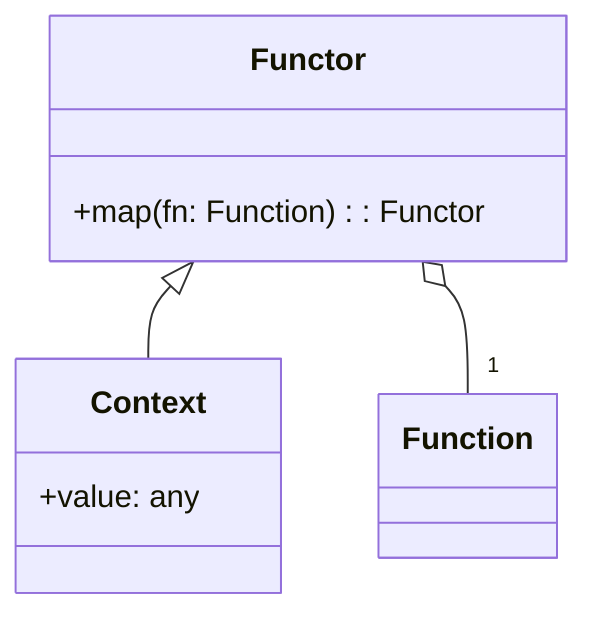
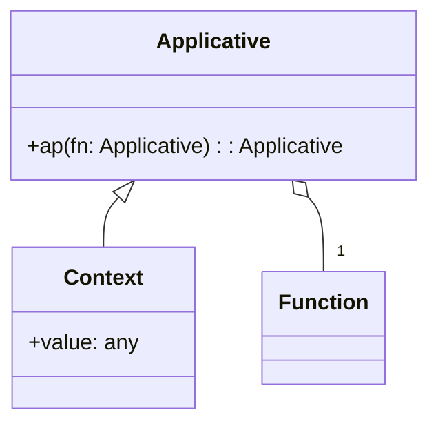

## 9.5.3 Use Cases and Examples

In the realm of functional programming, Functor and Applicative patterns play a crucial role in enhancing code modularity, reusability, and abstraction. These patterns are particularly useful in TypeScript for handling complex operations such as asynchronous processes and data validation. In this section, we will explore real-world applications of these patterns, demonstrating how they can simplify code and improve maintainability.

### Understanding Functor and Applicative Patterns

Before diving into use cases, let's briefly revisit what Functors and Applicatives are:

- **Functor**: A Functor is a type that implements a `map` function, allowing you to apply a function to a wrapped value. It provides a way to apply a function to values within a context, such as an array or a promise.

- **Applicative**: An Applicative extends the capabilities of a Functor by allowing you to apply functions that are themselves wrapped in a context. This is particularly useful for combining multiple independent computations.

### Use Case 1: Performing Parallel Asynchronous Operations

One of the most powerful applications of Applicatives is in managing parallel asynchronous operations. In scenarios where multiple asynchronous tasks need to be executed and their results combined, Applicatives provide a clean and efficient solution.

#### Code Example: Combining Asynchronous Results

Consider a scenario where we need to fetch user data and their associated posts from an API. Using Applicatives, we can perform these operations in parallel and combine their results seamlessly.

```typescript
import { of, combineLatest } from 'rxjs';
import { map } from 'rxjs/operators';

// Simulate asynchronous operations
const fetchUser = of({ id: 1, name: 'Alice' });
const fetchPosts = of([{ id: 1, title: 'Post 1' }, { id: 2, title: 'Post 2' }]);

// Combine results using Applicative pattern
const combinedData = combineLatest([fetchUser, fetchPosts]).pipe(
  map(([user, posts]) => ({
    user,
    posts
  }))
);

combinedData.subscribe(data => console.log(data));
```

In this example, we use `combineLatest` from RxJS to execute `fetchUser` and `fetchPosts` in parallel. The `map` function then combines the results into a single object. This approach not only simplifies the code but also adheres to functional programming principles by treating operations as data transformations.

### Use Case 2: Validating Multiple Independent Data Fields

Data validation is a common task in software development, often involving multiple independent fields that need to be validated simultaneously. Applicative patterns allow us to validate each field independently and aggregate any errors that occur.

#### Code Example: Aggregating Validation Errors

Let's implement a form validation system where each field is validated independently, and errors are aggregated.

```typescript
type ValidationResult<T> = { isValid: boolean; value?: T; error?: string };

const validateName = (name: string): ValidationResult<string> => {
  return name.length > 0 ? { isValid: true, value: name } : { isValid: false, error: 'Name is required' };
};

const validateEmail = (email: string): ValidationResult<string> => {
  const isValid = /^[^\s@]+@[^\s@]+\.[^\s@]+$/.test(email);
  return isValid ? { isValid: true, value: email } : { isValid: false, error: 'Invalid email format' };
};

const validateForm = (name: string, email: string) => {
  const validations = [validateName(name), validateEmail(email)];
  const errors = validations.filter(v => !v.isValid).map(v => v.error);

  return errors.length > 0 ? { isValid: false, errors } : { isValid: true };
};

const result = validateForm('Alice', 'alice@example.com');
console.log(result);
```

In this example, each field is validated independently, and the results are aggregated. This approach ensures that each validation function is modular and reusable, adhering to the principles of functional programming.

### Use Case 3: Applying a Function Over Multiple Optional Values

In functional programming, handling optional values (such as `Maybe` types) is a common task. Applicatives allow us to apply a function over multiple optional values, providing a clean way to handle operations that may fail.

#### Code Example: Working with Maybe Types

Let's consider a scenario where we have two optional values, and we want to combine them using a function.

```typescript
type Maybe<T> = T | null;

const maybeAdd = (a: Maybe<number>, b: Maybe<number>): Maybe<number> => {
  if (a !== null && b !== null) {
    return a + b;
  }
  return null;
};

const result1 = maybeAdd(5, 10);
const result2 = maybeAdd(null, 10);

console.log(result1); // 15
console.log(result2); // null
```

In this example, the `maybeAdd` function takes two `Maybe` values and returns their sum if both are present. This pattern simplifies the handling of optional values and ensures that operations are safe and predictable.

### Benefits of Functor and Applicative Patterns

The use of Functor and Applicative patterns offers several benefits:

- **Modularity**: By encapsulating operations within contexts, these patterns promote modularity and reusability of code.
- **Abstraction**: They provide a high level of abstraction, allowing developers to focus on the logic rather than the implementation details.
- **Error Handling**: Applicatives, in particular, facilitate error handling by allowing multiple operations to be combined and their errors aggregated.
- **Functional Principles**: These patterns adhere to functional programming principles, promoting immutability and pure functions.

### Libraries and Frameworks

Several libraries and frameworks facilitate working with Functor and Applicative patterns in TypeScript:

- **RxJS**: A library for reactive programming using Observables, which provides powerful tools for managing asynchronous operations.
- **fp-ts**: A library that brings functional programming to TypeScript, offering implementations of Functor, Applicative, and other functional patterns.
- **Ramda**: A practical functional library for JavaScript developers, which can be used alongside TypeScript for functional programming.

### Encouragement to Explore

We encourage you to explore Functor and Applicative patterns in your TypeScript applications. These patterns offer a robust framework for handling complex abstractions and can significantly improve the maintainability and readability of your code. By embracing these patterns, you can build applications that are not only efficient but also adhere to the principles of functional programming.

### Try It Yourself

Experiment with the code examples provided in this section. Try modifying the asynchronous operations to include additional API calls, or extend the validation system to handle more fields. By actively engaging with these patterns, you'll gain a deeper understanding of their power and versatility.

## Visualizing Functor and Applicative Patterns

To further enhance your understanding, let's visualize how Functor and Applicative patterns work using Mermaid.js diagrams.

### Functor Pattern



**Caption**: The Functor pattern involves a context (such as an array or promise) that implements a `map` function, allowing a function to be applied to the contained value.

### Applicative Pattern



**Caption**: The Applicative pattern extends Functor by allowing functions that are themselves wrapped in a context to be applied, enabling the combination of multiple independent computations.

## Quiz Time!



### What is a Functor in functional programming?

- [x] A type that implements a `map` function to apply a function to a wrapped value.
- [ ] A type that allows functions to be applied to multiple contexts.
- [ ] A type that manages asynchronous operations.
- [ ] A type that validates data fields.

> **Explanation:** A Functor is a type that implements a `map` function, allowing a function to be applied to a value within a context.

### How does an Applicative extend the capabilities of a Functor?

- [x] By allowing functions that are themselves wrapped in a context to be applied.
- [ ] By providing a `map` function for asynchronous operations.
- [ ] By validating multiple data fields.
- [ ] By encapsulating operations within a context.

> **Explanation:** An Applicative extends a Functor by allowing functions that are themselves wrapped in a context to be applied, enabling the combination of multiple computations.

### Which library is commonly used in TypeScript for reactive programming?

- [x] RxJS
- [ ] Lodash
- [ ] Express
- [ ] Angular

> **Explanation:** RxJS is a library for reactive programming using Observables, commonly used in TypeScript for managing asynchronous operations.

### What is a key benefit of using Functor and Applicative patterns?

- [x] Improved code modularity and reusability.
- [ ] Simplified error handling in synchronous code.
- [ ] Enhanced performance in all applications.
- [ ] Reduced need for functional programming principles.

> **Explanation:** Functor and Applicative patterns improve code modularity and reusability by encapsulating operations within contexts.

### In the provided code example, what does `combineLatest` do?

- [x] Executes multiple asynchronous operations in parallel and combines their results.
- [ ] Validates multiple data fields and aggregates errors.
- [ ] Applies a function over multiple optional values.
- [ ] Manages state in a reactive application.

> **Explanation:** `combineLatest` from RxJS executes multiple asynchronous operations in parallel and combines their results into a single output.

### What is the purpose of the `maybeAdd` function in the code example?

- [x] To add two optional numbers if both are present.
- [ ] To validate two numbers and return errors.
- [ ] To execute two asynchronous operations in parallel.
- [ ] To manage state in a functional application.

> **Explanation:** The `maybeAdd` function takes two optional numbers and returns their sum if both are present, demonstrating the handling of optional values.

### Which library provides implementations of Functor and Applicative patterns in TypeScript?

- [x] fp-ts
- [ ] Redux
- [ ] Angular
- [ ] Node.js

> **Explanation:** `fp-ts` is a library that brings functional programming to TypeScript, offering implementations of Functor, Applicative, and other functional patterns.

### What does the `validateForm` function do in the code example?

- [x] Validates multiple data fields and aggregates any errors.
- [ ] Executes multiple asynchronous operations in parallel.
- [ ] Applies a function over multiple optional values.
- [ ] Manages state in a reactive application.

> **Explanation:** The `validateForm` function validates multiple data fields independently and aggregates any errors, demonstrating the use of Applicative patterns in data validation.

### What is a common use case for Applicative patterns?

- [x] Performing parallel asynchronous operations and combining their results.
- [ ] Managing state in a reactive application.
- [ ] Simplifying error handling in synchronous code.
- [ ] Enhancing performance in all applications.

> **Explanation:** Applicative patterns are commonly used for performing parallel asynchronous operations and combining their results, as they allow multiple computations to be combined seamlessly.

### True or False: Functor and Applicative patterns are only useful in functional programming languages.

- [ ] True
- [x] False

> **Explanation:** False. Functor and Applicative patterns are useful in any language that supports functional programming principles, including TypeScript.



Remember, this is just the beginning. As you progress, you'll build more complex and interactive applications using these patterns. Keep experimenting, stay curious, and enjoy the journey!
