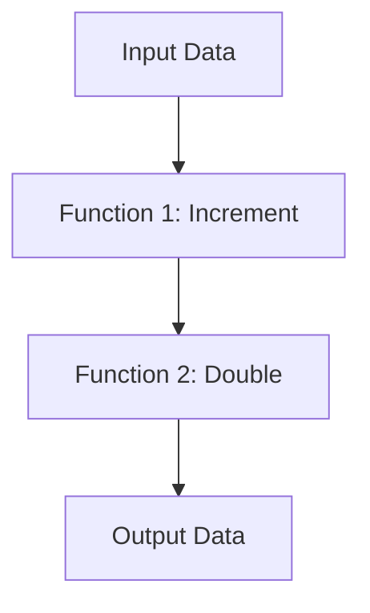

## 9.6.1 Implementing Pipelines in TypeScript

In this section, we delve into the concept of pipelines in TypeScript, a powerful paradigm borrowed from functional programming that allows for clean and efficient data processing. Pipelines enable us to transform data through a series of steps, each encapsulated in a function, promoting code reusability and readability. Let's explore how to implement these pipelines using TypeScript's robust type system, higher-order functions, and popular libraries.

### Understanding Pipelines

Pipelines are sequences of data transformations, where the output of one function becomes the input of the next. This approach is akin to an assembly line, where each station performs a specific task, ultimately producing a refined product. Pipelines are particularly useful in scenarios where data needs to be processed through multiple stages, such as data validation, transformation, and aggregation.

#### Key Concepts

- **Function Composition**: Combining simple functions to build more complex ones.
- **Higher-Order Functions**: Functions that take other functions as arguments or return them as results.
- **Type Safety**: Ensuring that data types are consistent throughout the pipeline.
- **Asynchronous Operations**: Handling operations that may not complete immediately, such as network requests.

### Creating Pipelines with Function Composition

Function composition is the heart of pipeline implementation. It allows us to create a new function by combining multiple functions. In TypeScript, we can achieve this using higher-order functions.

#### Example: Basic Function Composition

```typescript
// Define simple transformation functions
const add = (x: number) => (y: number) => x + y;
const multiply = (x: number) => (y: number) => x * y;

// Compose functions to create a pipeline
const addThenMultiply = (x: number) => (y: number) => multiply(x)(add(x)(y));

// Use the composed function
const result = addThenMultiply(2)(3); // (2 + 3) * 2 = 10
console.log(result);
```

In this example, we define two simple functions, `add` and `multiply`, and compose them to create a new function `addThenMultiply`. This function first adds a number and then multiplies the result, demonstrating how function composition can streamline operations.

### Simulating the Pipeline Operator

The proposed pipeline operator (`|>`) in JavaScript is not yet widely supported, but we can simulate its behavior using utility functions.

#### Simulating the Pipeline Operator

```typescript
// Define a utility function to simulate the pipeline operator
const pipe = <T>(...fns: Array<(arg: T) => T>) => (initialValue: T): T =>
  fns.reduce((acc, fn) => fn(acc), initialValue);

// Define transformation functions
const increment = (x: number) => x + 1;
const double = (x: number) => x * 2;

// Create a pipeline using the pipe function
const pipeline = pipe(increment, double);

// Execute the pipeline
const pipelineResult = pipeline(3); // (3 + 1) * 2 = 8
console.log(pipelineResult);
```

Here, we define a `pipe` function that takes a list of functions and returns a new function. This new function applies each transformation in sequence, mimicking the behavior of the pipeline operator.

### Leveraging Libraries for Pipeline Creation

Libraries like Ramda and Lodash-fp provide utilities that make pipeline creation more intuitive and concise.

#### Using Ramda for Pipelines

[Ramda](https://ramdajs.com/) is a functional programming library that emphasizes immutability and side-effect-free functions.

```typescript
import * as R from 'ramda';

// Define transformation functions
const square = (x: number) => x * x;
const subtractOne = (x: number) => x - 1;

// Create a pipeline using Ramda's pipe function
const ramdaPipeline = R.pipe(square, subtractOne);

// Execute the pipeline
const ramdaResult = ramdaPipeline(5); // (5 * 5) - 1 = 24
console.log(ramdaResult);
```

Ramda's `pipe` function simplifies the creation of pipelines by chaining functions in a left-to-right order, enhancing code readability.

#### Using Lodash-fp for Pipelines

[Lodash-fp](https://github.com/lodash/lodash/wiki/FP-Guide) is a functional programming variant of Lodash, providing a similar `flow` function for pipelines.

```typescript
import { flow } from 'lodash/fp';

// Define transformation functions
const divideByTwo = (x: number) => x / 2;
const addFive = (x: number) => x + 5;

// Create a pipeline using Lodash-fp's flow function
const lodashPipeline = flow(divideByTwo, addFive);

// Execute the pipeline
const lodashResult = lodashPipeline(10); // (10 / 2) + 5 = 10
console.log(lodashResult);
```

Lodash-fp's `flow` function operates similarly to Ramda's `pipe`, offering a familiar syntax for those accustomed to Lodash.

### Maintaining Type Safety in Pipelines

TypeScript's type system ensures that data types remain consistent throughout the pipeline, preventing runtime errors.

#### Example: Type-Safe Pipeline

```typescript
// Define a type-safe pipeline function
const typeSafePipe = <T, R>(...fns: Array<(arg: T) => R>) => (initialValue: T): R =>
  fns.reduce((acc, fn) => fn(acc), initialValue);

// Define transformation functions with type annotations
const toUpperCase = (str: string): string => str.toUpperCase();
const exclaim = (str: string): string => `${str}!`;

// Create a type-safe pipeline
const shoutPipeline = typeSafePipe(toUpperCase, exclaim);

// Execute the pipeline
const shoutResult = shoutPipeline("hello");
console.log(shoutResult); // "HELLO!"
```

By explicitly defining input and output types, we ensure that each function in the pipeline adheres to expected types, enhancing reliability and maintainability.

### Handling Asynchronous Operations in Pipelines

Asynchronous operations, such as fetching data from an API, can be seamlessly integrated into pipelines using Promises or async/await.

#### Example: Asynchronous Pipeline with Promises

```typescript
// Define asynchronous transformation functions
const fetchData = async (url: string): Promise<string> => {
  const response = await fetch(url);
  return response.text();
};

const parseData = (data: string): string[] => data.split('\n');

// Create an asynchronous pipeline
const asyncPipeline = async (url: string) => {
  const data = await fetchData(url);
  return parseData(data);
};

// Execute the asynchronous pipeline
asyncPipeline('https://example.com/data.txt').then(result => {
  console.log(result);
});
```

In this example, we define an asynchronous pipeline that fetches data from a URL and parses it into an array of strings. By using async/await, we maintain a clear and concise syntax.

#### Example: Asynchronous Pipeline with Async/Await

```typescript
// Define an async function to simulate a delay
const delay = (ms: number) => new Promise(resolve => setTimeout(resolve, ms));

// Define asynchronous transformation functions
const asyncIncrement = async (x: number): Promise<number> => {
  await delay(1000);
  return x + 1;
};

const asyncDouble = async (x: number): Promise<number> => {
  await delay(1000);
  return x * 2;
};

// Create an asynchronous pipeline using async/await
const asyncPipelineWithAwait = async (value: number) => {
  const incremented = await asyncIncrement(value);
  return await asyncDouble(incremented);
};

// Execute the asynchronous pipeline
asyncPipelineWithAwait(3).then(result => {
  console.log(result); // After 2 seconds: 8
});
```

This example demonstrates how to handle asynchronous operations within a pipeline using async/await, providing a straightforward approach to managing asynchronous tasks.

### Organizing Code for Readability and Maintainability

When implementing pipelines, organizing code effectively is crucial to maintain readability and facilitate future modifications.

#### Tips for Organizing Pipeline Code

1. **Modularize Functions**: Define each transformation as a separate, reusable function.
2. **Use Descriptive Names**: Name functions and variables clearly to convey their purpose.
3. **Document Pipelines**: Include comments or documentation to explain the purpose and flow of each pipeline.
4. **Leverage TypeScript's Type System**: Use type annotations and interfaces to clarify expected inputs and outputs.

### Try It Yourself

Experiment with the provided code examples by modifying transformation functions or creating new pipelines. Consider integrating additional libraries or exploring different approaches to handling asynchronous operations.

### Visualizing Pipelines

To better understand the flow of data through a pipeline, let's visualize a simple pipeline using a flowchart.



**Diagram Description**: This flowchart illustrates a basic pipeline where input data is first incremented and then doubled, resulting in the final output.

### References and Links

- [MDN Web Docs: Function Composition](https://developer.mozilla.org/en-US/docs/Web/JavaScript/Guide/Functions#function_composition)
- [Ramda Documentation](https://ramdajs.com/docs/)
- [Lodash-fp Documentation](https://github.com/lodash/lodash/wiki/FP-Guide)
- [TypeScript Handbook](https://www.typescriptlang.org/docs/)

### Knowledge Check

- How does function composition facilitate pipeline creation?
- What are the benefits of using libraries like Ramda and Lodash-fp for pipelines?
- How can we ensure type safety in a TypeScript pipeline?
- What strategies can be employed to handle asynchronous operations in pipelines?

### Embrace the Journey

Implementing pipelines in TypeScript opens up a world of possibilities for writing clean, efficient, and maintainable code. As you continue to explore functional programming paradigms, remember to experiment, iterate, and refine your approach. The journey of mastering pipelines is ongoing, and each step brings you closer to becoming a more proficient developer.

## Quiz Time!



### What is the primary benefit of using pipelines in TypeScript?

- [x] To streamline data processing through a series of transformations.
- [ ] To increase the complexity of code.
- [ ] To reduce the need for functions.
- [ ] To eliminate the use of TypeScript's type system.

> **Explanation:** Pipelines streamline data processing by allowing data to flow through a series of transformations, enhancing code readability and maintainability.

### How can we simulate the proposed pipeline operator in TypeScript?

- [x] By using utility functions like `pipe`.
- [ ] By using the `async` keyword.
- [ ] By defining a new TypeScript syntax.
- [ ] By using the `await` keyword.

> **Explanation:** We can simulate the pipeline operator using utility functions like `pipe`, which chain functions together to process data sequentially.

### Which library provides a `pipe` function for creating pipelines?

- [x] Ramda
- [ ] Lodash-fp
- [ ] TypeScript
- [ ] Node.js

> **Explanation:** Ramda provides a `pipe` function that allows for easy creation of pipelines by chaining functions in a left-to-right order.

### How can we maintain type safety in a TypeScript pipeline?

- [x] By using type annotations and interfaces.
- [ ] By avoiding the use of functions.
- [ ] By using `any` type everywhere.
- [ ] By ignoring TypeScript compiler errors.

> **Explanation:** Type safety can be maintained by using type annotations and interfaces to ensure that each function in the pipeline adheres to expected types.

### What is a higher-order function?

- [x] A function that takes other functions as arguments or returns them as results.
- [ ] A function that only performs arithmetic operations.
- [ ] A function that cannot be composed.
- [ ] A function that is not used in pipelines.

> **Explanation:** A higher-order function is one that takes other functions as arguments or returns them as results, enabling function composition and pipeline creation.

### How can asynchronous operations be handled in pipelines?

- [x] Using Promises or async/await.
- [ ] By avoiding asynchronous tasks.
- [ ] By using only synchronous functions.
- [ ] By ignoring asynchronous operations.

> **Explanation:** Asynchronous operations can be handled in pipelines using Promises or async/await, allowing for seamless integration of asynchronous tasks.

### Which of the following is a benefit of using Ramda for pipelines?

- [x] It emphasizes immutability and side-effect-free functions.
- [ ] It requires more code to implement pipelines.
- [ ] It does not support function composition.
- [ ] It is not compatible with TypeScript.

> **Explanation:** Ramda emphasizes immutability and side-effect-free functions, making it a suitable choice for implementing pipelines in a functional programming style.

### What is the role of the `flow` function in Lodash-fp?

- [x] To create pipelines by chaining functions together.
- [ ] To execute asynchronous operations.
- [ ] To define new TypeScript types.
- [ ] To eliminate the need for function composition.

> **Explanation:** The `flow` function in Lodash-fp creates pipelines by chaining functions together, similar to Ramda's `pipe` function.

### How can we enhance the readability of pipeline code?

- [x] By modularizing functions and using descriptive names.
- [ ] By writing all code in a single line.
- [ ] By avoiding comments and documentation.
- [ ] By using only anonymous functions.

> **Explanation:** Enhancing readability involves modularizing functions, using descriptive names, and including comments or documentation to explain the pipeline's purpose and flow.

### Is it possible to handle both synchronous and asynchronous operations within the same pipeline?

- [x] True
- [ ] False

> **Explanation:** It is possible to handle both synchronous and asynchronous operations within the same pipeline by carefully managing the flow of data and using appropriate techniques like Promises or async/await.


