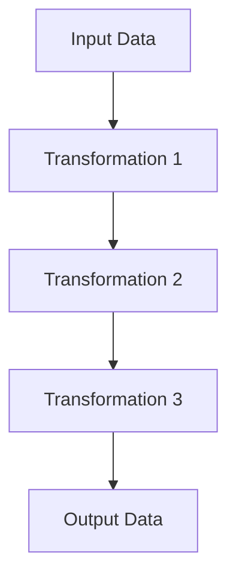

## 9.6.2 Improved Code Readability

In the realm of software development, code readability is paramount. It not only enhances maintainability but also facilitates collaboration among team members. In this section, we delve into how the pipeline and chain patterns contribute to improved code readability in TypeScript, making your codebase more intuitive and easier to manage.

### Understanding the Pipeline and Chain Patterns

Before we explore the benefits of these patterns, let's briefly define them:

- **Pipeline Pattern**: This pattern involves passing data through a sequence of processing stages, each transforming the data in some way. It mirrors the transformation steps, making the logic clear and linear.

- **Chain Pattern**: Similar to the pipeline pattern, the chain pattern involves passing a request along a chain of handlers. Each handler decides whether to process the request or pass it to the next handler in the chain.

Both patterns promote a linear flow of data or requests, which can significantly enhance code readability.

### Linear Data Flow and Transformation

One of the key advantages of the pipeline pattern is its linear data flow, which mirrors the transformation steps. This linearity makes the logic of the code apparent and easy to follow. Let's consider a simple example to illustrate this concept.

#### Traditional Imperative Code

```typescript
function processData(input: number): number {
    let result = input;
    result = result * 2;
    result = result + 10;
    result = Math.sqrt(result);
    return result;
}

const output = processData(5);
console.log(output);
```

In this traditional imperative style, the transformations are applied sequentially, but the logic is not immediately apparent. Each step modifies the `result` variable, making it harder to trace the flow of data.

#### Pipeline-Style Code

```typescript
function double(x: number): number {
    return x * 2;
}

function addTen(x: number): number {
    return x + 10;
}

function squareRoot(x: number): number {
    return Math.sqrt(x);
}

const output = squareRoot(addTen(double(5)));
console.log(output);
```

In the pipeline-style code, each transformation is a separate function, and the data flows through these functions in a linear fashion. This approach makes the transformation steps explicit and easy to understand.

### Comparing Readability: Imperative vs. Pipeline

Let's compare the readability of traditional imperative code with pipeline-style code using a more complex example.

#### Imperative Code Example

```typescript
function processUserData(users: User[]): User[] {
    const processedUsers: User[] = [];
    for (const user of users) {
        if (user.isActive) {
            const updatedUser = {
                ...user,
                fullName: `${user.firstName} ${user.lastName}`,
                age: calculateAge(user.birthDate),
            };
            processedUsers.push(updatedUser);
        }
    }
    return processedUsers;
}
```

In this imperative code, we loop through the users, apply transformations, and push the results into a new array. The logic is intertwined with the control structure, making it less readable.

#### Pipeline-Style Code Example

```typescript
function filterActiveUsers(users: User[]): User[] {
    return users.filter(user => user.isActive);
}

function addFullName(user: User): User {
    return {
        ...user,
        fullName: `${user.firstName} ${user.lastName}`,
    };
}

function calculateUserAge(user: User): User {
    return {
        ...user,
        age: calculateAge(user.birthDate),
    };
}

const processedUsers = users
    .filter(filterActiveUsers)
    .map(addFullName)
    .map(calculateUserAge);
```

In the pipeline-style code, each transformation is a distinct function, and the data flows through these functions using `filter` and `map`. This separation of concerns enhances readability and makes the code self-documenting.

### Reducing Nesting and Callback Complexity

Another significant benefit of the pipeline and chain patterns is the reduction of nesting and callback complexity. In traditional code, especially when dealing with asynchronous operations, nesting can quickly become unwieldy.

#### Nested Callbacks Example

```typescript
function fetchData(callback: (data: any) => void): void {
    setTimeout(() => {
        callback({ id: 1, name: 'John Doe' });
    }, 1000);
}

function processData(data: any, callback: (processedData: any) => void): void {
    setTimeout(() => {
        callback({ ...data, processed: true });
    }, 1000);
}

fetchData(data => {
    processData(data, processedData => {
        console.log(processedData);
    });
});
```

In this example, the nested callbacks make the code harder to follow and maintain.

#### Using Promises for Better Readability

```typescript
function fetchData(): Promise<any> {
    return new Promise(resolve => {
        setTimeout(() => {
            resolve({ id: 1, name: 'John Doe' });
        }, 1000);
    });
}

function processData(data: any): Promise<any> {
    return new Promise(resolve => {
        setTimeout(() => {
            resolve({ ...data, processed: true });
        }, 1000);
    });
}

fetchData()
    .then(processData)
    .then(processedData => {
        console.log(processedData);
    });
```

By using promises, we can chain asynchronous operations, reducing nesting and improving readability.

### Benefits for Team Collaboration and Onboarding

Clear and self-documenting code is invaluable for team collaboration and onboarding new developers. When code is easy to read and understand, team members can quickly grasp the logic and contribute effectively.

- **Self-Documenting Code**: Pipeline and chain patterns naturally lead to self-documenting code. Each function in the pipeline represents a distinct transformation or operation, making it clear what the code is doing.

- **Ease of Onboarding**: New developers can quickly understand the flow of data or requests through the system, reducing the learning curve and enabling them to contribute sooner.

- **Consistent Style**: Adopting these patterns encourages a consistent coding style across the codebase, further aiding collaboration.

### Trade-offs and Considerations

While the pipeline and chain patterns offer significant readability benefits, there are some trade-offs to consider:

- **Initial Learning Curve**: Developers unfamiliar with these patterns may require some time to learn and adapt to this style of coding.

- **Performance Considerations**: In some cases, the additional function calls in a pipeline can introduce a slight performance overhead. However, this is often negligible compared to the readability benefits.

- **Complexity in Error Handling**: Managing errors in a pipeline can be more complex, especially in asynchronous operations. It's important to implement robust error handling strategies.

### Adhering to Coding Standards and Best Practices

To maximize the readability benefits of pipeline and chain patterns, it's crucial to adhere to coding standards and best practices:

- **Use Descriptive Function Names**: Ensure that each function in the pipeline has a clear and descriptive name that reflects its purpose.

- **Keep Functions Small and Focused**: Each function should perform a single, well-defined task. This makes the pipeline easier to understand and maintain.

- **Document Complex Logic**: While the pipeline pattern promotes self-documenting code, it's still important to document any complex logic or edge cases.

- **Leverage TypeScript's Type System**: Use TypeScript's type annotations to provide additional context and ensure type safety throughout the pipeline.

### Try It Yourself

To truly grasp the benefits of pipeline and chain patterns, try modifying the code examples provided. Experiment with adding new transformations, handling errors, or converting existing imperative code to a pipeline style. This hands-on practice will reinforce your understanding and help you apply these patterns effectively in your own projects.

### Visualizing Pipeline and Chain Patterns

To further enhance your understanding, let's visualize the flow of data in a pipeline using a Mermaid.js diagram.



This diagram represents a simple pipeline where data flows through a series of transformations, culminating in the final output. Each transformation is a distinct step, making the process clear and easy to follow.

### Conclusion

The pipeline and chain patterns are powerful tools for improving code readability in TypeScript. By promoting a linear flow of data or requests, these patterns make the logic of your code apparent and easy to follow. While there are some trade-offs to consider, the benefits in terms of maintainability, collaboration, and onboarding are significant. By adhering to coding standards and best practices, you can maximize the readability benefits of these patterns and create a more intuitive and manageable codebase.

## Quiz Time!



### What is one of the main benefits of using the pipeline pattern?

- [x] It mirrors the transformation steps, making logic clear.
- [ ] It increases the performance of the code.
- [ ] It allows for more complex nesting.
- [ ] It reduces the number of lines of code.

> **Explanation:** The pipeline pattern mirrors the transformation steps, making the logic clear and easy to follow.

### How does the chain pattern improve code readability?

- [x] By passing a request along a chain of handlers.
- [ ] By increasing the number of nested callbacks.
- [ ] By reducing the number of functions used.
- [ ] By making the code more complex.

> **Explanation:** The chain pattern improves readability by passing a request along a chain of handlers, making the flow of logic clear.

### What is a potential trade-off of using pipeline and chain patterns?

- [x] Initial learning curve for developers.
- [ ] Increased code complexity.
- [ ] Reduced code readability.
- [ ] Decreased maintainability.

> **Explanation:** A potential trade-off is the initial learning curve for developers unfamiliar with these patterns.

### How can pipeline-style code reduce nesting?

- [x] By chaining functions instead of nesting them.
- [ ] By using more variables.
- [ ] By increasing the number of loops.
- [ ] By adding more conditions.

> **Explanation:** Pipeline-style code reduces nesting by chaining functions, making the code more linear and readable.

### What should you do to maximize the readability benefits of pipeline patterns?

- [x] Use descriptive function names.
- [ ] Avoid using TypeScript's type system.
- [ ] Use as few functions as possible.
- [ ] Nest functions deeply.

> **Explanation:** Using descriptive function names helps make the purpose of each step in the pipeline clear.

### How does clear, self-documenting code benefit team collaboration?

- [x] It makes the code easier to understand and maintain.
- [ ] It increases the number of lines of code.
- [ ] It makes the code more complex.
- [ ] It reduces the need for comments.

> **Explanation:** Clear, self-documenting code is easier to understand and maintain, which benefits team collaboration.

### What is a consideration when using pipeline patterns in terms of performance?

- [x] The additional function calls can introduce slight overhead.
- [ ] The code will always run faster.
- [ ] The code will use less memory.
- [ ] The code will be more complex.

> **Explanation:** The additional function calls in a pipeline can introduce slight performance overhead, though often negligible.

### How can you handle errors in a pipeline?

- [x] Implement robust error handling strategies.
- [ ] Ignore errors to keep the code clean.
- [ ] Use more nested callbacks.
- [ ] Avoid using try-catch blocks.

> **Explanation:** Implementing robust error handling strategies is important to manage errors effectively in a pipeline.

### What is one way to visualize the flow of data in a pipeline?

- [x] Using a Mermaid.js diagram.
- [ ] Writing more comments in the code.
- [ ] Increasing the number of functions.
- [ ] Adding more variables.

> **Explanation:** A Mermaid.js diagram can visually represent the flow of data in a pipeline, making it easier to understand.

### True or False: The pipeline pattern can help reduce callback complexity.

- [x] True
- [ ] False

> **Explanation:** True. The pipeline pattern can help reduce callback complexity by providing a linear flow of data.


