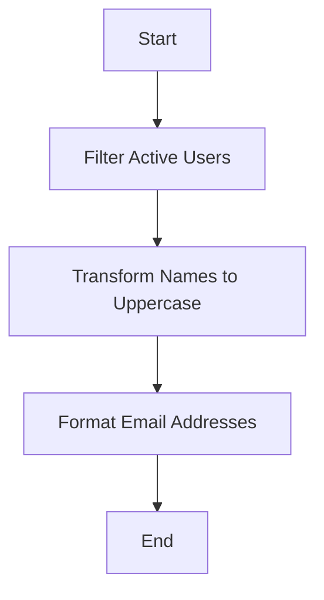

## 9.6.3 Use Cases and Examples

In the world of software engineering, especially when working with TypeScript, the pipeline and chain patterns are invaluable tools for creating clean, modular, and maintainable code. These patterns are particularly effective in scenarios involving data transformation and stream processing. In this section, we will delve into practical use cases, providing TypeScript code examples to illustrate how these patterns can be applied to solve real-world problems.

### Transforming and Filtering Data Collections

One of the most common use cases for pipeline and chain patterns is transforming and filtering data collections. This involves processing a sequence of operations where each step transforms the data in some way. Let's explore how this can be achieved in TypeScript.

#### Example: Data Transformation Pipeline

Imagine we have a collection of user data, and we want to filter out inactive users, transform their names to uppercase, and then extract their email addresses. Here's how we can implement this using a pipeline pattern in TypeScript:

```typescript
type User = {
  name: string;
  email: string;
  active: boolean;
};

// Sample data
const users: User[] = [
  { name: "Alice", email: "alice@example.com", active: true },
  { name: "Bob", email: "bob@example.com", active: false },
  { name: "Charlie", email: "charlie@example.com", active: true },
];

// Pipeline function
const processUsers = (users: User[]): string[] => {
  return users
    .filter(user => user.active) // Step 1: Filter active users
    .map(user => user.name.toUpperCase()) // Step 2: Transform names to uppercase
    .map(name => `${name}@example.com`); // Step 3: Format email addresses
};

const result = processUsers(users);
console.log(result); // Output: ["ALICE@example.com", "CHARLIE@example.com"]
```

**Explanation**: In this example, we use a series of array methods (`filter`, `map`) to create a pipeline that processes the user data. Each method represents a step in the pipeline, making the code modular and easy to understand.

### Processing Streams of Data

Another powerful application of the pipeline and chain patterns is in processing streams of data, such as reading from files or network sockets. This is particularly useful in scenarios where data is continuously flowing and needs to be processed in real-time.

#### Example: Stream Processing with Node.js

Let's consider a scenario where we need to read a large text file, filter out lines containing a specific keyword, and then write the filtered lines to a new file. We can achieve this using Node.js streams and the pipeline pattern.

```typescript
import * as fs from 'fs';
import * as readline from 'readline';

// Create a read stream from the input file
const inputStream = fs.createReadStream('input.txt');

// Create a write stream for the output file
const outputStream = fs.createWriteStream('output.txt');

// Create an interface for reading lines
const rl = readline.createInterface({
  input: inputStream,
  output: process.stdout,
  terminal: false
});

// Process each line
rl.on('line', (line: string) => {
  if (line.includes('keyword')) {
    outputStream.write(line + '\n'); // Write filtered lines to the output file
  }
});

rl.on('close', () => {
  console.log('Processing complete.');
});
```

**Explanation**: In this example, we use Node.js streams to efficiently process a large file line by line. The `readline` module allows us to handle each line as it is read, applying a filter to determine which lines should be written to the output file. This approach is memory-efficient and well-suited for large data sets.

### Building Complex Queries or Data Analytics Pipelines

Pipeline and chain patterns are also highly effective in building complex queries or data analytics pipelines. These patterns enable the composition of multiple operations into a single, cohesive process, enhancing modularity and reusability.

#### Example: Data Analytics Pipeline

Consider a scenario where we need to analyze a dataset of transactions to calculate the total sales for each product category. We can use a pipeline to achieve this:

```typescript
type Transaction = {
  product: string;
  category: string;
  amount: number;
};

// Sample transaction data
const transactions: Transaction[] = [
  { product: "Laptop", category: "Electronics", amount: 1200 },
  { product: "Headphones", category: "Electronics", amount: 200 },
  { product: "Coffee Maker", category: "Home Appliances", amount: 100 },
  { product: "Blender", category: "Home Appliances", amount: 150 },
];

// Pipeline function
const calculateSalesByCategory = (transactions: Transaction[]): Record<string, number> => {
  return transactions
    .reduce((acc, transaction) => {
      if (!acc[transaction.category]) {
        acc[transaction.category] = 0;
      }
      acc[transaction.category] += transaction.amount;
      return acc;
    }, {} as Record<string, number>);
};

const salesByCategory = calculateSalesByCategory(transactions);
console.log(salesByCategory); // Output: { Electronics: 1400, Home Appliances: 250 }
```

**Explanation**: In this example, we use the `reduce` method to aggregate transaction amounts by category. The pipeline pattern allows us to encapsulate the logic for calculating sales, making the code easy to understand and modify.

### Practical Benefits of Pipeline and Chain Patterns

The use of pipeline and chain patterns in TypeScript offers several practical benefits:

1. **Modularity**: By breaking down complex operations into smaller, reusable steps, these patterns promote modular code design. Each step in the pipeline can be developed and tested independently.

2. **Reusability**: Once a pipeline is defined, it can be reused across different parts of the application. This reduces code duplication and enhances maintainability.

3. **Ease of Testing**: The modular nature of pipeline and chain patterns makes it easier to write unit tests for individual steps. This improves code quality and reliability.

4. **Clarity and Readability**: Pipelines provide a clear, linear flow of data transformations, making the code more readable and easier to understand.

### Relevant Tools and Libraries

Several tools and libraries can facilitate the implementation of pipeline and chain patterns in TypeScript:

- **RxJS**: A powerful library for reactive programming using observables, RxJS provides operators that can be used to create complex data pipelines.

- **Lodash**: A utility library that offers a variety of functions for manipulating arrays, objects, and other data structures, making it easier to implement pipeline-like operations.

- **Node.js Streams**: Built-in support for handling streams of data in Node.js, enabling efficient processing of large datasets.

### Encouragement to Adopt Pipeline and Chain Patterns

Adopting pipeline and chain patterns in your TypeScript projects can significantly enhance the organization and clarity of your code. By structuring your code as a series of transformations, you can create flexible and maintainable solutions that are easy to extend and adapt to changing requirements.

### Try It Yourself

To truly grasp the power of pipeline and chain patterns, try experimenting with the examples provided. Modify the code to add new steps, change the order of operations, or apply different transformations. This hands-on approach will deepen your understanding and help you discover new ways to apply these patterns in your projects.

### Visualizing Pipeline and Chain Patterns

To further illustrate the concept, let's visualize a simple data transformation pipeline using a flowchart:



**Description**: This flowchart represents a data transformation pipeline where user data is filtered, transformed, and formatted in a sequence of operations.

### Knowledge Check

- **Question**: What are the main benefits of using pipeline and chain patterns in TypeScript?
- **Challenge**: Implement a pipeline to process a list of orders, calculating the total revenue for each customer.

### Summary

In this section, we've explored the use cases and examples of pipeline and chain patterns in TypeScript. These patterns are powerful tools for transforming and processing data, offering benefits such as modularity, reusability, and ease of testing. By adopting these patterns, you can enhance the organization and clarity of your code, creating solutions that are both flexible and maintainable.

## Quiz Time!



### What is a primary benefit of using pipeline and chain patterns in TypeScript?

- [x] Modularity
- [ ] Complexity
- [ ] Redundancy
- [ ] Obfuscation

> **Explanation:** Pipeline and chain patterns promote modularity by breaking down complex operations into smaller, reusable steps.

### Which TypeScript method is commonly used to transform data in a pipeline?

- [x] map
- [ ] filter
- [ ] reduce
- [ ] forEach

> **Explanation:** The `map` method is used to transform each element in an array, making it a common choice for data transformation in pipelines.

### In the stream processing example, which Node.js module is used to read lines from a file?

- [x] readline
- [ ] fs
- [ ] http
- [ ] path

> **Explanation:** The `readline` module is used to read lines from a file, enabling line-by-line processing.

### What is a key advantage of using Node.js streams for data processing?

- [x] Memory efficiency
- [ ] Increased latency
- [ ] Complexity
- [ ] Redundancy

> **Explanation:** Node.js streams are memory-efficient as they process data in chunks rather than loading the entire dataset into memory.

### Which library is known for providing operators to create complex data pipelines in TypeScript?

- [x] RxJS
- [ ] Lodash
- [ ] jQuery
- [ ] Angular

> **Explanation:** RxJS is a library for reactive programming that provides operators to create complex data pipelines.

### What is the main purpose of the `reduce` method in a data analytics pipeline?

- [x] Aggregating data
- [ ] Filtering data
- [ ] Transforming data
- [ ] Sorting data

> **Explanation:** The `reduce` method is used to aggregate data, such as calculating totals or combining values.

### Which pattern is particularly useful for processing streams of data?

- [x] Pipeline pattern
- [ ] Singleton pattern
- [ ] Factory pattern
- [ ] Observer pattern

> **Explanation:** The pipeline pattern is useful for processing streams of data, allowing for sequential data transformations.

### What is a practical benefit of using pipeline and chain patterns for testing?

- [x] Ease of testing
- [ ] Increased complexity
- [ ] Reduced readability
- [ ] Obfuscation

> **Explanation:** Pipeline and chain patterns make it easier to write unit tests for individual steps, improving code quality.

### Which TypeScript utility library offers functions for pipeline-like operations?

- [x] Lodash
- [ ] RxJS
- [ ] Angular
- [ ] jQuery

> **Explanation:** Lodash is a utility library that provides functions for manipulating data, facilitating pipeline-like operations.

### True or False: Pipeline and chain patterns can enhance the clarity and readability of code.

- [x] True
- [ ] False

> **Explanation:** Pipeline and chain patterns enhance clarity and readability by providing a clear, linear flow of data transformations.



Remember, this is just the beginning. As you progress, you'll build more complex and interactive applications using these patterns. Keep experimenting, stay curious, and enjoy the journey!
