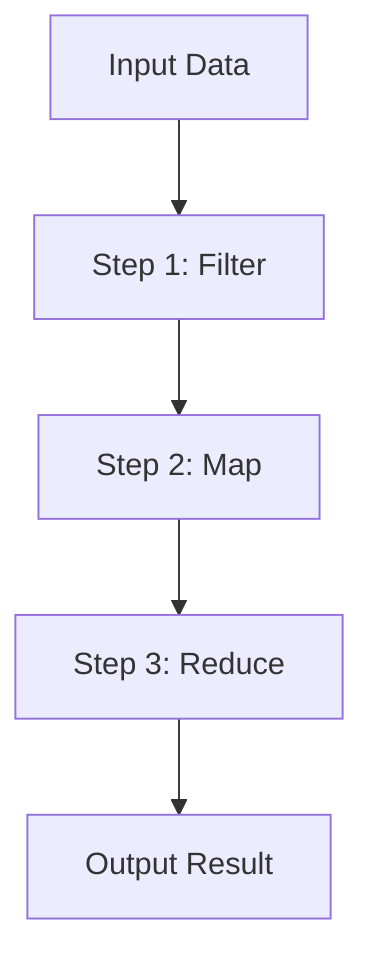
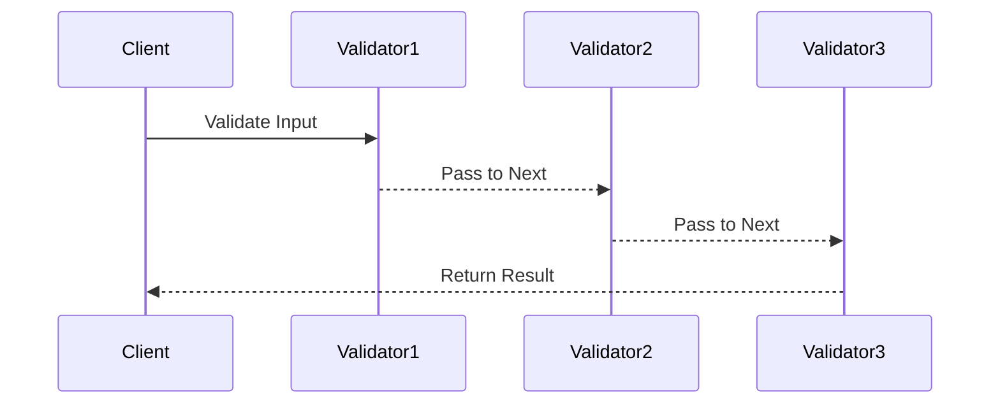

## 9.6 Pipeline and Chain Patterns

In the realm of functional programming, the pipeline and chain patterns stand out as powerful paradigms for processing data through a sequence of operations. These patterns not only enhance code readability but also promote a logical flow of data transformations. In this section, we will delve into the intricacies of pipeline and chain patterns, explore their benefits, and demonstrate their implementation in TypeScript.

### Understanding Pipeline and Chain Patterns

**Pipeline Pattern**: The pipeline pattern is a design pattern that allows you to pass data through a sequence of processing steps, where each step transforms the data in some way. This pattern is akin to a factory assembly line, where each station performs a specific task, and the output of one station becomes the input for the next.

**Chain Pattern**: The chain pattern, often referred to as the chain of responsibility, involves passing a request along a chain of handlers. Each handler decides whether to process the request or pass it to the next handler in the chain. This pattern is useful for scenarios where multiple handlers can process a request, but only one should ultimately handle it.

Both patterns emphasize the separation of concerns and promote a modular approach to building applications. They are particularly useful in functional programming, where functions are first-class citizens and can be composed to create complex behaviors.

### Benefits of Using Pipeline and Chain Patterns

1. **Improved Code Readability**: By breaking down complex operations into smaller, manageable steps, these patterns make code easier to read and understand.

2. **Enhanced Debugging**: With each step clearly defined, identifying and fixing bugs becomes more straightforward.

3. **Reusability**: Individual steps in a pipeline or chain can be reused across different parts of an application, reducing code duplication.

4. **Scalability**: As applications grow, adding new processing steps or handlers is simple and does not require significant changes to existing code.

5. **Functional Data Flow**: These patterns align well with functional programming principles, enabling a declarative style of coding where the focus is on what should be done rather than how.

### Implementing Pipelines in TypeScript

To illustrate the pipeline pattern, let's consider a scenario where we need to process a list of numbers by filtering out even numbers, doubling the remaining numbers, and then summing them up.

```typescript
// Define a type for a function that takes a number and returns a number
type NumberFunction = (input: number) => number;

// Step 1: Filter out even numbers
const filterEvenNumbers: NumberFunction = (num) => (num % 2 !== 0 ? num : 0);

// Step 2: Double the number
const doubleNumber: NumberFunction = (num) => num * 2;

// Step 3: Sum the numbers
const sumNumbers = (numbers: number[]): number => numbers.reduce((acc, num) => acc + num, 0);

// Pipeline function to process the numbers
const processNumbers = (numbers: number[]): number => {
  return sumNumbers(
    numbers.map(filterEvenNumbers).map(doubleNumber)
  );
};

// Example usage
const numbers = [1, 2, 3, 4, 5];
const result = processNumbers(numbers);
console.log(result); // Output: 18
```

In this example, we define a series of functions that each perform a specific task. The `processNumbers` function orchestrates the pipeline by applying each function in sequence. This approach not only makes the code more readable but also allows us to easily modify or extend the pipeline by adding new functions.

### Implementing Chains in TypeScript

The chain pattern can be implemented using classes or functions. Let's consider a scenario where we have a series of validation checks for user input. Each validator will either process the input or pass it to the next validator.

```typescript
// Define an interface for a validator
interface Validator {
  setNext(validator: Validator): Validator;
  validate(input: string): boolean;
}

// Base class for validators
class BaseValidator implements Validator {
  private nextValidator: Validator | null = null;

  setNext(validator: Validator): Validator {
    this.nextValidator = validator;
    return validator;
  }

  validate(input: string): boolean {
    if (this.nextValidator) {
      return this.nextValidator.validate(input);
    }
    return true;
  }
}

// Concrete validator to check if input is not empty
class NotEmptyValidator extends BaseValidator {
  validate(input: string): boolean {
    if (input.trim() === '') {
      console.log('Validation failed: Input is empty.');
      return false;
    }
    return super.validate(input);
  }
}

// Concrete validator to check if input is a valid email
class EmailValidator extends BaseValidator {
  validate(input: string): boolean {
    const emailRegex = /^[^\s@]+@[^\s@]+\.[^\s@]+$/;
    if (!emailRegex.test(input)) {
      console.log('Validation failed: Invalid email format.');
      return false;
    }
    return super.validate(input);
  }
}

// Example usage
const input = 'test@example.com';
const notEmptyValidator = new NotEmptyValidator();
const emailValidator = new EmailValidator();

notEmptyValidator.setNext(emailValidator);

const isValid = notEmptyValidator.validate(input);
console.log(`Is input valid? ${isValid}`); // Output: Is input valid? true
```

In this example, we create a chain of validators, where each validator checks a specific condition. If a validator fails, it logs an error message and stops the chain. Otherwise, it passes the input to the next validator. This approach allows us to easily add new validators without modifying existing ones.

### Functional Utilities and Native JavaScript Methods

TypeScript, being a superset of JavaScript, benefits from the rich set of functional utilities available in JavaScript. Methods such as `map`, `filter`, and `reduce` are essential tools for implementing pipeline patterns. Additionally, libraries like [Lodash](https://lodash.com/) provide a plethora of functional utilities that can further enhance your TypeScript code.

**Example with Lodash:**

```typescript
import _ from 'lodash';

const numbers = [1, 2, 3, 4, 5];

const result = _.chain(numbers)
  .filter((num) => num % 2 !== 0)
  .map((num) => num * 2)
  .sum()
  .value();

console.log(result); // Output: 18
```

In this example, we use Lodash's `chain` method to create a pipeline that filters, maps, and sums the numbers. The `value` method at the end executes the chain and returns the result.

### Type Safety and Inference in Chained Operations

One of the strengths of TypeScript is its type system, which helps catch errors at compile time. When implementing pipeline or chain patterns, it's crucial to ensure type safety and correct type inference.

**Example with TypeScript Generics:**

```typescript
// Define a generic type for a pipeline function
type PipelineFunction<T> = (input: T) => T;

// Function to create a pipeline
function createPipeline<T>(...functions: PipelineFunction<T>[]): PipelineFunction<T> {
  return (input: T): T => {
    return functions.reduce((acc, fn) => fn(acc), input);
  };
}

// Example pipeline functions
const addOne: PipelineFunction<number> = (num) => num + 1;
const square: PipelineFunction<number> = (num) => num * num;

// Create a pipeline
const pipeline = createPipeline(addOne, square);

// Example usage
const number = 3;
const result = pipeline(number);
console.log(result); // Output: 16
```

In this example, we define a generic `PipelineFunction` type and a `createPipeline` function that accepts a series of pipeline functions. This approach ensures that all functions in the pipeline have the same input and output types, providing type safety and correct type inference.

### Best Practices for Structuring Code with Pipeline and Chain Patterns

1. **Keep Functions Pure**: Ensure that each function in a pipeline or chain is pure, meaning it does not have side effects and always produces the same output for the same input.

2. **Use Descriptive Names**: Name your functions and variables descriptively to make the code self-documenting.

3. **Limit the Number of Steps**: Avoid creating overly long pipelines or chains, as they can become difficult to understand and maintain.

4. **Leverage TypeScript's Type System**: Use TypeScript's type system to enforce type safety and prevent runtime errors.

5. **Document Each Step**: Provide comments or documentation for each step in the pipeline or chain to explain its purpose and behavior.

### Advanced Techniques for Expert-Level Readers

For expert developers, there are several advanced techniques that can be employed to take full advantage of pipeline and chain patterns in TypeScript.

**Lazy Evaluation with Generators**: Use generator functions to implement lazy evaluation in pipelines, allowing you to process large datasets efficiently without loading everything into memory at once.

```typescript
function* lazyFilter<T>(iterable: Iterable<T>, predicate: (item: T) => boolean): IterableIterator<T> {
  for (const item of iterable) {
    if (predicate(item)) {
      yield item;
    }
  }
}

function* lazyMap<T, U>(iterable: Iterable<T>, transform: (item: T) => U): IterableIterator<U> {
  for (const item of iterable) {
    yield transform(item);
  }
}

// Example usage
const numbers = [1, 2, 3, 4, 5];
const filtered = lazyFilter(numbers, (num) => num % 2 !== 0);
const mapped = lazyMap(filtered, (num) => num * 2);

for (const num of mapped) {
  console.log(num); // Output: 2, 6, 10
}
```

**Monads for Error Handling**: Use monads, such as `Maybe` or `Either`, to handle errors and nullable values in pipelines, providing a more elegant and functional approach to error handling.

```typescript
// Define a Maybe monad
class Maybe<T> {
  private constructor(private value: T | null) {}

  static just<T>(value: T): Maybe<T> {
    return new Maybe(value);
  }

  static nothing<T>(): Maybe<T> {
    return new Maybe(null);
  }

  map<U>(fn: (value: T) => U): Maybe<U> {
    if (this.value === null) {
      return Maybe.nothing();
    }
    return Maybe.just(fn(this.value));
  }

  getOrElse(defaultValue: T): T {
    return this.value !== null ? this.value : defaultValue;
  }
}

// Example usage
const maybeNumber = Maybe.just(5)
  .map((num) => num * 2)
  .map((num) => num + 1);

console.log(maybeNumber.getOrElse(0)); // Output: 11
```

### Try It Yourself

To deepen your understanding of pipeline and chain patterns, try modifying the examples provided:

- **Experiment with Different Functions**: Add new functions to the pipeline or chain to see how they affect the output.
- **Implement Error Handling**: Introduce error handling in the pipeline using monads or other techniques.
- **Optimize for Performance**: Use lazy evaluation to process large datasets efficiently.

### Visualizing Pipeline and Chain Patterns

To better understand how data flows through pipelines and chains, let's visualize these patterns using Mermaid.js diagrams.

**Pipeline Pattern Flowchart**:



**Chain Pattern Sequence Diagram**:



These diagrams illustrate the sequential processing of data in pipeline and chain patterns, highlighting the flow of data and the interactions between different components.

### References and Further Reading

- [MDN Web Docs: Array.prototype.map()](https://developer.mozilla.org/en-US/docs/Web/JavaScript/Reference/Global_Objects/Array/map)
- [MDN Web Docs: Array.prototype.filter()](https://developer.mozilla.org/en-US/docs/Web/JavaScript/Reference/Global_Objects/Array/filter)
- [MDN Web Docs: Array.prototype.reduce()](https://developer.mozilla.org/en-US/docs/Web/JavaScript/Reference/Global_Objects/Array/reduce)
- [Lodash Documentation](https://lodash.com/docs/)

### Knowledge Check

- What are the main differences between pipeline and chain patterns?
- How can you ensure type safety in a pipeline of functions?
- What are the benefits of using lazy evaluation in pipelines?
- How can monads be used to handle errors in a functional pipeline?

### Embrace the Journey

Remember, mastering pipeline and chain patterns is a journey. As you continue to explore these patterns, you'll discover new ways to enhance your code's readability, maintainability, and performance. Keep experimenting, stay curious, and enjoy the journey!

## Quiz Time!



### What is the primary benefit of using pipeline patterns?

- [x] Improved code readability
- [ ] Increased execution speed
- [ ] Reduced memory usage
- [ ] Enhanced security

> **Explanation:** Pipeline patterns improve code readability by breaking down complex operations into smaller, manageable steps.

### How do chain patterns differ from pipeline patterns?

- [x] Chain patterns involve passing a request along a chain of handlers.
- [ ] Chain patterns are used for data transformation.
- [ ] Chain patterns are specific to TypeScript.
- [ ] Chain patterns require asynchronous operations.

> **Explanation:** Chain patterns involve passing a request along a chain of handlers, where each handler decides whether to process the request or pass it to the next handler.

### Which TypeScript feature is crucial for ensuring type safety in pipelines?

- [x] Type inference
- [ ] Decorators
- [ ] Interfaces
- [ ] Modules

> **Explanation:** Type inference is crucial for ensuring type safety in pipelines, as it helps catch errors at compile time.

### What is a common use case for the chain of responsibility pattern?

- [x] Validation checks
- [ ] Data transformation
- [ ] Asynchronous operations
- [ ] UI rendering

> **Explanation:** The chain of responsibility pattern is commonly used for validation checks, where multiple handlers can process a request.

### Which library provides functional utilities that support pipeline patterns?

- [x] Lodash
- [ ] Express
- [ ] Angular
- [ ] React

> **Explanation:** Lodash provides functional utilities that support pipeline patterns, such as `chain`, `map`, `filter`, and `reduce`.

### What is the purpose of using generator functions in pipelines?

- [x] To implement lazy evaluation
- [ ] To handle errors
- [ ] To improve type safety
- [ ] To enhance security

> **Explanation:** Generator functions are used in pipelines to implement lazy evaluation, allowing efficient processing of large datasets.

### How can monads be used in pipelines?

- [x] To handle errors and nullable values
- [ ] To improve execution speed
- [ ] To reduce memory usage
- [ ] To enhance security

> **Explanation:** Monads, such as `Maybe` or `Either`, can be used in pipelines to handle errors and nullable values in a functional way.

### What is a best practice for structuring code with pipeline patterns?

- [x] Keep functions pure
- [ ] Use global variables
- [ ] Limit type annotations
- [ ] Avoid using comments

> **Explanation:** Keeping functions pure is a best practice for structuring code with pipeline patterns, as it ensures predictability and reusability.

### Which TypeScript feature helps enforce type safety in chained operations?

- [x] Generics
- [ ] Decorators
- [ ] Modules
- [ ] Namespaces

> **Explanation:** Generics help enforce type safety in chained operations by ensuring consistent input and output types.

### True or False: The pipeline pattern is specific to functional programming.

- [x] True
- [ ] False

> **Explanation:** The pipeline pattern is closely associated with functional programming, where functions are composed to create complex behaviors.


